# C语言笔记

* [1.C语言概论](#1c语言概论)
  * [1.1.写C语言的过程](#11写c语言的过程)
  * [1.2.完整的C代码分析](#12完整的c代码分析)
  * [1.3.例一：求圆的面积](#13例一求圆的面积)
  * [1.4.例二：函数的调用](#14例二函数的调用)
* [2.C语言的类型及语句](#2c语言的类型及语句)
  * [2.1.C语言关键字（32个）](#21c语言关键字32个)
  * [2.2.数据类型](#22数据类型)
    * [常量与变量](#常量与变量)
    * [整型数据](#整型数据)
    * [实型数据（浮点型）](#实型数据浮点型)
    * [字符----`''`作用](#字符----作用)
    * [字符串----`""`作用](#字符串----作用-)
    * [总结一下](#总结一下)
    * [数据的混合运算](#数据的混合运算)
  * [2.3.运算符](#23运算符)
    * [算数运算符](#算数运算符)
    * [关系运算符](#关系运算符)
    * [逻辑运算符](#逻辑运算符)
    * [位运算符](#位运算符)
    * [其他运算符](#其他运算符)
    * [综合案例](#综合案例)
    * [复合运算符](#复合运算符)
    * [优先级](#优先级)
  * [2.4.控制语句](#24控制语句)
    * [C语言运行结构](#c语言运行结构)
    * [if判断语句](#if判断语句)
    * [switch选择语句](#switch选择语句)
    * [for循环语句](#for循环语句)
    * [while循环](#while循环)
    * [总结](#总结)
* [3.数组](#3数组)
  * [3.1.数组的概念](#31数组的概念)
  * [3.2.数组的分类](#32数组的分类)
  * [3.3.一维数组](#33一维数组)
    * [一维数组的定义](#一维数组的定义)
    * [初始化](#初始化)
    * [数组的空间大小](#数组的空间大小)
    * [数组元素的操作](#数组元素的操作)
  * [3.4.二维数组](#34二维数组)
    * [二维数组的定义](#二维数组的定义)
    * [二维数组的遍历](#二维数组的遍历)
    * [二维数组的初始化](#二维数组的初始化)
  * [3.5.字符数组](#35字符数组)
    * [一维字符数组](#一维字符数组)
    * [二维字符数组](#二维字符数组)
* [4.函数](#4函数)
  * [4.1.示例的概述](#41示例的概述)
  * [4.2.函数的参数](#42函数的参数)
  * [4.3.案例](#43案例)
* [5.变量的存储类别](#5变量的存储类别)
  * [5.1.内存的分区](#51内存的分区)
  * [5.2.变量类型](#52变量类型)
    * [普通局部变量](#普通局部变量)
    * [普通全局变量](#普通全局变量)
    * [静态局部变量](#静态局部变量)
    * [静态全局变量](#静态全局变量)
  * [5.3.函数类型](#53函数类型)
    * [全局函数（普通函数）](#全局函数普通函数)
    * [静态函数（局部函数）](#静态函数局部函数)
* [6.预处理](#6预处理)
  * [6.1.C语言编译过程](#61c语言编译过程)
  * [6.2.头文件包含](#62头文件包含)
  * [6.3.define 宏](#63define-宏)
  * [6.4.条件编译](#64条件编译)
  * [6.5.防止头文件重复包含](#65防止头文件重复包含)
* [7.二进制 原/反/补码](#7二进制-原反补码)
* [8.指针的概念与应用](#8指针的概念与应用)
  * [8.1.关于内存](#81关于内存)
  * [8.2.指针的概念](#82指针的概念)
  * [8.3.指针变量](#83指针变量)
    * [概念](#概念)
    * [变量的定义](#变量的定义)
    * [变量的使用](#变量的使用)
    * [变量的类型](#变量的类型)
    * [变量的初始化](#变量的初始化)
    * [使用变量须知](#使用变量须知)
    * [指针注意事项](#指针注意事项)
  * [8.4.数组元素的指针](#84数组元素的指针)
    * [数组的 [] 和 *() 关系](#数组的--和--关系)
    * [arr 和 &arr 的区别](#arr-和-arr-的区别)
    * [指向同一数组的两指针关系](#指向同一数组的两指针关系)
    * [题目案例](#题目案例)
  * [8.5.指针数组](#85指针数组)
    * [字符指针数组](#字符指针数组)
  * [8.6.数组指针](#86数组指针)
    * [数组指针应用](#数组指针应用)
  * [8.7.多级指针](#87多级指针)
  * [8.8.指针作为函数的参数](#88指针作为函数的参数)
    * [再次总结](#再次总结)
  * [8.9.一维数组名作为函数参数](#89一维数组名作为函数参数)
  * [8.10.二维数组名作为函数参数](#810二维数组名作为函数参数)
  * [8.11.指针作为函数的返回值](#811指针作为函数的返回值)
  * [8.12.函数指针](#812函数指针)
    * [函数指针参数](#函数指针参数)
* [9.动态内存分配](#9动态内存分配)
  * [9.1.malloc函数（申请内存）](#91malloc函数申请内存)
  * [9.2.free函数（释放函数）](#92free函数释放函数)
  * [9.3.内存分配示例](#93内存分配示例)
  * [9.4.calloc函数（申请内存）](#94calloc函数申请内存)
  * [9.5.realloc函数(动态增减内存)](#95realloc函数动态增减内存)
  * [9.6.堆区空间使用的注意事项](#96堆区空间使用的注意事项)
  * [9.7.防止多次释放](#97防止多次释放)
* [10.字符串处理函数](#10字符串处理函数)
  * [10.1.测字符串长度函数](#101测字符串长度函数)
    * [sizeof 和 strlen 的主要区别](#sizeof-和-strlen-的主要区别)
    * [实例：重写函数](#实例重写函数)
  * [10.2.字符串拷贝函数](#102字符串拷贝函数)
    * [实例：重写函数](#实例重写函数-1)
  * [10.3.字符串拼接函数](#103字符串拼接函数)
    * [实例：重写函数](#实例重写函数-2)
  * [10.4.字符串比较函数](#104字符串比较函数)
    * [实例：重写函数](#实例重写函数-3)
  * [10.5.字符串变换函数](#105字符串变换函数)
    * [strchr字符查找](#strchr字符查找)
    * [strstr字符串查找](#strstr字符串查找)
  * [10.6.字符串处理函数](#106字符串处理函数)
    * [memset字符填充](#memset字符填充)
    * [atoi/atol/atof字符转换](#atoiatolatof字符转换)
      * [实例：重写函数](#实例重写函数-4)
    * [strtok字符串切割](#strtok字符串切割)
  * [10.7.sprintf组包](#107sprintf组包)
  * [10.8.sscanf解包](#108sscanf解包)
    * [高级用法](#高级用法)
    * [高级用法案例](#高级用法案例)
  * [10.9.const关键字](#109const关键字)
    * [const修饰普通变量](#const修饰普通变量)
    * [const修饰指针星花](#const修饰指针星花)
    * [const修饰指针变量](#const修饰指针变量)
    * [const同时修饰指针星花和变量](#const同时修饰指针星花和变量)
* [11.结构体](#11结构体)
  * [11.1.结构体定义形式](#111结构体定义形式)
    * [注意事项](#注意事项)
    * [实例展示](#实例展示)
  * [11.2.结构体使用法则](#112结构体使用法则)
  * [11.3.结构体的操作](#113结构体的操作)
    * [初始化结构体](#初始化结构体)
    * [清空结构体](#清空结构体)
  * [11.4.结构体变量操作](#114结构体变量操作)
    * [获取键盘输入](#获取键盘输入)
    * [变量之间的赋值](#变量之间的赋值)
  * [11.5.结构体数组操作](#115结构体数组操作)
  * [11.6.结构体指针操作](#116结构体指针操作)
    * [结构体指针作为函数的参数](#结构体指针作为函数的参数)
  * [11.7.typedef取别名](#117typedef取别名)
  * [11.8.结构体内存对齐](#118结构体内存对齐)
    * [结构体内存分布](#结构体内存分布)
    * [结构体内存分布的作用](#结构体内存分布的作用)
  * [11.9.结构体嵌套结构体](#119结构体嵌套结构体)
    * [嵌套结构内存分布](#嵌套结构内存分布)
  * [11.10.强制类型对齐](#1110强制类型对齐)
* [12.位段/位域](#12位段位域)
  * [12.1.位段的注意事项](#121位段的注意事项)
  * [12.2.位域和单片机](#122位域和单片机)
* [13.共用体](#13共用体)
  * [13.1.结构体和共用体的区别](#131结构体和共用体的区别)
  * [13.2.共用体成员提取](#132共用体成员提取)
* [14.枚举](#14枚举)
  * [14.1.枚举定义](#141枚举定义)
  * [14.2.枚举中的索引值](#142枚举中的索引值)
* [15.冒泡排序](#15冒泡排序)
  * [15.1.数组排序](#151数组排序)
  * [15.2.结构体排序](#152结构体排序)

# 1.C语言概论

## 1.1.写C语言的过程

- 编写：程序员写代码的过程，在记事本，vs code，VS studio等等；
- 编译：查看代码语法错误，生成汇编语言；
- 汇编：将生成好的汇编语言生成为二进制语言（目标文件）；
- 连接：将**生成好的二进制语言 + 用到的库 + 启动代码**生成**可执行文件**;

## 1.2.完整的C代码分析

- 先写一个`hello world`：

  ```c
  // 这是注释行
  #include<stdio.h>
  int main(int argc, char* argv[])
  {
  	printf("hello world\n");
  	return 0;
  }
  ```

- 注释：

  ```c
  "//"   这是行注释；
  "/**/"   这是块注释，且不能嵌套；
  ```

- 头文件标识：

  ```c
  #include<stdio.h>   
  ```

  `stdio.h`：`std`表示标准、`i`表示输入、`o`表示输出、`h`表示头文件，连起来就是标准的输入输出文件。

- 输出：

  `printf`是将`""`中的字符串输出出来，这是由`头部文件`所决定的，能够进行标准的输出和输入。

- 主函数：

  `main`是主函数，是一个程序的入口，是一个执行代码的开始，所以主函数有且仅有一个。

  `main`左边的`int`表示该函数返回的是一个`int`值。

  `main`右边的小括号内是该函数的形式参数，简称“形参”。

- 大括号：

  `{}`是函数体，函数的功能都在大括号里面实现，每条记着缩进。

- 分号：

  `;`是C语言的语句结束标记，每一行代码必须得有。

- **总结代码如下：**

  ```c
  //行注释:
  #include<stdio.h>//std 标准 i输入 o输出（标准的输入输出头文件）
  /* 块注释 不能嵌套
  main 是程序的入口 有且仅有一个
  main左边的int 代表的是函数的返回值类型
  ()里面函数的形参（函数外部将数据传递到函数内部的桥梁）
  */
  int main(int argc,char *argv[])
  {//函数的功能都在{}里面实现
  //使用任何东西 必先存在
  //printf:将""中的字符串 输出到 终端上
  printf("hello iot\n");//来至系统库文件
  //;c语言的语句结束标记
  //如果你的代码 一闪而过 可以用带阻塞的代码
  getchar();
  return 0;
  }
  //int char return 都是后面要讲的关键字
  ```

## 1.3.例一：求圆的面积

- 分析所求例子过程：

  - 如果我们要求一个圆的面积，需要以下条件：

    半径`R`，算法`S=pi*R*R`；

  - 半径`R`可以通过提前声明，或者用户输入；

  - 算法需要定义一个面积变量：`area=pi*R*R`;
  - 最后将该`area`变量输出出来；

- 示例如下：

  ```c
  #include<stdio.h>
  #define PI 3.14 //定义一个宏，建议大写，和普通变量区分
  
  int main(int argc, char* argv[])
  {
  	float R = 0.0f;
  	float area = 0.0f;
  
  	printf("请输入一个半径R;");
  	scanf_s("%f", &R);
  	printf("R = %f\n", R);
  	area = PI * R * R;
  	printf("area = %.2f\n", area);
  
  	return 0;
  }
  ```

- 代码的解释：

  ```c
  #include<stdio.h>
  //定义一个宏 建议大写 和普通变量区分开
  #define PI 3.14
  int main(int argc,char *argv[])
  {
  float r=0.0f;//定义一个r变量 系统给r开辟4字节空间
  float area = 0.0f;//定义一个面积变量
  //获得半径 从键盘获得scanf
  printf("请输入圆的半径r:");
  scanf("%f", &r);//带阻塞
  //算法:计算面积area = 3.14 * r * r
  area = PI*r*r;
  //将面积输出%.2f中的.2表示小数部分保留两位
  printf("area = %.2f\n",area);
  return 0;
  }
  ```

## 1.4.例二：函数的调用

1. 定义两个变量data1 data2 获取键盘输入；

2. 定义一个函数去计算上面两个变量data1，data2的和，在函数的内部计算（怎么将数据传递到函数内部呢？）**需要用形参将data1，data2传递到函数内部**；

3. 得到函数内部的计算结果（怎么得到呢？）**通过函数的返回值得到函数的计算结果**；

   示例如下：

   ```c
   #include<stdio.h>
   int add_fun(int a, int b)
   {
   	return a + b;
   }
   int main(int argc,char *argv[])
   {
   	int data1 = 0, data2 = 0;
   	int ret = 0;
   	printf("请输入两个int变量：");
   	scanf_s("%d %d", &data1, &data2);
   	ret = add_fun(data1, data2);
   	printf("ret = %d", ret);
   	return 0;
   }
   ```

   代码解释：

   ```c
   #include<stdio.h>
   int add_fun(int a, int b)
   {
   	return a + b;
   }
   
   int main(int argc, char* argv[])
   {
   	//定义两个变量 获取键盘输入
   	//int data1 = 0;
   	//int data2 = 0;
   	int data1 = 0, data2 = 0;
   	int ret = 0;//存放函数的结果
   	printf("请输入两个int变量:");
   	scanf_s("%d %d", &data1, &data2);
   	//函数的调用
   	ret = add_fun(data1, data2);//a = data1 b = data2
   	//输出ret的结果
   	printf("ret = %d\n", ret);
   	return 0;
   }
   ```

# 2.C语言的类型及语句

**二进制基础：**

1. **计算机存储的是二进制，一位二进制只能存放一个0或1：`1b`**
2. **1B（字节） == 8b（8位二进制） ：0000 0000 ~ 1111 1111**
3. 1KB == 1024B；1MB == 1024KB；1GB == 1024MB；1TB == 1024GB；1PB == 1024TB

**数据类型基础：**

|        数据类型        | 所占内存  |
| :--------------------: | :-------: |
|    char（字符类型）    | 1B == 8b  |
|    short（短整型）     | 2B == 16b |
|      int（整型）       | 4B == 32b |
|     long（长整型）     | 4B == 32b |
| long long（长长整形）  | 8B == 64b |
| float（单精度浮点型）  | 4B == 32b |
| double（双精度浮点型） | 8B == 64b |

**案例（验证数据类型的长度）：**`sizeof`能够测量数据类型的长度

```c
#include<stdio.h>
int main(int argc, char *argv[])
{
	printf("sizeof(char)=%dB\n", sizeof(char));
	printf("sizeof(short)=%dB\n", sizeof(short));
	printf("sizeof(int)=%dB\n", sizeof(int));
	printf("sizeof(long)=%dB\n", sizeof(long));
	printf("sizeof(long long)=%dB\n", sizeof(long long));
	printf("sizeof(float)=%dB\n", sizeof(float));
	printf("sizeof(double)=%dB\n", sizeof(double));
	return 0;
}
```

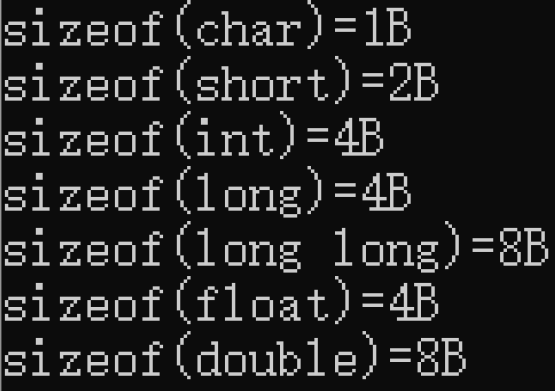

**有符号数和无符号数（unsigned和signed）**

1. 无符号数 unsigned：数据没有符号位，自身的所有二进制位都是数据位

   比如：unsigned char -------- 0000 0000~1111 1111

2. 有符号数 signed（默认一般省略）：二进制最高位为符号位，其他位为数据位

   比如：signed char -------- <mark>x</mark>xxx xxxx (x为0或1)

   负数：1xxx xxxx

   正数：0xxx xxxx

   所以表示范围是：1111 1111 ~ 1000 0000 ~ 0000 0000 ~ 0111 1111

**案例（进制的转换）：**

```c
#include<stdio.h>
#define MAX 32
int main(int argc, char *argv[])
{
	int i = 0, n, a[MAX];
	printf("请输入一个十进制数：");
	scanf_s("%d", &n);
	while (n > 0) {
		a[i] = n % 2;
		i = i + 1;
		n = n / 2;
	}
	printf("十进制整数转化为二进制数是：");
	for (; i > 0; i--)
		printf("%d", a[i - 1]);
	printf("\n");
	return 0;
}
```

**案例（有无符号的数据展示）：**

```c
#include<stdio.h>
int main(int argc, char* argv[])
{
	//以下这两种定义意思相同,都是有符号的int
	signed int num1 = 10;
	int num2 = 10;//（推荐）
	//下面这一种定义是无符号的int
	unsigned int num3 = 10;
	return 0;
}
```

## 2.1.C语言关键字（32个）

**数据类型关键字（12个）：（数据类型存在的意义是合理分配程序的内存）**
$$
\begin{cases}
char-\bf{字符类型}\\short-\bf{短整型}\\int-\bf{整型}\\long-\bf{长整型}\\float-\bf{单精度浮点型}\\double-\bf{双精度浮点型}\\unsigned-\bf{无符号数}\\signed-\bf{有符号数}\\struct-\bf{结构体}\\union-\bf{共用体}\\enum-\bf{枚举}\\void-\bf{无类型}\\
\end{cases}
$$

补充：

1. `struct`结构体：结构体中的成员拥有独立的空间：

```c
struct data
{
	char a;
	short b;
	int c;
}
```

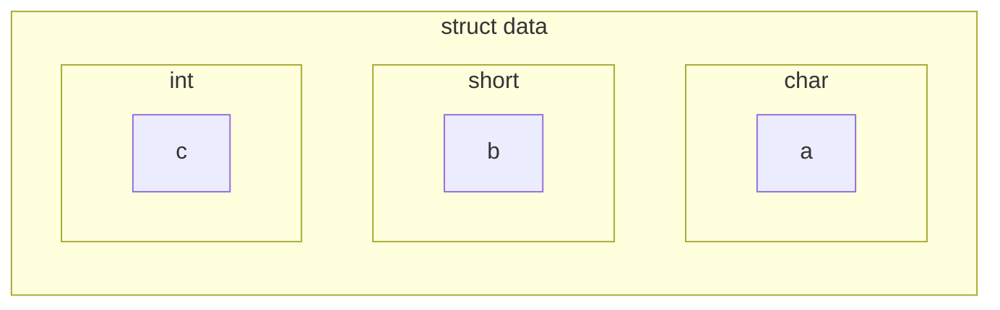

2. `union`共用体：共用体中的成员共用一个空间：

```c
union data
{
	char a;
	short b;
	int c;
}
```

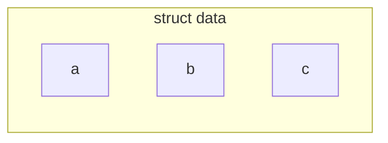

3. `enum`枚举和`void`无类型

   - `enum`枚举：将变量要赋值的值一一列举出来：

     C语言中没有`bool`，所以我们可以用`enum`语句将其表达出来

     ```c
     enum BOOL{false,true};
     enum BOOL bool = false;
     ```

   - `void`无类型：**记住不能用它定义变量**，原因如下：

     $\begin{cases}int\ num;\bf{当编译器编译到这句话时，能确定num占4B；}\\void\ num;\bf{当编译器编译到这句话时，不能确定num占据多少空间；}\end{cases}$

**控制语句关键字（12个）：**
$$
\begin{cases}
if-\bf{条件语句}\\else-\bf{条件语句否定分支（与 if 连用）}\\switch-\bf{用于开关语句}\\case-\bf{开关语句分支}\\default-\bf{开关语句中的其他分支}\\for-\bf{一种循环语句}\\do-\bf{循环语句的循环体}\\while-\bf{循环语句的循环条件}\\break-\bf{跳出当前循环}\\continue-\bf{结束当前循环，开始下一轮循环}\\goto-\bf{无条件跳转语句}\\return-\bf{子程序返回语句（可以带参数，也可不带参数）循环条件}\\
\end{cases}
$$

**存储类关键字（5个）：**
$$
\begin{cases}
auto-\bf{声明自动变量}\\extern-\bf{声明变量是在其他文件中声明}\\register-\bf{声明寄存器变量}\\static-\bf{声明静态变量}\\const-\bf{声明只读变量}
\end{cases}
$$

`register`(寄存器变量)：

 1. 如果没显示标明 register ，就类似int num,如果num被高频繁使用系统也会放入寄存器中；

 2. register int num;//显示的将num放入寄存器中；

 3. 寄存器的变量不能取地址 &num；

    <mark>取地址用“%p”，示例如下：</mark>

    ```c
    #include<stdio.h>
    int main(int argc, char *argv[])
    {
    	int a = 16;
    	printf("%p\n", a);
    }
    ```

    打印效果如下：

    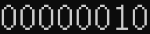

**其他关键字（3个）：**
$$
\begin{cases}
sizeof-\bf{计算数据类型长度}\\typedef-\bf{用以给数据类型取别名}\\volatile-\bf{防止编译器优化，强制访问内存操作}
\end{cases}
$$

`typedef`示例如下（我们将`int`转换成`int64`）：

```c
#include<stdio.h>
typedef int int64;
int64 main(int64 argc, char *argv[])
{
	int64 a = 16;
	printf("%p\n", a);
}
```

此时依然能够正常打印：


`volatile`示例如下：

```c
#include<stdio.h>
int main(int argc, char *argv[])
{
	int num = 10;
	volatile int value;
	printf("%d",num);
	return 0;
}
```

此时 `int num = 10;` 就一直保存在了内存里，即使高强度反复调用也不会存入寄存器。

## 2.2.数据类型

$$
数据类型\begin{cases}
基本类型\begin{cases}
整形：int、short、long\\
字符型：char\\
实型(浮点型)\begin{cases}
单精度实型float\\双精度实型double
\end{cases}
\end{cases}\\
构造类型\begin{cases}
数组类型\\结构类型:struct\\联合类型:union\\枚举类型:enum
\end{cases}\\
指针类型(char*、int*、int**等)
\end{cases}
$$

### 常量与变量

常量：在程序运行中，其值不能被改变的量；

1. 整型：`100`，`125`，`-100`，`0`
2. 实型：`3.14`，`0.125`，`-3.232`
3. 字符：`'a'`，`'b'`，`'2'`
4. 字符串：`"a"`，`"ab"`，`"123"`

示例如下：

```c
int a = 100
char c = 'abc'
//因为一般出现在表达式右边，所以也称“右值”
```

变量：系统根据变量的类型开辟对应的空间，其值可以被修改；

示例如下：

```c
int num = 10;
/*
注意:变量名num代表的是空间的内容
变量命名规则：由数字，字母和下划线组成但不能以数字开头；
*/
```

特点：变量在编译时为其分配相应的内存地址，可以通过名字和地址访问相应空间；

### 整型数据

1. **整型常量：**

   十进制；

   八进制；

   十六进制；

   以上三种都是整型的输出形式；

   ```c
   #include<stdio.h>
   int test() {
   	int num = 100;
   	//十进制输出	%d %u %ld %lu
   	printf("十进制：num = %d\n", num);
   	//八进制输出	%o
   	printf("八进制：num = %o\n", num);
   	//十六进制输出 %x
   	printf("十六进制：num = %x\n", num);
   }
   int main(int argc, char* argv[]) {
   	test();
   	return 0;
   }
   ```

   打印效果如下：

   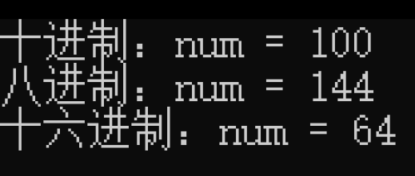

   **不同的进制仅仅是数据的表现形式，并不能修改数据本身；**

   我们还可以对上面的代码进行修改，让输出结果看起来更直观：

   ```c
   #include<stdio.h>
   int test() {
   	int num = 100;
   	//十进制输出	%d %u %ld %lu
   	printf("十进制：num = %#d\n", num);
   	//八进制输出	%o
   	printf("八进制：num = %#o\n", num);
   	//十六进制输出 %x
   	printf("十六进制：num = %#x\n", num);
   }
   int main(int argc, char* argv[]) {
   	test();
   	return 0;
   }
   ```

   打印效果如下：

   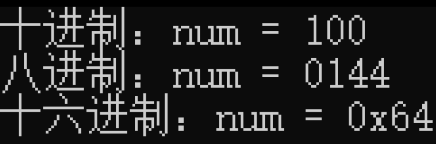

2. **整型变量：**

   **整型变量操作：读、写**

   ```c
   #include<stdio.h>
   int test() {
   	//局部变量不初始化，内容随机
   	//int num;
   	int num = 0;
   	printf("num = %d\n", num);//读操作，取值
   	num = 100;//写操作，赋值
   	printf("num = %d\n", num);//读操作，取值
   }
   int main(int argc, char* argv[]) {
   	test();
   	return 0;
   }
   ```

   打印效果如下：

   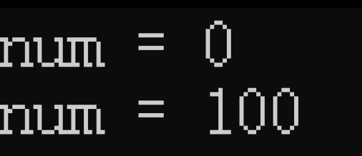

   如果我们想从键盘获取用户输入的话，我们可以在以上代码做改进：

   ```c
   #include<stdio.h>
   int test() {
   	//局部变量不初始化，内容随机
   	//int num;
   	int data = 0;
   	int num = 0;
   	printf("num = %d\n", num);//读操作，取值
   	num = 100;//写操作，赋值
   	printf("num = %d\n", num);//读操作，取值
   	data = num;//num是读，data是写
   	printf("data = %d\n", data);
   	
   	//获取键盘输入
   	printf("请输入一个整型数据：");
   	scanf_s("%d", &data);//&data 代表data对应空间的起始地址
   	printf("data = %d", data);
   }
   int main(int argc, char* argv[]) {
   	test();
   	return 0;
   }
   ```

   打印效果如下：

   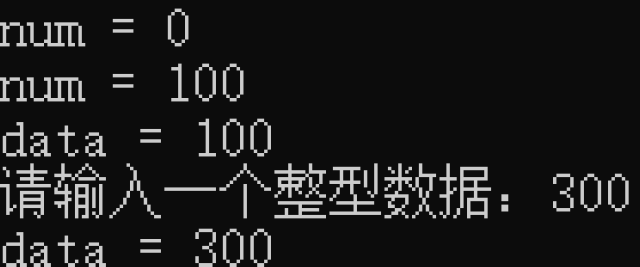

   有/无符号短整型`(un/signed) short(int)` ----2个字节
   
   有/无符号基本整型`(un/signed) int`-------------4个字节

   有/无符号长整型`(un/signed) long(int)`-------4个字节

   示例如下：
   
   ```c
   #include<stdio.h>
   int test() {
   	int num1 = 0;
   	// %d 有符号整型输出
   	printf("num1 = %d\n", num1);
   
   	unsigned int num2 = 0;
   	// %u 无符号整型输出
   	printf("num2 = %u\n", num2);
   
   	long num3 = 0;
   	// %ld 有符号长整型输出
   	printf("num3 = %ld\n", num3);
   
   	unsigned long num4 = 0;
   	// %lu 无符号长整型输出
   	printf("num4 = %lu\n", num4);
   
   	short num5 = 0;
   	// %hd 有符号短整型输出
   	printf("num5 = %hd\n", num5);
   
   	unsigned short num6 = 0;
   	// %hu 无符号短整型输出
   	printf("num6 = %hu\n", num6);
   }
   int main(int argc, char* argv[]) {
   	test();
   	return 0;
   }
   ```

   打印效果如下：
   
   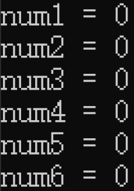

### 实型数据（浮点型）

**实型常量：**

实型常量也称为实数或者浮点数；

十进制形式：由数字和小数点组成：`0.0`、`0.12`、`5.0`；

指数形式：`123e3`表示 $123×10^3$；

不以 `f` 结尾的常量是 `double` 类型；

以 `f` 结尾的常量是 `float` 类型；

说明实例：

```c
int fun() {
	//不以 f 结尾的实型常量为 double 类型
	printf("sizeof(3.14) = %d\n", sizeof(3.14));
	//以 f 结尾的实型常量为 float 类型
	printf("sizeof(3.14f) = %d\n", sizeof(3.14f));
}
int main(int argc, char* argv[]) {
	fun();
	return 0;
}
```

打印效果如下：

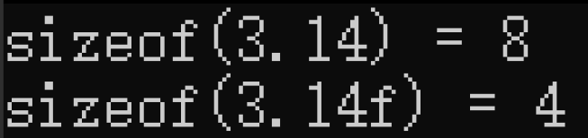

所以下面这个例子就有错误：

```c
int fun() {
	//所以下面这个例子就有错误
	//float f = 3.14; //会报错
	double d = 3.14;
	// double 用%lf
	printf("d = %lf\n", d);
	//或者
	float f = 3.14f;
	// float 用%f
	printf("f = %f\n", f);
}
int main(int argc, char* argv[]) {
	fun();
	return 0;
}
```

我们将它们输出出来：

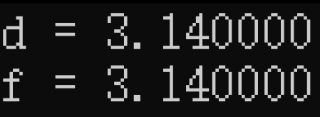

**实型变量：**

单精度`(float)`和双精度`(double)`；

float型：占4B，7位有效数字，指数-37到38；

double型：占8B，16位有效数字，指数-307到308；

### 字符----`''`作用

1. **字符常量：**

   直接常量：用单引号括起来----`'a'` `'b'`等；

   示例如下：

   ```c
   int fuc() {
   	// %c 输出的是字符
   	printf("%c\n", 'a');
   
   	//ch储存的是'a'的ASCII值，单引号表示的取字符的ASCII值
   	char ch = 'a';
   	printf("ch = %c\n", ch);
       // %d 输出的是ASCII值
   	printf("ch = %d\n", ch);
   }
   int main(int argc, char* argv[]) {
   	fuc();
   	return 0;
   }
   ```

   打印效果如下：

   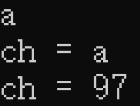

   `'a'`单引号表示取 a 的`ASCII`值，字符在计算机及存储的是`ASCII`；

   如果我们要获取一个字符：

   ```c
   int fuc() {
   	char ch;
   	printf("请输入一个字符：");
   	//scanf里的 %c 只能提取一个字符
   	//scanf_s("%c", &ch);
   	//等同于：
   	ch = getchar();
   	printf("ch = %c\n", ch);
   	printf("ch = %d\n", ch);
   }
   int main(int argc, char* argv[]) {
   	fuc();
   	return 0;
   }
   ```

   **打印效果如下：**

   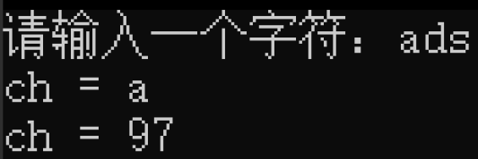

   **案例：输入字符`'abc'`，只取其中的`'a'`和`'b'`**

   ```c
   int fuc() {
   	char ch1, ch2;
   	printf("请输入'abc':");
   	ch1 = getchar();
   	ch2 = getchar();
   	printf("ch1 = %c\n", ch1);
   	printf("ch2 = %c\n", ch2);
   }
   int main(int argc, char *argv[]) {
   	fuc();
   	return 0;
   }
   ```

   **打印效果如下：**

   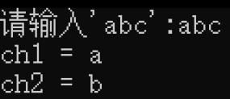

   **案例改编：输入字符`'abc'`，只取其中的`'a'`和`'c'`**

   ```c
   int fuc() {
   	char ch1, ch2;
   	printf("请输入'abc':");
   	ch1 = getchar();
   	getchar();
   	ch2 = getchar();
   	printf("ch1 = %c\n", ch1);
   	printf("ch2 = %c\n", ch2);
   }
   int main(int argc, char *argv[]) {
   	fuc();
   	return 0;
   }
   ```

   **打印效果如下：**

   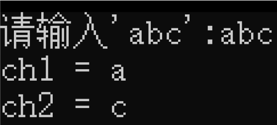

   **案例原理：**

   `getchar()`函数能够依次在键入字符串中拿取字符，若没有被赋值项，则该字符被丢弃；

2. **转义字符：**

   - `\n` 换行字符;

   - `\t` 跳格，等于 `tab`;

   - `\\` 反斜杠;

   - `%%` 百分号;

   - `\0` 将字符转义成数字

     **示例如下：**

     ```c
     int fuc() {
     	printf("%d\n",0);
     	printf("%d\n", '\0');
     }
     int main(int argc, char *argv[]) {
     	fuc();
     	return 0;
     }
     ```

     **打印效果如下：**

     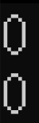

### 字符串----`""`作用 

案例：程序员的第一条代码；

```c
int func() {
	// %s 就是输出字符串
	// %s 从字符串的首元素，逐个字符输出，遇到'\0'，结束
	printf("%s", "hello world\n");
	// 所以系统会在字符串末尾自动添加一个结束字符 '\0'
	printf("\"hello world\"的内存大小是 %d\n", sizeof("hello world"));
}
int main(int argc, char *argv[]) {
	func();
	return 0;
}
```

打印效果如下：

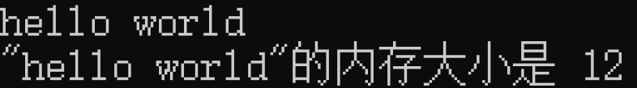

**问：为什么 `hello world` 占12个比特大小而不是11个比特大小呢？**

**答：因为字符串默认以 `\0` 结尾；**

<mark><b>注意</b></mark>：`""` **双引号取的是字符串的首元素地址，而`''`单引号取的是字符串的首元素ASCII值；`%s` 从字符串的首元素，逐个字符输出，遇到`'\0'`，结束;**

**示例如下：**

```c
int func() {
    //双引号取的是字符串的首元素地址
	printf("%d\n", "hello world");
    //%s 从字符串的首元素，逐个字符输出，遇到'\0'，结束
	printf("%s\n", "hello wo\0rld");
}
int main(int argc, char *argv[]) {
	func();
	return 0;
}
```

**打印效果如下：**

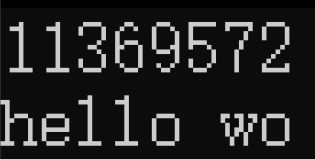

### 总结一下

| **格式化输出** |        **意义**        |
| :------------: | :--------------------: |
|     **%d**     |  **十进制有符号整数**  |
|     **%u**     |  **十进制无符号整数**  |
|    **%ld**     | **十进制有符号长整型** |
|    **%lu**     | **十进制无符号长整型** |
|    **%hd**     | **十进制有符号短整型** |
|    **%hu**     | **十进制无符号短整型** |
|     **%o**     |  **八进制有符号整数**  |
|     **%x**     | **十六进制有符号整数** |
|     **%f**     |       **浮点数**       |
|     **%e**     |  **指数形式的浮点数**  |
|    **%lf**     |   **double型浮点数**   |
|     **%c**     |      **单个字符**      |
|     **%s**     |       **字符串**       |
|     **%p**     |      **指针的值**      |

**特殊应用示例如下：**

```c
int func() {
	printf("###################\n");
	// %5d 表示占5个终端位宽 右对齐
	printf("##%5d##\n", 123);
	// %-5d 表示占5个终端位宽 左对齐
	printf("##%-5d##\n",123);
	// %05d 表示占5个终端位宽 右对齐 空位用0补齐
	printf("##%05d##\n", 123);
	//千万不能写 %-05d
	//printf("##%-05d##",123);没办法输出出来
	// %5.2f 5表示总位宽为5，2表示小数点保留俩位
	printf("##%5.2f##\n", 3.1);
}
int main(int argc, char *argv[]) {
	func();
	return 0;
}
```

**打印效果如下：**

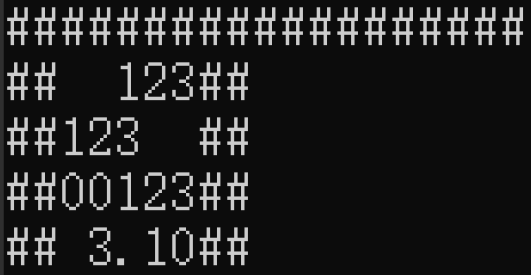

| **格式化** |                 **意义**                 |
| ---------- | :--------------------------------------: |
| **%5d**    |       **表示占5个终端位宽 右对齐**       |
| **%05d**   | **表示占5个终端位宽 右对齐 空位用0补齐** |
| **%-5d**   |       **表示占5个终端位宽 左对齐**       |
| **%5.2f**  | **5表示总位宽为5，2表示小数点保留俩位**  |

**`typedef` 类型重定义：为已有的类型重新取个别名步骤**

1. 用已有的类型定义一个变量;
2. 用别名替换变量名;
3. 在整个表达式的前方加上 `typedef`;

**案例一：给 `int` 取别名 `INT32`**

```c
typedef int INT32;
```

**案例二：给一个数组 `arr[5]` 取一个别名**

- step1:

  ```c
  int arr[5];
  ```

- step2:

  ```c
  int ARR[5];
  ```

- step3:

  ```c
  typedef int ARR[5];
  ```

- 最终如下：

  ```c
  typedef int ARR[5];
  ARR arr;//arr就是一个拥有5个int元素的数组
  ```

### 数据的混合运算

数据有不同的类型，不同类型数据之间进行混合运算时必然涉及到类型的转换问题；

转换的方法有两种：$\begin{cases}\bf{自动转换：遵循一定的规则，由编译系统自动完成；}\\\bf{强制类型转换：把表达式的运算结果强制转换成所需的数据类型；}\end{cases}$

- 自动类型转换（图示）：

  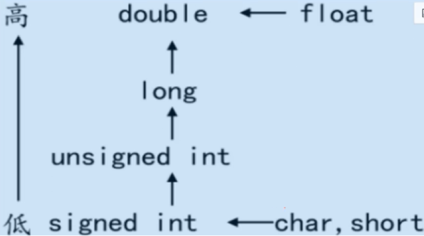

  案例：有符号和无符号的转换；

  ```c
  int way() {
  	int data1 = -20;
  	unsigned int data2 = 10;
  	//有符号和无符号计算时，先将有符号转换成无符号
  	//则这里会将 -20 转换成无符号（-20的补码，很大的数）
  	if (data1 + data2 > 0) {
  		printf(">0\n");
  	}
  	else if(data1 + data2 < 0) {
  		printf("<0\n");
  	}
  }
  int main(int argc, char *argv[]) {
  	way();
  	return 0;
  }
  ```

  打印效果如下：

  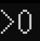

  案例：`int` 和 `double` 的转换；

  ```c
  int way() {
  	int data = 10;
  	// 3.14 是 double 类型，data 是 int 类型
  	//应该先把 int 转换成 double
  	printf("%d\n", sizeof(data + 3.14));
  }
  int main(int argc, char *argv[]) {
  	way();
  	return 0;
  }
  ```

  打印效果如下：

  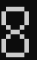

  案例：`short` 和 `char` 的类型转换；

  ```c
  int way() {
  	char ch = 'a';
  	short data = 20;
  	//由于 char short 自身字节数过小，很容易溢出
  	//所以只要它们参加运算，都会被系统转换为 int 类型
  	printf("%d\n", sizeof(ch + ch));
  	printf("%d\n", sizeof(ch + data));
  	printf("%d\n", sizeof(data + data));
  }
  int main(int argc, char *argv[]) {
  	way();
  	return 0;
  }
  ```

  打印效果如下：

  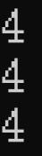

  案例：`double` 和 `float` 的类型转换；

  ```c
  int way() {
      // 3.14 是 double 类型
      // 3.14f 是 float 类型
  	printf("%d\n", sizeof(3.14 + 3.14f));
  }
  int main(int argc, char *argv[]) {
  	way();
  	return 0;
  }
  ```

  打印效果如下：

  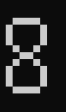

- 强制转换：通过类型转换运算来实现；

  公式如下：
  $$
  (类型说明符) 表达式
  $$
  注意：

  类型说明符要用小括号给括起来；

  功能：

  把表达式的运算结果强制转换成类型说明符所表示的类型；

  例如下：

  ```c
  int way() {
  	float x = 3.14f;
  	int j;
      //强制类型转换只是在当前语句起作用，并没有改变 x 是 float 的实时；
  	j = (int)x;    
  	printf("%d\n", j);
  }
  int main(int argc, char *argv[]) {
  	way();
  	return 0;
  }
  ```

  打印效果如下：

  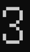

- 无论是强制类型转换还是自动转换，都只是为了本次运算的需要，而对变量的数据长度进行的临时性转换，而不改变数据定义的类型；

- 为什么printf()用%f输出double型，而scanf却用%lf呢？

  答：printf的%f说明符的确既可以输出float型又可以输出double型。 根据"默认参数提升"规则（在printf这样的函数的可变参数列表中 ，不论作用域内有没有原型，都适用这一规则）float型会被提升为double型。因此printf()只会看到双精度数。参见问题15.2。

  对于scanf，情况就完全不同了，它接受指针，这里没有类似的类型提升。（通过指针）向float存储和向double存储大不一样，因此，scanf区别%f和%lf。

  下表列出了printf和scanf对于各种格式说明符可以接受的参数类型。


## 2.3.运算符

用运算符将运算对象连接起来，复合C语言语法规则的式子，称为C算术表达式；

运算对象包括常量，变量和函数等：

例如：`a*b/c-1.5+'a'`

### 算数运算符

| **符号** | **意义** |
| :------: | :------: |
| **`+`**  | **加法** |
| **`-`**  | **减法** |
| **`*`**  | **乘法** |
| **`/`**  | **取整** |
| **`%`**  | **取余** |

示例如下：

```c
int way() {
	printf("%d\n", 5 + 2);
	printf("%d\n", 5 - 2);
	printf("%d\n", 5 * 2);
    // 5/2 = 2···1 取整之后为 2
	printf("%d\n", 5 / 2);
    // 5/2 = 2···1 取余之后为 1
	printf("%d\n", 5 % 2);
}
int main(int argc, char *argv[]) {
	way();
	return 0;
}
```

打印效果如下：

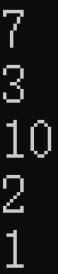

如果我们想要做一次生活当中的除法，示例如下：

```c
int way() {
	printf("%f\n", 5 / 2.0f);//加一个浮点数就是除法
}
int main(int argc, char* argv[]) {
	way();
	return 0;
}
```

打印效果如下：

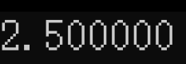

案例：键盘输入一个数，判断其是否能被 3 整除；

```c
int way() {
	printf("请输入一个数：");
	int num;
	scanf_s("%d", &num);
	if (num / 3 == 0) {
		printf("这个数能被 3 整除\n");
	}
	else if (num / 3 != 0) {
		printf("这个数不能被 3 整除\n");
	}
}
int main(int argc, char *argv[]) {
	way();
	return 0;
}
```

打印效果如下：

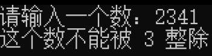

案例：键盘输入一个四位数，请取出每位上的数值；

```c
int way() {
	printf("请输入一个四位数：");
	int num,num1,num2,num3,num4;
	scanf_s("%d", &num);
	num1 = num % 10;
	num2 = num % 100 / 10;
	num3 = num / 100 % 10;
	num4 = num / 1000;
	printf("个位：%d  十位：%d  百位：%d  千位：%d", num1, num2, num3, num4);
}
int main(int argc, char *argv[]) {
	way();
	return 0;
}
```

打印效果如下：

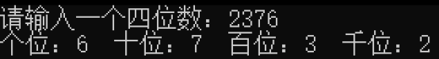

### 关系运算符

| **符号** |   **意义**   |
| :------: | :----------: |
| **`>`**  |   **大于**   |
| **`<`**  |   **小于**   |
| **`==`** |   **等于**   |
| **`>=`** | **大于等于** |
| **`<=`** | **小于等于** |
| **`!=`** |  **不等于**  |

### 逻辑运算符

| **符号** |  **意义**  |
| :------: | :--------: |
| **`!`**  | **逻辑非** |
| **`&&`** | **逻辑与** |
| **`||`** | **逻辑或** |

- 逻辑非：

  C语言中只有 `0` 为假，其他的数都为真：

  `！0 == Ture		！Ture == False`

  示例如下：

  ```c
  int way() {
  	printf("%d\n", !1);
  	printf("%d\n", !-1);
  	printf("%d\n", !0);
  }
  int main(int argc, char* argv[]) {
  	way();
  	return 0;
  }
  ```

  打印效果如下：

  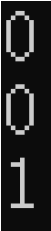

- 逻辑与：

  1. `A && B` ：当 `A` `B` 同时为真，整个表达式才为真；只要`A` `B` 有一个为假，整个表达式也为假；

     示例如下：

     ```c
     int way() {
     	if (3 > 2 && 5 > 4) {
     		printf("ok\n");
     	}
     	else {
     		printf("no\n");
     	}
     	if (2 > 3 && 5 > 4) {
     		printf("ok\n");
     	}
     	else {
     		printf("no\n");
     	}
     }
     int main(int argc, char* argv[]) {
     	way();
     	return 0;
     }
     ```

     打印效果如下：

  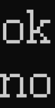

  2. 逻辑与的短路特性

     `A && B` ：如果`A`为假，系统不会执行`B`，这就是`&&`的短路特性；

     示例如下：

     ```c
     //验证短路特性
     int way() {
     	int num = 10;
     	printf("比较之前num = %d\n", num);
     	(2 > 3) && (num = 100);
     	printf("比较之后num = %d\n", num);
     }
     int main(int argc, char* argv[]) {
     	way();
     	return 0;
     }
     ```

     打印效果如下：

     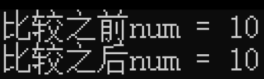

- 逻辑或：

  `A || B` 只要 `A` `B` 任意一个为真，整个表达式为真； `A` `B` 同时为假，整个表达式才为假；

  示例如下：

  ```c
  int way() {
  	// 假 假
  	if ((3 < 2) || (5 < 4)) {
  		printf("ok\n");
  	}
  	else {
  		printf("no\n");
  	}
  	// 真 假
  	if (3 > 2 || 5 < 4) {
  		printf("ok\n");
  	}
  	else {
  		printf("no\n");
  	}
  	// 真 真
  	if (3 > 2 || 5 > 4) {
  		printf("ok\n");
  	}
  	else {
  		printf("no\n");
  	}
  }
  int main(int argc, char* argv[]) {
  	way();
  	return 0;
  }
  ```

  打印效果如下：

  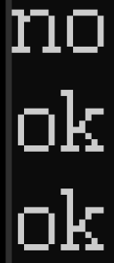

  逻辑或也有短路特性：

  ```c
  int way() {
  	int num = 10;
  	printf("比较之前的num = %d\n", num);
  	(3 > 2) || (num = 100);
      // num = 100 等不到执行
  	printf("比较之后的num = %d\n", num);
  }
  int main(int argc, char* argv[]) {
  	way();
  	return 0;
  }
  ```

  打印效果如下：

  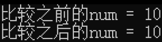

- 综合案例：表示横轴区间；

  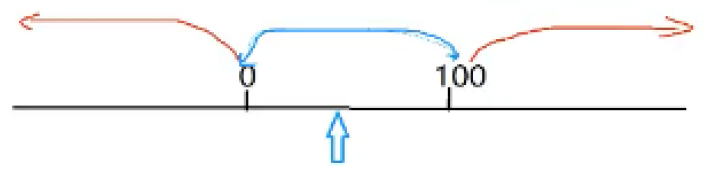

  注释：蓝色表示`0-100`且不包含 0 和 100

  1. 蓝色：

     ```c
     x < 100 && x > 0;
     ```

  2. 红色：

     ```c
     x >= 100 || x <=0;
     ```

### 位运算符

主要是指二进制位的操作；

| **符号** |   **意义**   |
| :------: | :----------: |
| **`>>`** |   **右移**   |
| **`<<`** |   **左移**   |
| **`&`**  |  **按位与**  |
| **`|`**  |  **按位或**  |
| **`~`**  | **按位取反** |
| **`^`**  | **按位异或** |

- **左移：`<<`**

  **示例如下**：我们将 `10101100` 左移两位；

  ```c
  1010 1100 << 2;
  //(10)10 1100 00 移出的丢弃掉，空缺的用 0 去补;
  //结果为 1011 0000
  ```
  
  注意：移动的位数不要超过或者等于自身长度；
  
- **右移：`>>`**

  **示例如下**：我们将 `10101100` 右移两位；

  ```c
  1010 1100 >> 2;
  // 11/00 1010 11(00) 移出的丢弃掉，空缺的用 0 或 1 去补；
  //结果为 1110 1011 或者 0010 1011
  ```

  $$
  \bf{右移}\begin{cases} \bf{逻辑右移：右边丢弃，左边补0} \\ \bf{算术右移} \begin{cases} \bf{无符号数：右边丢弃，左边补0}\\\bf{有符号数：}\begin{cases} \bf{正数：右边丢弃，左边补0}\\\bf{负数：右边丢弃，左边补1} \end{cases} \end{cases} \end{cases}
  $$

  注意：右移有且只有是负数且算术右移时，左边才会补 1 ；

  逻辑右移和算术右移是编译器决定的，我们可以对此做出检测；

  示例如下（以VS为例）：

  ```c
  void method() {
  	char ch = 0x85;//1000 0101
  	//逻辑右移：1000 0101>>4 == 0000 1000 == 0x08
  	//算术右移：1000 0101>>4 == 1111 1000 == 0xf8
  	ch = ch >> 4;
  	printf("%#x\n", ch);
  }
  int main(int argc, char* argv[]) {
  	method();
  	return 0;
  }
  ```

  打印效果如下：

  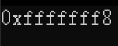

  打印结果分析：

  因为 `ch` 是 char 型，占内存为 1B，而输出得是 int 型，占内存为 4B，`f` 是编译器自己补上去的，所以只看最后两位 `f8` ，该结果满足算术右移，所以判断 VS 是算术右移编译器；

- **按位与：`&`**

  `0 & 0 = 0` `0 & 1 = 0` `1 & 1 = 1` 

  **即**：全一为一，其他为零；

  **示例如下**：

  ```
  	1010 1010
    &	1111 0000
   ---------------
  	1010 0000
  ```

  **特点**：和一相与保持，和零相与清零；

  **应用场景**：将固定位清零；

- **按位或：`|`**

  `0 | 0 = 0` `1 | 0 = 1` `1 | 1 = 1`

  **即**：全零为零，其他为一；

  **示例如下**：

  ```
  	1010 1010
    |	1111 0000
   ---------------
  	1111 1010
  ```

  **特点**：和零相或保持，和一相或置一；

  **应用场景**：将固定位置一；

  **案例**：将1010 1010的第2、3位置一，其他位保持不变

  ```
  位次 7654 3210
   ---------------
  题目:
  	1010 1010
    | 
   ---------------
  	1010 1110
  答：
  	1010 1010
    | 0000 1100
   ---------------
  	1010 1110
  ```

- **按位取反：`~`**

  `~ 0 = 1` `~ 1 = 0`

  **即**：零变一，一变零；

  **示例如下**：

  ```
  ~1010 1010 == 0101 0101
  ```

  **应用场景**：配合 `&` `|` 操作；

- **按位异或**：`^`

  `1 ^ 1 = 0` `0 ^ 0 = 0` `1 ^ 0 = 1`

  **即**：相同为零，相反为一；

  **示例如下**：

  ```
  	1010 1010
    ^ 0000 1111
   ---------------
  	1010 0101
  ```

  **特点**：和零异或保持，和一异或取反；

  **应用场景**：将固定位发生高低电平反转；

  **案例**：将1010 1010第零位发生翻转；

  ```
  位次 7654 3210
   ---------------
  题目：
  	1010 1010
    ^ 
   ---------------
  	1010 1011
  答：
  	1010 1010
    ^ 0000 0001
   ---------------
  	1010 1011
  ```

### 其他运算符

|    **符号**     |      **意义**      |
| :-------------: | :----------------: |
|     **`=`**     |   **赋值运算符**   |
|  **`?`和`:`**   |   **条件运算符**   |
|     **`,`**     |   **逗号运算符**   |
| **`*` 和 `&`**  |   **指针运算符**   |
| **`sizeof()`**  | **求字节数运算符** |
| **`.` `-` `>`** |   **分量运算符**   |
|   **`[` `]`**   |   **下标运算符**   |

- **条件运算符----`?`和`:`**

  **用法**：`表达式? a : b`，若表达式为真，则输出`a`，否则输出`b`。

  **示例如下**：

  ```c
  int way() {
  	int ret = 0;
  	ret = 3 > 2 ? 5 : 6;
  	printf("ret = %d\n", ret);
  }
  int main(int argc, char* argv[]) {
  	way();
  	return 0;
  }
  ```

  打印效果如下：

  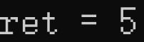

- **逗号运算符**

  逗号运算符的优先级最低，且计算顺序从左往右，所以逗号运算符在括号里时，会遍历括号里的元素，直至最后；

  **示例如下**：

  ```c
  void way() {
  	int data1 = 0;
  	int data2 = 0;
  	data1 = 3, 4, 5, 6;
  	data2 = (3, 4, 5, 6);
  	printf("data1 = %d\n", data1);
  	printf("data2 = %d\n", data2);
  }
  int main(int argc, char* argv[]) {
  	way();
  	return 0;
  }
  ```

  打印效果如下：

  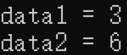

### 综合案例

**注意**：我们用十六进制去表示二进制，比如：`0xaa` 代表 `1010 1010`；

- 将 `1010 1010` 的第`1`，`5`位 清零，第`3`，`4`位 置一；

  方法一：

  ```c
  int way() {
  	//我们用十六进制去换算二进制
  	signed int num = 0xaa;
  	num = num & 0xcc;
  	num = num | 0x18;
  	printf("%x\n", num);
  }
  int main(int argc, char* argv[]) {
  	way();
  	return 0;
  }
  ```

  方法二：

  ```c
  int way() {
  	//我们用十六进制去换算二进制
  	signed int num = 0xaa;
  	num = num & ~(0x01 << 5 | 0x01 << 1); //可读性 1 5 位清零
  	num = num | (0x01 << 4 | 0x01 << 3);  //可读性 3 4 位置一
  	printf("%x", num);
  }
  int main(int argc, char* argv[]) {
  	way();
  	return 0;
  }
  ```

  打印效果如下：

  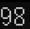

  我们再将 `98` 转换成二进制得：`1001 1000` ;

### 复合运算符

| **符号** |  **意义**  |
| :------: | :--------: |
| **`+=`** |  **加等**  |
| **`-=`** |  **减等**  |
| **`*=`** |  **乘等**  |
| **`/=`** | **除整等** |
| **`%=`** | **除余等** |
|  `++i`   |            |
|  `--i`   |            |
|  `i++`   |            |
|  `i--`   |            |

- 以 `+=` 举例：$A+=B\ <==>\ A =A+B\\A+=B+C\ <==>\ A=A+(B+C)$  

  注意： `=` 右边需要看成一个整体先算；

- `++i` 或者 `--i`：先加减，后使用；

  示例如下：

  ```c
  void way() {
  	int i = 3;
  	int j = 0;
  	j = ++i;
  	printf("i = %d,j = %d", i, j);
  }
  int main(int argc, char* argv[]) {
  	way();
  	return 0;
  }
  ```

  解释：

  `step1：i+1 ==> i==4(先加减)`

  `step2：y=i ==> j==4(然后赋值)`

  打印效果如下：

  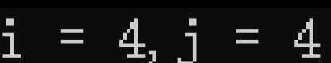

- `i++` 或者 `i--`：先使用，后加减；

  示例如下：

  ```c
  void way() {
  	int i = 3;
  	int j = 0;
  	j = i++;
  	printf("i = %d,j = %d", i, j);
  }
  int main(int argc, char* argv[]) {
  	way();
  	return 0;
  }
  ```

  解释：

  `step1：j=i ==> j==3(先赋值)`

  `step2：i+1 ==> i==4(然后加减)`

  打印效果如下：

  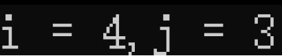

  **注意**：当`i++/--`或者`++/--i`作为单独的指令没有区别；

  示例如下：

  ```c
  void way() {
  	int a = 1;
  	int b = 1;
  	int c = 1;
  	int d = 1;
  	a++;
  	b--;
  	++c;
  	--d;
  	printf("a = %d,b = %d, c = %d, d = %d", a, b, c, d);
  }
  int main(int argc, char* argv[]) {
  	way();
  	return 0;
  }
  ```

   打印效果如下：

  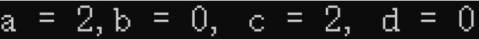

### 优先级

C语言中，运算符的优先级一共分为15级，优先级高的先执行；

同级别的优先级需要看结合性；

优先级如下图：

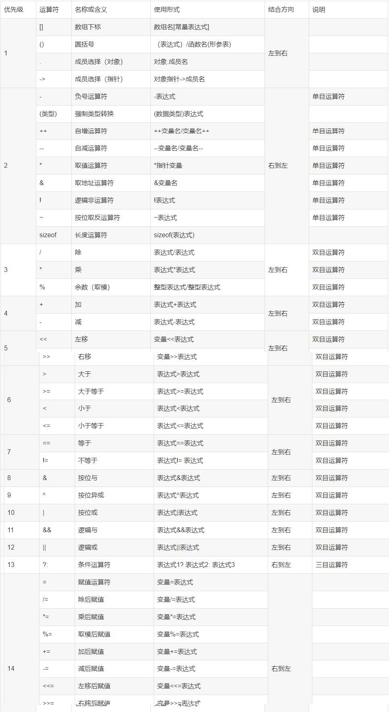

注意：自己写代码时，尽量规范优先级，实在不能确定，用小括号将优先参与运算的部分括起来；

## 2.4.控制语句

### C语言运行结构

$$
\bf{运行结构}\begin{cases} \bf{顺序结构：程序按顺序执行，不发生跳转；}\\\bf{选择结构：依据是否满足条件，有选择的执行相应功能；}\\\bf{循环结构：依据条件是否满足，循环多次执行某段代码；} \end{cases}
$$

### if判断语句

- 如果<mark>只在乎项目的一个结果</mark>，则选择 `if`：

  ```c
  if (表达式){
      语句1;
  }
  ```

  只有表达式为真的时候，才执行语句1；

  案例：判断一个数能被二整除；

  ```
  void function() {
  	int a = 0;
  	printf(" 请输入一个整数：");
  	scanf_s("%d", &a);
  	if (a % 2 == 0) {
  		printf(" %d 能被 2 整除", a);
  	}
  }
  int main(int argc, char* argv[]) {
  	function();
  	return 0;
  }
  ```

  打印效果如下：

  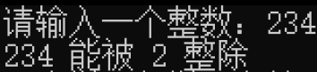

  或者

  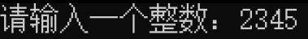

- 如果项目只有<mark>两种结果</mark>且<mark>不会同时出现</mark>，则选择 `if……else……`:

  ```c
  if (表达式){
      语句1;
  }
  else{
      语句2;
  }
  ```

  表达式为真，执行语句1，否则执行语句2；

  案例：判断 data 对 2 的余数；

  ```c
  void function() {
  	int data = 0;
  	printf(" 请输入一个整数：");
  	scanf_s("%d", &data);
  	if (data % 2 == 1) {
  		printf(" %d 对 2 的余数为 1", data);
  	}
  	else {
  		printf(" %d 对 2 的余数为 0", data);
  	}
  }
  int main(int argc, char* argv[]) {
  	function();
  	return 0;
  }
  ```

  打印效果如下：

  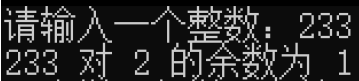
  
  或者
  
  

- 如果一个项目有<mark>多个结果</mark>且<mark>不同时出现</mark>，则选择 `if……else if ……else if……else`:

  ```c
  if(表达式1){
      语句1;
  }
  else if(表达式){
      语句2;
  }
  //……
  //一共 n 个
  //……
  else{
      语句n;
  }
  ```

  只有表达式1为真，执行语句1，只有表达式2为真，执行语句2，所有表达式都为假，才执行语句n;

  案例：判断data对3的余数；

  ```c
  void function() {
  	int data = 0;
  	printf(" 请输入一个整数：");
  	scanf_s("%d", &data);
  	if (data % 3 == 2) {
  		printf(" %d 对 3 的余数为 2\n", data);
  	}
  	else if (data % 3 == 1) {
  		printf(" %d 对 3 的余数为 1\n", data);
  	}
  	else {
  		printf(" %d 对 3 的余数为 0\n", data);
  	}
  }
  int main(int argc, char* argv[]) {
  	function();
  	return 0;
  }
  ```

  打印效果如下：

  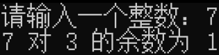

  或者

  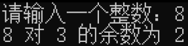

  或者

  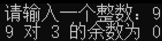

  注意：在 `else if` 中，只有前面的条件不满足，才会判断后面的条件，如果前面的条件满足了，后面的条件不管真假都不会执行；

  示例如下：

  ```c
  void function() {
  	if (6 % 2 == 0) {
  		printf(" 6%%2\n");
  	}
  	else if (6 % 3 == 0) {
  		printf(" 6%%3\n");
  	}
  	else if (6 % 1 == 0) {
  		printf(" 6%%1\n");
  	}
  }
  int main(int argc, char* argv[]) {
  	function();
  	return 0;
  }
  ```

  打印效果如下：

  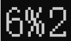

- 一个项目有<mark>多个结果</mark>，<mark>不确定是否同时出现</mark>，则选择`if……if……if……`:

  ```c
  if(表达式1){
  	语句1;
  }
  if(表达式2){
  	语句2;
  }
  //……
  //一共 n 个
  //……
  if(表达式n){
  	语句n;
  }
  ```

  注意：每一个 `if` 语句是独立的，所以这样写就不会按顺序表达，且不会停止判断；

- 案例（键盘输入一个数，判断能否被3和7同时整除）；

  ```c
  void function() {
  	int num = 0;
  	printf(" 请输入一个整数：");
  	scanf_s("%d", &num);
  	if ((num % 3 == 0) & (num % 7 == 0)) {
  		printf(" %d 能同时被 3 和 7 整除\n",num);
  	}
  	else {
  		printf(" %d 不能同时被 3 和 7 整除\n", num);
  	}
  }
  int main(int argc, char* argv[]) {
  	function();
  	return 0;
  }
  ```

  打印效果如下：

  

  或者

  

### switch选择语句

```c
switch(表达式){
case 值1:
    语句1;
    break;
case 值2:
    语句2;
    break;
case 值3:
    语句3;
    break;
//……
//一共 n 个
//……
default:
    语句n;
    break;
}
```

注意：`switch` 中的<mark>值</mark>不能是<mark>浮点型</mark>，只能是<mark>整型</mark>或者<mark>字符型</mark>，<mark>default可以省略</mark>，大部分 `case` 语句都会跟上 `break`；

整型示例如下：

```c
void function() {
	int num = 0;
	printf(" 请输入一个整数：");
	scanf_s("%d", &num);
	switch (num % 3) {
	case 1:
		printf(" %d 对 3 的余数是 1\n",num);
		break;
	case 2:
		printf(" %d 对 3 的余数是 2\n",num);
		break;
	default:
		printf(" %d 对 3 的余数是 0\n", num);
		break;
	}
}
int main(int argc, char* argv[]) {
	function();
	return 0;
}
```

打印效果如下：


字符型示例如下：

```c
void function() {
	char ch = 0;
	printf(" 请输入一个方向（wsad）：");
	//ch = getchar();
	scanf_s("%c", &ch);
	//按键不会区分大小写，所以代码如下
	switch (ch) {
	case 'w':
	case 'W':
		printf(" 你正在前进！\n");
		break;
	case 's':
	case 'S':
		printf(" 你正在退后！\n");
		break;
	case 'a':
	case 'A':
		printf(" 你正在左转！\n");
		break;
	case 'd':
	case 'D':
		printf(" 你正在右转！\n");
		break;
	}
}
int main(int argc, char* argv[]) {
	function();
	return 0;
}
```

打印效果如下：


案例：键盘输入 1-7 的数，用switch判断今天是星期几；

```c
void function() {
	int num = 0;
	printf(" 这是一个判断星期的程序，请输入一个整数：");
	scanf_s("%d", &num);
	switch (num) {
	case 1:
		printf(" 星期一\n");
		break;
	case 2:
		printf(" 星期二\n");
		break;
	case 3:
		printf(" 星期三\n");
		break;
	case 4:
		printf(" 星期四\n");
		break;
	case 5:
		printf(" 星期五\n");
		break;
	case 6:
		printf(" 星期六\n");
		break;
	case 7:
		printf(" 星期天\n");
		break;
	default:
		printf(" 输入超范围！\n");
		break;
	}
}
int main(int argc, char* argv[]) {
	function();
	return 0;
}
```

打印效果如下：


### for循环语句

```c
for(初始语句 ; 循环条件 ; 步进条件){
    循环语句;
}
```

公式讲解：
$$
for\bf{循环}\begin{cases} \bf{初始语句：只在循环开始时执行一次} \\ \bf{循环条件：每一次循环都要执行，循环条件为真，进入循环体，否则退出循环体}\\\bf{步进语句：每次循环结束后，要执行的语句} \end{cases}
$$
内部运行图示：


案例：求 `1-100` 的和；

```c
void method() {
	int num = 0;
	int i = 0;
	for (i = 1; i <= 100; i++) {
		num += i;
	}
	printf(" 1 到 100 的和为 %d", num);
}
int main(int argc, char* argv[]) {
	method();
	return 0;
}
```

打印效果如下：


案例：求 `1-10` 的积；

```c
void method() {
	int num = 1;
	int i = 1;
	for (i = 1; i <= 10; i++) {
		num *= i;
	}
	printf(" 1 到 10 的积为 %d\n", num);
}
int main(int argc, char* argv[]) {
	method();
	return 0;
}
```

打印效果如下：


注意：如果变量提前初始化了，那么for循环里面的初始语句可以省略；如果循环语句中实现了步进条件，则步进条件也可以省略；如果循环中设置过退出循环的条件，for循环里面的循环条件也可以省略。

示例如下：

```c
void method() {
	int num = 0;
	int i = 1;//在 for 循环外初始化
	for (;;) {
		if (i > 100) {
			break;//跳出循环
		}
		num += i;
		i++;
	}
	printf(" 1 到 100 的和为 %d\n", num);
}
int main(int argc, char* argv[]) {
	method();
	return 0;
}
```

打印效果如下：


- **break：**

  break只能跳出离它最近的循环；

  ```c
  void method() {
  	for (;;) {     //for1
  		for (;;) { //for2
  			break; //break只能跳出离它最近的循环，即 for2
  		}
  	}
  }
  int main(int argc, char* argv[]) {
  	method();
  	return 0;
  }
  ```

- **continue**

  结束当前循环，立刻从当前位置进入下一次循环；

  ```c
  void method() {
  	int i = 0;
  	int sum = 0;
  	for (i = 1 ; i <= 100; i++) {
  		if (i == 50) {
  			continue; //结束本次循环，立即从当前位置直接进入下一次循环
  		}
  		sum += i;
  	}
  	printf("sum = %d\n", sum);
  }
  int main(int argc, char* argv[]) {
  	method();
  	return 0;
  }
  ```

  打印效果如下：

  

- 案例：求出 `1-100` 中能被 `7` 整除的数；

  ```c
  void method() {
  	int num = 0;
  	int i = 0;
  	/*for (i = 1; i <= 100; i++) {
  		if (i % 7 != 0) {
  			continue;
  		}*/
  		if (i % 7 == 0) {
  			printf(" %2d 能被 7 整除\n",i);
  		}
  	}
  }
  int main(int argc, char* argv[]) {
  	method();
  	return 0;
  }
  ```

  打印效果如下：

  

- 案例：求出 `0-100` 中所有偶数的和；

  ```c
  void method() {
  	int num = 0;
  	int i = 0;
  	for (; i <= 100; i++) {
  		if (i % 2 == 0) {
  			num += i;
  		}
  	}
  	printf(" 0 - 100 中所有偶数的和为 %d\n", num);
  }
  int main(int argc, char* argv[]) {
  	method();
  	return 0;
  }
  ```

  打印效果如下：

  

- 补充：循环嵌套循环（99乘法表）；

  ```c
  void method() {
  	int i = 0;
  	int j = 0;
  	for (i = 1; i < 10; i++) {
  		for (j = 1; j < i+1; j++) {
  			printf("%d * %d = %2d   ", j, i, i * j);
  		}
  		printf("\n");
  	}
  }
  int main(int argc, char* argv[]) {
  	method();
  	return 0;
  }
  ```

  打印效果如下：

  

### while循环

- **while循环**

  ```c
  while(循环条件){
  	循环语句;
  }
  ```

  如果循环条件为真，就进入循环体，并且执行循环语句；

  **注意：**

  while没有初始化语句，所以我们应该提前设置好；

  while没有步进条件，所以我们需要再循环语句中写好步进语句；

  **案例：**

  求 `1-100` 的和；

  ```c
  void method() {
  	int num = 0;
  	int i = 1;
  	while (i <= 100) {
  		num += i;
  		i++;
  	}
  	printf("1 - 100 的和为 %d\n", num);
  }
  int main(int argc, char* argv[]) {
  	method();
  	return 0;
  }
  ```

  打印效果如下：

  

  求 `1-10` 的积；

  ```c
  void method() {
  	int num = 1;
  	int i = 1;
  	while (i <= 10) {
  		num *= i;
  		i++;
  	}
  	printf("1 - 10 的积为 %d\n", num);
  }
  int main(int argc, char* argv[]) {
  	method();
  	return 0;
  }
  ```

  打印效果如下：

  

  求出 `1-100` 中能被 `7` 整除的数；

  ```c
  void method() {
  	int i = 1;
  	while (i <= 100) {
  		if (i % 7 == 0) {
  			printf(" %2d 能被 7 整除\n",i);
  		}
  		i++;
  	}
  }
  int main(int argc, char* argv[]) {
  	method();
  	return 0;
  }
  ```

  打印效果如下：

  

  求出 `0-100` 中所有偶数的和；

  ```c
  void method() {
  	int num = 0;
  	int i = 1;
  	while (i <= 100) {
  		if (i % 2 == 0) {
  			num += i;
  		}
  		i++;
  	}
  	printf(" 0 - 100 中所有偶数的和 %d\n", num);
  }
  int main(int argc, char* argv[]) {
  	method();
  	return 0;
  }
  ```

  打印效果如下：

  

- **do……while()循环**（相对于 while ， do……while() 不常用）

  ```c
  do{
      循环语句;
  }
  while(循环条件);
  ```

  先执行循环语句，再判断循环条件是否为真，进行下次循环，否则直接退出循环；

  示例如下 ：

  ```c
  void method() {
  	int num = 3;
  	do {
  		printf("ok!");
  	}
  	while (num < 0);
  	//如果这里用 while ，“ok!”是不会打印出来的
  }
  int main(int argc, char* argv[]) {
  	method();
  	return 0;
  }
  ```

  打印效果如下：

  

- **goto跳转**

  ```c
  void method() {
  	printf("------001------\n");
  	printf("------002------\n");
  	printf("------003------\n");
  	goto position;//这里是分号
  	printf("------004------\n");
  	printf("------005------\n");
  	printf("------006------\n");
  	printf("------007------\n");
  	position://这里是冒号
  	printf("------008------\n");
  	printf("------009------\n");
  }
  int main(int argc, char* argv[]) {
  	method();
  	return 0;
  }
  ```

  打印效果如下：

  

  能看出：`goto` 所包含的一部分没有被打印出来；

  案例：重复输入 1-7 的数字判断星期，输入 0 时结束程序，其他的数请提示“请重新输入有效数字”

  ```c
  void method() {
  	int num = 0;
  	int i = 0;
  	for (i = 1; i > 0;) {
  		printf("请输入一个整数（0-7）判断日期，输入零结束程序：");
  		scanf_s("%d", &num);
  		if (num == 1) {
  			printf("星期一！\n");
  		}
  		else if (num == 2) {
  			printf("星期二！\n");
  		}
  		else if (num == 3) {
  			printf("星期三！\n");
  		}
  		else if (num == 4) {
  			printf("星期四！\n");
  		}
  		else if (num == 5) {
  			printf("星期五！\n");
  		}
  		else if (num == 6) {
  			printf("星期六！\n");
  		}
  		else if (num == 7) {
  			printf("星期天！\n");
  		}
  		else if (num == 0) {
  			i -= 1;
  			printf("程序已退出！\n");
  		}
  		else {
  			printf("请重新输入有效数字!\n");
  		}
  	}
  }
  int main(int argc, char* argv[]) {
  	method();
  	return 0;
  }
  ```

  打印效果如下：

  

### 总结

- **for 和 while 我们如何选择？**

  如果循环的次数是确定的，建议用 `for` ;

  如果循环的次数不确定，只知道退出的条件，建议用 `while` ;

# 3.数组

## 3.1.数组的概念

**概念**：在程序设计中，为了方便处理数据，把具有相同类型得若干变量按连续空间形式储存起来——称为数组；数组属于构造数据类型，一个数组可以分解为多个数组元素，这些数组元素可以是基本数组类型或者构造类型；

## 3.2.数组的分类

$$
按照数组元素分类\begin{cases} 基本数据类型：int\ a[10]\\ 结构类型：struct\ stu\ boy[10]\end{cases}\\ \\
按照数组类型分类\begin{cases} 数值数组：int\ a[10] \\字符数组： char\ s[10] \\指针数组： char\ ^*p[10] \\结构数组 \end{cases}
$$

## 3.3.一维数组

### 一维数组的定义

- **数组的定义**：

  **需求**：请定义一个数组，该数组有 10 个元素，元素都为 int 类型；

  **定义的过程**：

  - `arr[]` --------`arr` 和 `[]` 结合是数组；
  - 将确定的元素的个数放入 `[]` 中；
  - 用元素的类型定义一个普通变量；
  - 然后

  示例如下：

  ```c
  int arr[10];
  ```

  再定义一个数组，该数组有 10 个整型元素，元素都为地址类型（指针）；

  ```c
  int *arr[10];
  ```
  
  注意：
  
  - 数组名不能和其他变量名同名；
  - 数组的元素小标是从 0 开始；
  - `arr[10]` 里的元素是 arr[0]、arr[1]、……、arr[9] ，如果访问 `arr[10]` ，数组越界；
  - 数组的元素等价于普通变量；
  - 在定义数组的时候，[]里面的值不能是变量；（最新的C标准是可以的）
  
- 案例：遍历数组；

  ```c
  void method() {
  	int arr[10];
  	int i = 0;
  	//遍历数组
  	printf("\n");
  	for (i = 0; i < 10; i++) {
  		printf(" %d ", arr[i]);
  	}
  	printf("\n");
  }
  int main(int argc, char* argv[]) {
  	method();
  	return 0;
  }
  ```

  打印效果如下：

  

### 初始化

初始化：定义的时候，给变量或者数组元素赋值的动作，就叫做初始化；

示例如下：

```c
int num = 100;//这是初始化
num = 100;//这是赋值，不是初始化
```

- **全部初始化：**

  ```c
  int arr[5] = {1,2,3,4,5};
  ```

  全部初始化时，元素的个数可以省略： `arr[5] --> arr[]` （尽量少用）

  ```c
  int arr[] = {1,2,3,4,5};
  ```

- **部分初始化：**

  ```c
  int arr[10] = {1,2,3};
  ```

  未被初始化的部分自动补 0 ；

  示例如下：

  ```c
  void method() {
  	int arr[10] = { 1,2,3 };
  	int i = 0;
  	//遍历数组
  	printf("\n");
  	for (i = 0; i < 10; i++) {
  		printf(" %d ", arr[i]);
  	}
  	printf("\n");
  }
  int main(int argc, char* argv[]) {
  	method();
  	return 0;
  }
  ```

  打印效果如下：

  

  **应用：我们可以用部分初始化去重置整个数组；**

  ```c
   int arr[5] = {0};
  ```

  案例如下：

  ```c
  void method() {
  	int arr[10] = {0};
  	int i = 0;
  	//遍历数组
  	printf("\n");
  	for (i = 0; i < 10; i++) {
  		printf(" %d ", arr[i]);
  	}
  	printf("\n");
  }
  int main(int argc, char* argv[]) {
  	method();
  	return 0;
  }
  ```

  打印效果如下：

  

- **扩展（了解）：**

  如果我们想规定第三位和第五位的数字为 5 和 3 ，其他位为 0 ，示例如下：

  ```c
  void method() {
  	int arr[10] = { [2] = 5,[4] = 3 };
  	int i = 0;
  	//遍历数组
  	printf("\n");
  	for (i = 0; i < 10; i++) {
  		printf(" %d ", arr[i]);
  	}
  	printf("\n");
  }
  int main(int argc, char* argv[]) {
  	method();
  	return 0;
  }
  ```

  打印效果如下：

  

### 数组的空间大小

**引入示例：**

```c
void method() {
	int arr[10] = {1,2,3,4,5,6,7,8,9,0};
	printf(" 数组的总大小 = %d\n", sizeof(arr));
    //这里测量的是 arr ，即整个数组
    //如果我们要测数组中的单独元素的大小
    //应该用 arr[0] ~ arr[9] 其中的一个
}
int main(int argc, char* argv[]) {
	method();
	return 0;
}
```

打印效果如下：


可以看出一个数组的内存总大小等于数组内的所有元素内存大小之和；

这样我们也可以推算出整个数组的元素个数：

```c
int n = sizeof(arr)/sizeof(arr[0]);
```

**我们可以利用上例便于代码的移植性：**

首先我们先定义一个数组：

```c
void method() {
	int num[5] = {11,22,33,44,55};
	int i = 0;
	printf("我们对此遍历一下:\n");
	for (i = 0; i < 5; i++) {
		printf(" %d ", num[i]);
	}
}
int main(int argc, char* argv[]) {
	method();
	return 0;
}
```

显然该数组打印结果为 ：`11 22 33 44 55 `

当我们要改变数组中的元素数量再遍历时：

```c
void method() {
	int num[10] = {11,22,33,44,55,66,77,88,99,100};
	int i = 0;
	printf("我们对此遍历一下:\n");
	for (i = 0; i < 10; i++) {
		printf(" %d ", num[i]);
	}
}
int main(int argc, char* argv[]) {
	method();
	return 0;
}
```

这样的修改方法会修改两处，一是修改数组的内容，二是修改` for `循环，所以我们可以优化：

```c
void method() {
	//首先我们先定义一个数组
	int num[10] = {11,22,33,44,55,66,77,88,99,100};
	int i = 0;
	int n = sizeof(num) / sizeof(num[0]);
	printf("我们对此遍历一下:\n");
	for (i = 0; i < n; i++) {
		printf(" %d ", num[i]);
	}
}
int main(int argc, char* argv[]) {
	method();
	return 0;
}
```

可以看出我们可以先将元素个数算出来，然后将该数替换掉原来的循环条件，这样只需要修改数组了；

### 数组元素的操作

```c
void method() {
	int arr[5] = { 1,2,3,4,5 };
	int n = sizeof(arr) / sizeof(arr[0]);
	int i = 0;
	
	//给数组元素赋值
	arr[0] = 100;
	
	//num++;
	arr[1]++;//arr[1] = arr[1] + 1;

	//scanf("%d",&num);
	printf("改变第三位的值：");
	scanf_s("%d", &arr[2]);

	for (i = 0; i < n; i++) {
		printf(" %d ", arr[i]);
	}
	printf("\n");
}
int main(int argc, char* argv[]) {
	method();
	return 0;
}
```

**案例**：定义一个数组，一共五个 int 元素，获取键盘输入；

```c
void method() {
	int arr[5] = { 0 };
	int n = sizeof(arr) / sizeof(arr[0]);
	int i = 0;
	for (i = 0; i < n; i++) {
		printf("一共有 5 位数字，请修改第 %d 位数字:", i+1);
		scanf_s("%d", &arr[i]);
	}
	printf("修改完毕！");
    //最后输出也可以用循环实现
	printf("修改后的结果是：\n %d %d %d %d %d",arr[0], arr[1], arr[2], arr[3], arr[4]); 
}
int main(int argc, char* argv[]) {
	method();
	return 0;
}
```

打印效果如下：


**案例**：定义数组，一共五个int元素，获取键盘输入，并求出最大值，最小值和平均值；

傻乎乎算法：

```c
void method() {
	int arr[5] = { 0 };
	int n = sizeof(arr) / sizeof(arr[0]);
	int i = 0;
	for (i = 0; i < n; i++) {
		printf("一共有 5 位数字，请修改第 %d 位数字:", i+1);
		scanf_s("%d", &arr[i]);
	}
	printf("修改完毕！");
	printf("修改后的结果是：\n %d %d %d %d %d",arr[0], arr[1], arr[2], arr[3], arr[4]);
	int max = 0;
	if (arr[0] >= arr[1] & arr[0] >= arr[2] & arr[0] >= arr[3] & arr[0] >= arr[4]) {
		max = arr[0];
	}
	if (arr[1] >= arr[0] & arr[1] >= arr[2] & arr[1] >= arr[3] & arr[1] >= arr[4]) {
		max = arr[1];
	}
	if (arr[2] >= arr[0] & arr[2] >= arr[1] & arr[2] >= arr[3] & arr[2] >= arr[4]) {
		max = arr[2];
	}
	if (arr[3] >= arr[1] & arr[3] >= arr[2] & arr[3] >= arr[0] & arr[3] >= arr[4]) {
		max = arr[3];
	}
	if (arr[4] >= arr[1] & arr[4] >= arr[2] & arr[4] >= arr[3] & arr[4] >= arr[0]) {
		max = arr[4];
	}
	int min = 0;
	if (arr[0] <= arr[1] & arr[0] <= arr[2] & arr[0] <= arr[3] & arr[0] <= arr[4]) {
		min = arr[0];
	}
	if (arr[1] <= arr[0] & arr[1] <= arr[2] & arr[1] <= arr[3] & arr[1] <= arr[4]) {
		min = arr[1];
	}
	if (arr[2] <= arr[0] & arr[2] <= arr[1] & arr[2] <= arr[3] & arr[2] <= arr[4]) {
		min = arr[2];
	}
	if (arr[3] <= arr[1] & arr[3] <= arr[2] & arr[3] <= arr[0] & arr[3] <= arr[4]) {
		min = arr[3];
	}
	if (arr[4] <= arr[1] & arr[4] <= arr[2] & arr[4] <= arr[3] & arr[4] <= arr[0]) {
		min = arr[4];
	}
	int average = (arr[0] + arr[1] + arr[2] + arr[3] + arr[4]) / n;
	printf("你输入的数字中最大值是 %d ，最小值是 %d ，平均值是 %d\n", max,min,average);
}
int main(int argc, char* argv[]) {
	method();
	return 0;
}
```

打印效果如下：


优化上述算法：

```c
void method() {
	int arr[5] = { 0 };
	int n = sizeof(arr) / sizeof(arr[0]);
	int i = 0;
	int j = 0;
	for (i = 0; i < n; i++) {
		printf("一共有 5 位数字，请修改第 %d 位数字:", i+1);
		scanf_s("%d", &arr[i]);
	}
	printf("修改完毕！");
	printf("修改后的结果是：\n %d %d %d %d %d\n",arr[0], arr[1], arr[2], arr[3], arr[4]);
	int max = 0;
	int count;
	for (i = 0; i < n; i++) {
		count = 0;
		for (j = 0; j < n; j++) {
			if (arr[i] >= arr[j]) {
				count++;
			}
		}
		if (count == 5) {
			max = arr[i];
		}
	}
	int min = 0;
	for (i = 0; i < n; i++) {
		count = 0;
		for (j = 0; j < n; j++) {
			if (arr[i] <= arr[j]) {
				count++;
			}
		}
		if (count == 5) {
			min = arr[i];
		}
	}
	int sigle = 0;
	int average = 0;
	for (i = 0; i < n; i++) {
		sigle += arr[i];
	}
	average = sigle / n;
	printf("你输入的数字中最大值是 %d ，最小值是 %d ，平均值是 %d\n",max,min,average);
}
int main(int argc, char* argv[]) {
	method();
	return 0;
}
```

打印效果如下：


”假设”算法：

```c
void method() {
	int arr[5] = { 0 };
	int n = sizeof(arr) / sizeof(arr[0]);
	int i = 0;
	for (i = 0; i < 5; i++) {
		printf("请你输入第%d个数：", (i + 1));
		scanf_s("%d", &arr[i]);
	}
	int compare = 0;  //此时假设 compare 是最大的
	for (i = 0; i < 5; i++) {
		if (compare < arr[i]) {
			compare = arr[i];
		}
	}
	printf("最大值为%d", compare);
	for (i = 0; i < 5; i++) {
		if (compare > arr[i]) {
			compare = arr[i];
		}
	}
	printf("最小值为%d", compare);
}
int main(int argc, char* argv[]) {
	method();
	return 0;
}
```

打印效果如下：


冒泡排序算法：

```c
#include<stdio.h>
void test() {
	int arr[10];
	int n = sizeof(arr) / sizeof(arr[0]);
	printf("请输入十个数：");
	for (int i = 0; i < n; i++) {
		scanf_s("%d", &arr[i]);
	}
	for (int i = 0; i < n; i++) {
		for (int j = 0; j < n; j++) {
			if (arr[i] <= arr[j]) {
				int temp = arr[i];
				arr[i] = arr[j];
				arr[j] = temp;
			}
			else {
				continue;
			}
		}
	}
	printf("你的排序结果为：");
	for (int i = 0; i < n; i++) {
		printf("%d ", arr[i]);
	}
}

int main(int argc, char* argv[]) {
	test();
	return;
}
```

打印效果如下：


## 3.4.二维数组

C语言允许构造多维数组，多维数组元素有多个下标，以标识它在数组中的位置，所以也成为多下标变量；

多维数组可由二维数组类推而得到；

### 二维数组的定义

**例如下：**

```c
int arr[3][4];
//第一个[]里面的值表示行数，第二个[]里面表示列数;
//arr数组有3行4列;
//3行：0~2行 ， 4列：0~3列;
```

### 二维数组的遍历

示例如下：

```c
void bingo() {
	//二维数组的初始化
	int arr[3][4] = { 0 };
	//遍历第 0 行
	printf("遍历第 0 行：\n");
	int k = 0;
	for (k = 0; k < 4; k++) {
		printf(" %d ", arr[0][k]);
	}
	printf("\n");
	printf("\n");
	//遍历第 0 列
	printf("遍历第 0 列：\n");
	int l = 0;
	for (l = 0; l < 3; l++) {
		printf(" %d \n", arr[l][0]);
	}
	printf("\n");
	//遍历所有元素
	printf("遍历所有元素：\n");
	int i = 0;
	int j = 0;
	for (i = 0; i < 3; i++) {
		for (j = 0; j < 4; j++) {
			printf(" %d ", arr[i][j]);
		}
		printf("\n");
	}
}
int main(int argc, char* argv[]) {
	bingo();
	return 0;
}
```

打印效果如下：


### 二维数组的初始化

- 分段初始化（用 {} 明确地表示一行）：

  ```c
  int arr[3][4] ={{1,2,3,4},{5,6,7,8},{9,10,11,12}};
  ```

  嵌入代码：

  ```c
  void bingo() {
  	//分段初始化
  	int arr[3][4] = { {1,2,3,4},{5,6,7,8},{9,10,11,12} };
  	//遍历第 0 行
  	printf("遍历第 0 行：\n");
  	int k = 0;
  	for (k = 0; k < 4; k++) {
  		printf(" %d ", arr[0][k]);
  	}
  	printf("\n");
  	printf("\n");
  	//遍历第 0 行
  	printf("遍历第 0 列：\n");
  	int l = 0;
  	for (l = 0; l < 3; l++) {
  		printf(" %d \n", arr[l][0]);
  	}
  	printf("\n");
  	//遍历所有元素
  	printf("遍历所有元素：\n");
  	int i = 0;
  	int j = 0;
  	for (i = 0; i < 3; i++) {
  		for (j = 0; j < 4; j++) {
  			printf(" %2d ", arr[i][j]);
  		}
  		printf("\n");
  	}
  }
  int main(int argc, char* argv[]) {
  	bingo();
  	return 0;
  }
  ```

  打印效果如下：

  

- 连续初始化（一行一行的依次放置）：

  ```c
  int arr[3][4] = {1,2,3,4,5,6,7,8,9,10,11,12};
  ```

  嵌入代码：

  ```c
  void bingo() {
  	//分段初始化
  	int arr[3][4] = { 1,2,3,4,5,6,7,8,9,10,11,12 };
  	//遍历第 0 行
  	printf("遍历第 0 行：\n");
  	int k = 0;
  	for (k = 0; k < 4; k++) {
  		printf(" %d ", arr[0][k]);
  	}
  	printf("\n");
  	printf("\n");
  	//遍历第 0 行
  	printf("遍历第 0 列：\n");
  	int l = 0;
  	for (l = 0; l < 3; l++) {
  		printf(" %d \n", arr[l][0]);
  	}
  	printf("\n");
  	//遍历所有元素
  	printf("遍历所有元素：\n");
  	int i = 0;
  	int j = 0;
  	for (i = 0; i < 3; i++) {
  		for (j = 0; j < 4; j++) {
  			printf(" %2d ", arr[i][j]);
  		}
  		printf("\n");
  	}
  }
  int main(int argc, char* argv[]) {
  	bingo();
  	return 0;
  }
  ```

  打印效果如下：

  

- 案例题目：

  ```c
  void bingo() {
  	int arr1[3][4] = { {1,2} , {3} , {4,5} };
  	int arr2[3][4] = { 1,2,3,4,5 };
  	printf("%d\n", arr1[1][2] + arr2[1][2]);
  }
  int main(int argc, char* argv[]) {
  	bingo();
  	return 0;
  }
  ```

  打印效果如下：

  

- 案例：定义一个 3 行 4 列的二维数组，获取键盘输入，并求出每一行和每一列的平均值；

  ```c
  void bingo() {
  	int arr[3][4] = { 0 };
  	int i = 0;
  	int j = 0;
  	int average1 = 0;
  	int average2 = 0;
  	int average3 = 0;
  	for (i = 0; i < 3; i++) {
  		printf("请输入第 %d 行:\n",i+1);
  		for (j = 0; j < 4; j++) {
  			printf("请输入第 %d 行第 %d 列数字：",i+1,j+1);
  			scanf_s("%d", &arr[i][j]);
  		}
  	}
  	printf("\n该数组为：\n");
  	for (i = 0; i < 3; i++) {
  		for (j = 0; j < 4; j++) {
  			printf("%2d ", arr[i][j]);
  		}
  		printf("\n");
  	}
  	for (i = 0; i < 3; i++) {
  		if (i == 0) {
  			average1 = (arr[i][0] + arr[i][1] + arr[i][2] + arr[i][3]) / 4;
  		}
  		if (i == 1) {
  			average2 = (arr[i][0] + arr[i][1] + arr[i][2] + arr[i][3]) / 4;
  		}
  		if (i == 2) {
  			average3 = (arr[i][0] + arr[i][1] + arr[i][2] + arr[i][3]) / 4;
  		}
  	}
  	printf("第一行的平均值是 %.2f\n第二行的平均值是 %.2f\n第三行的平均值是 %.2f\n", (float)average1, (float)average2, (float)average3);
  }
  int main(int argc, char* argv[]) {
  	bingo();
  	return 0;
  }
  ```

  打印效果如下：

  


## 3.5.字符数组

### 一维字符数组

**字符数组**：本质是数组，只是数组的每个元素是字符；

```c
char arr[5] = {'h','e','l','l','o'};
//arr[0] == 'h'的 ASCII 值
```

**字符数组的初始化**：

```c
//逐个字符的初始化
char arr[5] = {'h','e','l','l','o'};
//字符串形式的初始化
char arr[5] = "hello";
```

上述俩种初始化的区别：

- 空间大小

  ```c
  int chars() {
  	char str1[] = { 'h','e','l','l','o' };//逐个字符的初始化
  	char str2[] = "hello";//字符串形式初始化，字符串后面会添加"\0";
  	//空间大小比较
  	printf("逐个字符初始化大小：%d\n字符串初始化的大小：%d\n", sizeof(str1), sizeof(str2));
  }
  int main(int argc, char* argv[]) {
  	chars();
  	return 0;
  }
  ```

  打印效果如下：

  

- `%s` 输出的内容

  ```c
  int chars() {
  	char str1[] = { 'h','e','l','l','o' };//逐个字符的初始化
  	char str2[] = "hello";//字符串形式初始化
  	//空间大小比较
  	printf("sizeof(str1):%s\n", str1);
  	printf("sizeof(str2_:%s\n", str2);
  }
  int main(int argc, char* argv[]) {
  	chars();
  	return 0;
  }
  ```

  打印效果如下：

  

  我们能够看出这里出现了乱码，原因是 `%s` ，因为需要遇到 `\0` 才能结束，所以出现了乱码；

**字符数组的遍历**：

```c
//逐个字符的遍历
int chars() {
	int i = 0;
	char arr[5] = "hello";
	int n = sizeof(arr) / sizeof(arr[0]);
	for (i = 0; i < n; i++) {
		printf("%c", arr[i]);
	}
}
//字符数组可以整体遍历
int chars() {
	char arr[5] = "hello";
	printf("%s\n", arr);//这样整体遍历，遇到 “\n” 结束；
}
```

**注意**：一维数组名代表的是数组第 0 个元素的地址；

解释代码如下：

```c
int chars() {
	char arr[5] = "hello";
	//%p 是十六进制输出地址;
	//printf中的 & 是取地址输出;
	//scanf中的 & 是取地址写入;
	printf("第零个元素的地址是：%p\n", &arr[0]);
	printf("数组地址是：%p\n", arr);
}
int main(int argc, char* argv[]) {
	chars();
	return 0;
}
```

打印效果如下：


**字符数组获取键盘输入：**

- 定义一个字符数组，有足够大的空间，不够大的话容易溢出，污染内存：

  ```c
  int chars() {
  	char buf[1280] = "" ;
  	printf("请输入一个字符串：");
  	scanf_s("%s", buf, 80);
  	// 80 是 VS 安全输入中的必须的，表示最大输入字符数；
  	//所以定义的时候开辟空间应大于该字符数；
  	printf("str = %s\n", buf);
  }
  int main(int argc, char* argv[]) {
  	chars();
  	return 0;
  }
  ```
  
  打印效果如下：
  
  
  
  从上例可以看出 `scanf_s` 和 `%s` 一起作用的时候是不能获取带空格的字符；
  
  所以我们要运用到 `gets` 函数：
  
  ```c
  int chars() {
  	char buf[1280] = "" ;
  	printf("请输入一个字符串：");
  	gets(buf);
  	printf("str = %s\n", buf);
  }
  int main(int argc, char* argv[]) {
  	chars();
  	return 0;
  }
  ```
  
  打印效果如下：
  
  
  
  比较代码可以看出 `gets` 获取键盘输入的时候不会管 `buf` 的大小，容易造成内存污染；
  
  所以我们通常使用 `fgets` 函数，既可以带空格的字符串，也可以保证 `buf` 的不越界：
  
  ```c
  #include<stdio.h>
  char *fgets(char *s,int size,FILE *stream);
  // s 表示存放字符串的空间地址
  //size表示能够提取字符串中的最大长度 size-1 ;这里的减一是因为获取的字符串中要包含一个 \0
  //stream表示标准输入设备，该参数一般是 stdin 标准输入
  ```
  
  示例如下：
  
  ```c
  int chars() {
  	char buf[10] = "" ; 
  	printf("请输入一个字符串：");
  	fgets(buf,sizeof(buf),stdin);
  	printf("str = %s\n", buf);
  }
  int main(int argc, char* argv[]) {
  	chars();
  	return 0;
  }
  ```
  
  打印效果如下：
  
  
  
- 案例：字符串的大小写转换；

  先引入字符的大小写转换

  ```c
  int chars() {
  	//字母的ASCII值
  	//'a' 97  'b'98  ···  'z'122
  	//'A' 65  'B'66  ···  'Z'90
  	char ch = 'a';
  	//我们要将它从小写变为大写
  	ch = ch - 32;//ch = ch -('a' - 'A')
  	printf("ch = %c\n", ch);
  	//我们再将它从大写变为小写
  	ch = ch + 32;
  	printf("ch = %c\n", ch);
  }
  int main(int argc, char* argv[]) {
  	chars();
  	return 0;
  }
  ```

  打印效果如下：

  

  再看看字符串的转换：

  键盘获取一个字符串，将大写变小写，小写变大写，其他符号不变

  ```c
  int chars() {
  	char str[100] = "";
  	int i = 0;
  	printf("请输入一个包含大小写且长度不超过100的英文字符串：");
  	fgets(str, sizeof(str), stdin);
  	for (i = 0; i < 100; i++) {
  		if (str[i] >= 'a' && str[i] <= 'z') {
  			printf("%c", str[i]-('a' - 'A'));
  		}
          //空格的ASCII值为 32
  		if (str[i] == 32) {
  			printf(" ");
  		}
  		if (str[i] >= 'A' && str[i] <= 'Z') {
  			printf("%c", str[i] + ('a' - 'A'));
  		}
  	}
  	printf("\n");
  }
  int main(int argc, char* argv[]) {
  	chars();
  	return 0;
  }
  ```

  打印效果如下：

  

### 二维字符数组

二维字符数组是用来存放多个字符串的，每个字符串占一行；

```c
char str[2][16] = {"wuchengcheng","chenruying"};
//不管是数值还是字符的二维数组，在初始化的时候是可以省略行标的:
char str[][16] = {"wuchengcheng","chenruying"};
//遍历行如下：
str[0] == "wuchengcheng";
str[1] == "chenruying";
```

示例如下：

```c
int chars() {
	char str[3][16] = { "hehe","haha","heihei" };
	//输出的是字符串，仅仅使用行标
	printf("%s\n", str[0]);
	printf("%s\n", str[1]);
	printf("%s\n", str[2]);
	//输出字符串中的某个字符，必须行标、列标一起使用
	printf("%c\n", str[0][3]);
	printf("%c\n", str[1][3]);
	printf("%c\n", str[2][5]);
}
int main(int argc, char* argv[]) {
	chars();
	return 0;
}
```

打印效果如下：


**二维字符数组获取键盘输入**：

应用场景：当键盘需要输入多个独立的字符串，用户必须单独存储好；

输入的字符串个数决定了二维字符数组的行数，输入的字符串最大长度决定了二位字符数组的列数；

```c
int chars() {
	char buf[][16] = {"","","",""};
	//char buf[4][16] = {""};
	int i = 0;
	for (i = 0; i < 4; i++) {
		printf("输入第 %d 个数：", i + 1);//因为 %s 能够遇到 \0 自动结束，所以可以省略这里，然后下面键入时用空格隔开
		scanf_s("%s", buf[i],16);//这里也可以是首元素地址：scanf_s("%s",&buf[i][0],16);
	}
	for (i = 0; i < 4; i++) {
		printf("buf[%d] = %s\n", i, buf[i]);
	}
}
int main(int argc, char* argv[]) {
	chars();
	return 0;
}
```

打印效果如下：


案例：

- 键盘输入 10 个int数值，对其从小到大排序；

  ```c
  int chars() {
  	int arr[10] = { 0 };
  	int i = 0;
  	int j = 0;
  	int count = 0;
  	for (i = 0; i < 10; i++) {
  		printf("请输入第 %d 个数：",i+1);
  		scanf_s("%d", &arr[i]);
  	}
  	for (i = 0; i < 10; i++){
  		for (j = i; j < 10; j++){
  			if (arr[i] <= arr[j + 1]){
  				count = arr[i];
  				arr[i] = arr[j + 1];
  				arr[j + 1] = count;
  			}
  		}
  	}
  	printf("\n排序之后得：\n");
  	for (i = 9; i >= 0; i--) {
  		printf("%d ", arr[i]);
  	}
  }
  int main(int argc, char* argv[]) {
  	chars();
  	return 0;
  }
  ```

  打印效果如下：

  

- 键盘输入一个字符串 `"abcdef"` 进行前后的颠倒 ----> `"fedcba"`

  ```c
  int chars() {
  	char str[100] = { " " };
  	int i = 0;
  	printf("请输入一个字符串：");
  	scanf_s("%s", str, 100);
  	for (i = 99; i >= 0; i--) {
  		if ((int)str[i] == (-2)) {
  			continue;
  		}
  		printf("%c", str[i]);
  	}
  }
  int main(int argc, char* argv[]) {
  	chars();
  	return 0;
  }
  ```

  打印效果如下：

  

# 4.函数

## 4.1.示例的概述

```c
//函数的声明：告诉编译器该函数存在
void my_fun();
int main(int argc, char* argv[]) {
	//函数的调用：函数名 +（）
	my_fun();
	return 0;
}
//函数的定义，如果将函数定义放在函数调用上方，就可以省略函数的声明，但是不建议这样做
void my_fun() {
	printf("my fun\n");
	return;//return可以返回函数结果，也可以结束函数
}
```

- **函数的概述**

  C语言是由函数组成，函数是程序的基本模块，通过对函数模块得调用实现特定的功能；

- **函数的分类**
  $$
  \begin{cases} \bf{库函数：编译器提供的可在C源程序中调用的函数}\begin{cases} \bf{C语言标准库规定的库函数}\\\bf{编译器提供的库函数} \end{cases} \\\bf{用户自定义函数：用户把自己的算法编成相对独立的函数模块，通过调用的方法来使用} \end{cases}
  $$

- **函数的定义**

  实现函数功能，确定函数体、返回值、形参，让函数存在；

  ```c
  返回值类型 函数名（形参类型 形参）{
  	函数体;
  }
  ```

  1. 返回值类型：函数将来返回值的类型；
  2. 函数名：函数的入口地址；
  3. 形参：函数外部数据传递到函数内部的桥梁；
  4. 函数体：函数的具体功能；

- **函数的声明**

  不是实现函数功能，仅仅是说明该函数有声明返回值类型，形参类型，函数名；

  ```c
  返回值类型 函数名（形参类型 形参）;
  ```

- **函数的调用**

  函数的执行；

  ```c
  函数名（实参）;
  ```

  实参：函数外部的实际数据

## 4.2.函数的参数

1. 如果函数没有参数，请将形参写成 `void` ；

   ```c
   void my_fun(void);
   int main(int argc, char* argv[]) {
       //下方就不要传参
   	my_fun();
   	return 0;
   }
   //如果函数没写形参，在调用的时候可以传实参，只是实参得不到使用
   void my_fun(void) {
   	printf("my fun\n");
   	return;
   }
   ```

2. 函数参数的传递；

   ```c
   int my_fun(int x,int y);
   int main(int argc, char* argv[]) {
   	int data1 = 10;
   	int data2 = 20;
   	int ret = my_fun(data1,data2);
   	printf("ret = %d", ret);
   	return 0;
   }
   int my_fun(int x,int y) {
   	return x + y;
   }
   ```

   图示如下：
   
   
   
3. 注意

   - 函数的形参的本质是函数的局部变量；

     ```c
     int my_fun(int x,int y) {
     	return x + y;
     }
     ```

     即 `x` 和 `y` 是函数的形式参数；

   - 形参在函数定义的时候不会开辟空间；

     这是为了防止函数不调用时占电脑内存，但是当函数调用的时候就会开辟空间；

   - 形参在函数结束的时候才会被释放；

   - 函数名代表的是函数的入口地址；

   - 函数的返回值小于等于4B，那么存放到寄存器中，否则存放在栈区；

## 4.3.案例

案例一：用函数的方式求取数组的最大值和最小值；

```c
void arr_brith(int arr[5], int n);
void arr_print(int arr[5], int n);
int arr_max(int arr[5],int n);
int arr_min(int arr[5],int n);

int main(int argc, char* argv[]) {
	int arr[5] = { 0 };
	int max = 0, min = 0;
	int n = sizeof(arr) / sizeof(arr[0]);
	printf("这是一个从%d个数字中挑选出最大值最小值的程序\n",n);
	//键盘输入数组
	arr_brith(arr,n);
	//确认并遍历
	arr_print(arr, n);
	//计算数组的最大值
	arr_max(arr, n);
	//计算数组的最小值
	arr_min(arr, n);
}

void arr_brith(int arr[5], int n) {
	int i = 0;
	printf(" 请输入需要比较的%d个整数：\n",n);
	for (i = 0; i < n; i++) {
		scanf_s("%d", &arr[i]);
	}
}
void arr_print(int arr[5], int n) {
	int i = 0;
	printf(" 您输入的整数是: \n");
	for (i = 0; i < n; i++) {
		printf(" %d ", arr[i]);
	}
	printf("\n");
}
int arr_max(int arr[5],int n) {
	int tmp_max = arr[0]; //假设第 0 个元素是最大的
	int i = 0;
	for (i = 0; i < n; i++) {
		if (tmp_max <= arr[i]) {
			tmp_max = arr[i];
		}
	}
	printf(" 该数组最大值为%d\n", tmp_max);
	return 0;
}
int arr_min(int arr[5],int n) {
	int tmp_min = arr[0]; //假设第 0 个元素是最小的
	int i = 0;
	for (i = 0; i < n; i++) {
		if (tmp_min >= arr[i]) {
			tmp_min = arr[i];
		}
	}
	printf(" 该数组最小值为%d\n", tmp_min);
	return 0;
}
```

打印效果如下：


案例二：键盘输入 5 个int数值，对其从小到大排序，用函数封装；

```c
void input(int arr[5],int n);
void compare(int arr[5], int n);
void print(int arr[5]);

int main(int argc, char* argv[]) {
	int arr[5] = { 0 };
	int n = sizeof(arr) / sizeof(arr[0]);
	input(arr,n);
	compare(arr, n);
	print(arr);
}

void input(int arr[5],int n) {
	int i = 0;
	for (i = 0; i < n; i++) {
		printf("请输入第 %d 个数：", i + 1);
		scanf_s("%d", &arr[i]);
	}
}
void compare(int arr[5],int n) {
	int i = 0;
	int j = 0;
	int count = 0;
	for (i = 0; i < n; i++) {
		for (j = i; j < n; j++) {
			if (arr[i] <= arr[j + 1]) {
				count = arr[i];
				arr[i] = arr[j + 1];
				arr[j + 1] = count;
			}
		}
	}
}
void print(int arr[5]) {
	int i = 0;
	printf("\n排序之后得：\n");
	for (i = 4; i >= 0; i--) {
		printf(" %d ", arr[i]);
	}
}
```

打印效果如下：


案例三：键盘输入一个字符串 `"abcdef"` 进行前后的颠倒 ----> `"fedcba"`，用函数封装；

```c
void my_input(char str[100]);
void my_print(char str[100], int n);
void my_print(char str[100], int n);
void my_fun(char str[100], int n);


int main(int argc, char* argv) {
	char str[100] = { "" };
	int n = sizeof(str) / sizeof(str[0]);
	my_input(str);
	my_print(str, n);
	printf("\n");
	my_fun(str, n);
	return 0;
}

void my_input(char str[100]) {
	printf("请输入少于100个字符的英文：");
	scanf_s("%s", str, 100);
	return;
}
void my_print(char str[100],int n) {
	int i = 0;
	printf("你输入的字符串如下：\n");
	for (i = 0; i < n; i++) {
		printf("%c", str[i]);
	}
	return;
}
void my_fun(char str[100], int n) {
	printf("这串字符颠倒之后得：\n");
	int i = 0;
	for (i = n - 1; i >= 0; i--) {
		if (str[i] == -2) {
			continue;
		}
		printf("%c", str[i]);
	}
    return;
}
```

打印效果如下：


# 5.变量的存储类别

## 5.1.内存的分区

**可执行文件未运行时所占内存：**

>`bss`段：全局未初始化数据
>
>`data`段：全局初始化数据
>
>`text`段：代码段

**可执行文件运行时所占内存：**

> 堆区：使用`malloc` , `calloc` , `realloc` , `free`动态申请和释放
>
> 栈区：局部变量/数组、函数形参以及函数中大于 4B 的返回值
>
> 全局区：全局未初始化数据，全局初始化数据，全局变量和静态变量`static` <mark>（`bss`段和`data`段）</mark>
>
> 文字常量区：字符串常量、符号常量
>
> 代码区：代码段，二进制代码<mark>（`text`段）</mark>

**各个区域的读写性：**

> 可读可写：堆区、栈区、全局区；
>
> 只读：文字常量区、代码区；

## 5.2.变量类型

### 普通局部变量

**定义形式**：在 `{}` （复合语句）里面定义的普通变量；

```c
void test()
{//复合语句
    int num = 0; //普通变量
}
```

**作用范围**：离它最近的大括号之间有效；

```c
void test()
{//复合语句
    int num1 = 0; //普通局部变量 num1 对外层大括号有效
    {
        int num2 = 0; //普通局部变量 num2 对内层大括号有效
    }
    printf("num2 = %d",num2); //这里会报错，找不到 num2 这一个变量
}
```

**生命周期**：离它最近的大括号有效，离开大括号的局部变量，系统自动回收；

**存储区域**：栈区；

**注意事项**：

1. 普通局部变量不初始化，内容不确定；

2. 普通局部变量如果同名且不报错的情况下，就近原则；

   ```c
   void test(){
       int data = 100;
       {
           int data = 200;
           printf("A = %d",data); //这里 A = 200
       }
       printf("B = %d",data); //这里 B = 100
   }
   ```

   但是我们要杜绝同名的情况；

### 普通全局变量

**定义形式**：定义在函数外边的变量，称之为全局变量；

```c
int data; //这里就是普通全局变量
void test(){
    
}
int main(int argc,char *argv){
    
}
```

**作用范围**：当前的源文件都有效（可加可不加 extern），如果让这个变量在其他源文件有效的话，必须加上 extern；

```c
#include<stdio.h>
extern int num; //由于 num 在调取函数之间，所以此处要像函数一样声明一下;
//上面的这个代码尽量加一个 extern ,保证代码的可读性;
void test01() {
	printf("test01 中 num = %d\n", num);
}
int num = 100; //这里就是 num 的一个全局变量；
void test02() {
	printf("test02 中 num = %d\n", num);
}
int main(int argc, char* argv[]){
	printf("main 中 num = %d\n", num);
	test01();
	test02();
	return 0;
}
//打印结果都为 num = 100;
```

**生命周期**：整个进程都有效，程序结束的时候，全局变量才被释放；

**存储区域**：全局区；

**注意事项**：

1. 全局变量不初始化，内容为零，原因是不初始化的话就会被放在`bss`段，该段会自动置零；

2. 如果全局变量要在其他源文件中使用，必须在所使用的源文件中加 extern 声明；

3. 如果全局变量和局部变量同名，在大括号语句中优先使用局部变量；

   ```c
   int num = 100;
   int main(int argc,char *argv){
       num = 10;
       printf("num = %d",num);//这里打印出来是 num = 10
   }
   ```

### 静态局部变量

**定义形式**：在大括号中定义，前面必须加 `static` 修饰，这样的变量叫静态全局变量；

```c
#include<stdio.h>
void test() {
	static int num;//静态局部变量；
	return;
}
int main(int argc, char *argv[]) {
	test();
	return 0;
}
```

**作用范围**：离它最近的大括号之间有效；

```c
#include<stdio.h>
void test() {
	{
		static int num;//静态局部变量；
	}
	printf("num = %d\n", num);//这里不识别 num
	return;
}
int main(int argc, char *argv[]) {
	test();
	return 0;
}
```

**生命周期**：整个进程，程序结束的时候静态局部变量才被释放；

> **我们来比较一下普通局部变量和静态局部变量：**
>
> **普通局部变量：**
>
> ```c
> #include<stdio.h>
> void test() {
> 	int num = 10;
> 	num++;
> 	printf(" %d ", num);
> 	return;
> }
> int main(int argc, char *argv[]) {
> 	test();
> 	test();
> 	test();
> 	test();
> 	printf("\n");
> 	return 0;
> }
> ```
>
> 打印效果如下：
>
> 
>
> **静态局部量：**
>
> ```c
> #include<stdio.h>
> void test() {
> 	static int num = 10;
> 	num++;
> 	printf(" %d ", num);
> 	return;
> }
> int main(int argc, char *argv[]) {
> 	test();
> 	test();
> 	test();
> 	test();
> 	printf("\n");
> 	return 0;
> }
> ```
>
> 打印效果如下：
>
> 

**存储区域**：全局区；

**注意事项**：

1. 静态局部变量如果不初始化，内容为零；
2. 只能被定义一次（重要）；

### 静态全局变量

**定义形式**：在函数外边定义，同时加上 `static` 修饰；

```c
#include<stdio.h>
static data = 10;//静态全局变量
void test() {
	return;
}
int main(int argc, char *argv[]) {
	return 0;
}
```

**作用范围**：当前源文件有效，不能在其他源文件使用；

**生命周期**：整个进程，当程序结束后，静态全局变量才会被识别

**存储区域**：全局区；

**注意事项**：

1. 静态全局变量不初始化，内容为零；
2. 静态全局变量只在当前源文件有效；

## 5.3.函数类型

### 全局函数（普通函数）

```c
void test() {
	printf("这就是一个全局函数\n");
	return;
}
```

- **特点：**其他源文件可以使用全局函数，但是必须加 `extern` 声明；

### 静态函数（局部函数）

```c
static void test() {
	printf("这就是一个静态函数\n");
	return;
}
```

- **特点：**其他源文件不可以直接使用静态函数，只能在当前源文件使用；
- **注意：**如果想在其他源文件直接调用静态函数，需要将静态函数封装在全局函数中，同时全局函数和静态函数必须是同一个源文件，这样可以在其他源文件中直接调用全局函数，然后由全局函数直接调用静态函数；

**案例：**计算；

- fun1.c

  ```c
  int va = 7;
  int getG(void){
      int va = 20;
      return va;
  }
  // va = 7(是); getG = 20;(是)
  ```

- fun2.c

  ```c
  static int va = 18;
  static int getG(void){
  	return va;
  }
  int getO(void){
      return getG();
  }
  // va = 18(否); getG = 18(否); getO = 18(是);
  ```

- main.c

  ```c
  #include<stdio.h>
  extern int va;
  extern int getG(void);
  extern int getO(void);
  int main(void){
      printf("va = %d\n",va);				//答案为 7
      printf("getO = %d\n",getO());		//答案为 18
      printf("getG = %d\n",getG());		//答案为 20
      printf("%d\n",va*getO()*getG());	//答案为 2520
  }
  ```

# 6.预处理

## 6.1.C语言编译过程

1. **预处理**：头文件包含、宏替换、条件编译、删除注释，不做语法检查；

   ```c
   #include<stdio.h>
   ```

2. **编译**：将预处理后的文件生成汇编文件，并且进行语法检查；

3. **汇编**：将汇编文件编译成二进制文件；

4. **链接**：将“众多的二进制文件+库函数+启动代码”生成可执行文件（.exe等）；

## 6.2.头文件包含

- **`<>`用于包含系统的头文件**

```c
#include<hello.h>
```

上面代码表示在系统指定的目录下寻找 `hello.h` ；

- **`""`用于包含用户自定义的头文件**

```c
#include"hello.h"
```

上面代码表示先从源文件所在的目录寻找 `hello.h` ，如果找不到再到系统指定的目录下寻找；

- `include`只能包含头文件`.h`，不要去包含源文件`.c`；

## 6.3.define 宏

**定义**：在源代码中允许一个标识符（宏名）来表示一个语言符号的字符串，用特定的符号来代表指定的信息；

**优点**：提高代码的可读性和移植性；

```c
#include<stdio.h>
#define N 10
static void test() {
	int i = 0;
	for (i = 0; i < N; i++) {
		printf("%d ", i);
	}
	for (i = 0; i < N; i++) {
		printf("%d ", i);
	}
	for (i = 0; i < N; i++) {
		printf("%d ", i);
	}
	for (i = 0; i < N; i++) {
		printf("%d ", i);
	}
	for (i = 0; i < N; i++) {
		printf("%d ", i);
	}
	for (i = 0; i < N; i++) {
		printf("%d ", i);
	}
	for (i = 0; i < N; i++) {
		printf("%d ", i);
	}
	return;
}
int main(int argc, char *argv[]) {
    test();
	return 0;
}
```

打印效果如下：


**过程**：上例的过程是将代码中的 `10` 转变成了 `N` ，如果需要修改 `10` 这一个数值的话，仅需改变宏，该过程被称之为“宏展开”；

**注意**：宏的后方不能加分号，因为加了分号，编译器就会把分号给编进宏内，宏一般为大写，以便和普通变量区分开来；

**分类**：

1. **无参数的宏：**

   > #define  宏名  代替内容
   >
   > 例如：#define  PI  3.14f

   例如：

   ```c
   #include<stdio.h>
   #define N 10
   static void test() {
   	int i = 0;
   	for (i = 0; i < N; i++) {
   		printf("%d ", i);
   	}
   	for (i = 0; i < N; i++) {
   		printf("%d ", i);
   	}
   	for (i = 0; i < N; i++) {
   		printf("%d ", i);
   	}
   	for (i = 0; i < N; i++) {
   		printf("%d ", i);
   	}
   	for (i = 0; i < N; i++) {
   		printf("%d ", i);
   	}
   #undef N
   	for (i = 0; i < N; i++) {
   		printf("%d ", i);
   	}
   	for (i = 0; i < N; i++) {
   		printf("%d ", i);
   	}
   	return;
   }
   int main(int argc, char *argv[]) {
   	test();
   	return 0;
   }
   ```

   **注意**：

   - 宏只在当前源文件有效，当需要终止宏的作用范围时需要 `#undef 宏名` ，例如上；
   - 这种方法能使用户能以一个简单的名字代替一个长的内容（数字，字符，字符串）

2. **带参数的宏（宏函数）：**

   > #define  宏名(形参表)  被替代内容；
   >
   > 例如：#define  N(a,b)  a+b；
   >
   > 注意：参数表中的参数不能写类型，即 N(int a,int b) 是错的； 

   例如：

   ```c
   #define MY_ADD(a,b) a+b
   //调用宏
   MY_ADD(10,20); //这里等价于 10 + 20;
   ```

   **注意**：千万不要擅自加括号，比如求 `MY_ADD(10+10,20+20);` 那么求得的过程就是 `10+10*20+20` 

   **案例一**：两数相加；

   ```c
   #include<stdio.h>
   #define MY_ADD(a,b) a+b
   static void test() {
   	int num = 0;
   	num = MY_ADD(10 , 20);
   	printf("num = %d\n", num);
   	return;
   }
   int main(int argc, char *argv[]) {
   	test();
   	return 0;
   }
   ```

   打印效果如下：

   

   **案例二**：两数相乘；

   ```c
   #include<stdio.h>
   #define MY_MUL(a,b) a*b
   static void test() {
   	int num = 0;
   	num = MY_ADD(10 , 20);
   	printf("num = %d\n", num);
   	return;
   }
   int main(int argc, char *argv[]) {
   	test();
   	return 0;
   }
   ```

   打印效果如下：

   

3. **宏函数和普通函数的区别**：

   <mark>宏函数</mark>调用多少次，就会宏展开多少次，执行代码的时候没有函数调用的过程，也不需要函数的出入栈，所以带参数的宏会浪费空间，节省了时间；

   <mark>普通函数</mark>代码只有一份，存在代码段，调用的时候去代码段读取函数指令，调用的时候要压栈（保存调用函数前的相关信息），调用完之后会出栈（恢复调用前的相关信息），所以函数浪费了时间，节省了空间；

4. **案例：求出下例`printf`；**

   ```c
   #include<stdio.h>
   #define MY_MUL(a,b) a*b
   #define MY_ADD(a,b) a+b
   static void test() {
   	printf("%d\n", MY_MUL(MY_ADD(10 + 10, 20 + 20), MY_MUL(10 + 10, 20 + 20)));
       //列算式出来就是 10 + 10 + 20 + 20 * 10 + 10 * 20 +20 = 460
   	return;
   }
   int main(int argc, char *argv[]) {
   	test();
   	return 0;
   }
   ```

   打印效果如下：

   

## 6.4.条件编译

一般情况下，源程序中所有行都参加编译，但有时希望对部分源程序行只在满足一定条件时才编译，即对这部分源程序行指定编译条件。


**注意：以下案例在 `Linux`下测试；**

**案例一**：测试不存在；


测试预处理结果如下：


**案例二**：测试存在；


测试预处理结果如下：


**案例三**：判断表达式；


<center><mark>变蓝表示不编译</mark></center>

**综合案例：通过条件编译来控制大小写的转换；**

```c
#include<stdio.h>
int main(int argc, char *argv[]) {
	char str[128] = { "" };
	int i = 0;
	printf("请输入一个字符串：");
	//fgets 会获取换行符“\n”
	fgets(str, sizeof(str), stdin);
	//去掉换行符，strlen返回的是字符串的实际长度，不包括“\0”
	str[strlen(str) - 1] = 0;  //strlen[str] 是换行符的下标位置
#if 1
	//大写变小写
	while (str[i] != '\0') {
		if (str[i] >= 'A' && str[i] <= 'Z') {
			str[i] = str[i] + 32;
		}
		i++;
	}
#else
	//小写变大写
	while (str[i] != '\0') {
		if (str[i] >= 'a' && str[i] <= 'z') {
			str[i] -= 32;
		}
		i++;
	}
#endif
	printf("str = %s\n", str);
	return 0;
}
```

<center><mark>由于条件变量为 1 ，即编译大写变小写；</mark></center>

## 6.5.防止头文件重复包含

- 方法一：编译器层面 `#pragma once`；

  在所有头文件上方写上 `#pragma once` ，例如下：

  ```c
  #pragma once
  #include"a.h"
  #include"b.h"
  #include"c.h"
  ```

- 方法二：C++层面 `#ifndef 宏……#define 宏……头文件具体内容……#endif`；

  例如下：

  `main.c`

  ```c
  #include<stdio.h>
  #include"a.h"
  #include "b.h"
  int main(int argc,char *argv[]){
  	printf("num = %d\n",num);
  	return 0;
  }
  ```

  `a.h`

  ```c
  #ifndef __A_H__
  #define __A_H__
  #include "b.h"
  #endif
  ```

  `b.h`

  ```c
  #ifndef __B_H__
  #define __B_H__
  int num = 10;
  #endif
  ```

- 总结：

  `#pragma once` 编译器决定，强调的文件名；

  `#ifndef` 是C/C++标准制定，强调的是宏而不是文件；

# 7.二进制 原/反/补码

<table style="text-align:center;font-size:15px">
    <tr>
    	<th colspan = 3>无符号数和正数</th>
    	<th colspan = 3>负数</th>
    </tr>
    <tr>
    	<td></td>
    	<td>概念</td>
    	<td>10</td>
    	<td></td>
    	<td>概念</td>
    	<td>-10</td>
    </tr>
    <tr>
    	<td>原码</td>
    	<td>数据的二进制形式</td>
    	<td>0000 1010</td>
    	<td>原码</td>
    	<td>数据的二进制形式</td>
    	<td>1000 1010</td>
    </tr>
    <tr>
    	<td>反码</td>
    	<td>和原码相同</td>
    	<td>0000 1010</td>
    	<td>反码</td>
    	<td>原码的符号位不变，其他取反</td>
    	<td>1111 0101</td>
    </tr>
    <tr>
    	<td>补码</td>
    	<td>和原码相同</td>
    	<td>0000 1010</td>
    	<td>补码</td>
    	<td>反码 + 1</td>
    	<td>1111 0110</td>
    </tr>
</table>

**注意**：

1. 无符号数和正数——原码==反码\==补码
2. 负数——
   - 反码==原码的符号位不变，其他位取反
   - 补码=反码 + 1
3. 任何数据在计算机中都是以补码形式存储

**计算机为什么要补码？**

补码将减法运算转换成加法运算：

```
计算下式：
6 - 10 == -4
6 + (-10) == -4
如果没有补码：
  0000 0110
+ 1000 1010
-------------
  1001 0000 == -16(错误)
如果有补码：
  0000 0110
+ 1111 0110
-------------
  1111 1100 --> 1000 0011 --> 1000 0100 == -4
```

补码统一了零的编码：

```
有符号数：1111 1111 ~ 1000 0000 ~ 0000 0000 ~ 0111 1111
		  -127    ~    -0     ~    +0     ~    +127
		计算机为了扩大数据的表示范围，故意将 -0 看成了 -128
		所以范围是 -128 ~ 127
无符号数：0000 0000 ~ 1111 1111
		范围是 0 ~ 255
即：
+0 == 0000 0000(原) == 0000 0000(反) == 0000 0000(补)
-0 == 1000 0000(原) == 1111 1111(反) == 0000 0000(补)
```

补码意义：将减法运算变加法运算，同时统一了零的编码。

# 8.指针的概念与应用

## 8.1.关于内存

**存储器**：计算机的组成中，用来存储程序和数据，辅助CPU进行运算处理的重要部分；

**外存：**又叫外部存储器，长期存放数据，掉电不丢失数据，常用设备：硬盘，flash，rom，u盘，光盘，磁带；

**内存：**又叫内部存储器，暂时存放数据，掉电数据丢失，常见设备：ram，DDR；

**内存作用：**

- 内存是沟通CPU与硬盘的桥梁；
- 暂存放CPU中的运算数据；
- 暂存与硬盘等外部存储器交换的数据；

**内存的分类：**

- 物理内存：内存物理硬件；
- 虚拟内存：操作系统虚拟处理的内存；

**注意：**

- 操作系统会在物理内存和虚拟内存之间做映射；
- 在32位系统下，每个进程的寻址地址是4G：0x00 00 00 00 ~ 0xff ff ff ff；
- 写程序时，我i们操作的是虚拟空间；
- 在运行程序时，操作系统会将虚拟内存进行分区：
  - 堆：在动态申请内存的时候，在堆里开辟内存；
  - 栈：主要存放局部变量；
  - 静态全局区：
    1. 未初始化的静态全局区；
    2. 初始化的静态全局区；
  - 代码区：存放代码程序；
  - 文字常量区：存放常量；
- 内存是以字节为单位来存储数据，可以将程序中的虚拟寻址空间看成一个很大的一维字符数据（因为字符是一字节的）；

## 8.2.指针的概念

操作系统给内存的每个存储单元分配了一个编号，32位系统从 0x00 00 00 00 ~ 0xff ff ff ff ，64位系统从 0x00 00 00 00 00 00 00 00 ~ 0xff ff ff ff ff ff ff ff ，这个编号称之为地址，而指针就是地址；指针很重要，甚至可以通过相邻指针来推算数据类型，需要结合 C 语言中的数据类型所占内存来进行操作；

**以64位为例，$2^{64}$如下：**


注意：我们认为逻辑地址是从 1 开始的，而物理地址是从 0 开始的，当物理地址转换成虚拟地址之后，也是从 0 开始的，也就是说，我们能打印出来的指针范围介于 0 ~ 18446744073709551615之间：

```c
#include<stdio.h>

static void test() {
	int* a = 0;
	int* b = 18446744073709551615;
	printf("%p\n", a);
	printf("%p\n", b);
}

int main(int argc, char* argv[]) {
	test();
	return 0;
}
```

打印效果如下：


然而，指针也可以为负数，但是不要让它为负数，因为负地址中存放着系统数据，例如 bios 系统等；

## 8.3.指针变量

### 概念

本质是一个变量，但是并不存放普通的数据类型，而是存放一个地址编号，即存放指针；

**所占内存大小：**

16位系统指针变量所占大小为：2B     示例：0x00 00 ==> 二字节；

32位系统指针变量所占大小为：4B     示例：0x00 00 00 00 ==> 四字节；

64位系统指针变量所占大小为：8B     示例：0x00 00 00 00 00 00 00 00 ==> 八字节；

以64位系统为例：

```c
#include<stdio.h>

static void test() {
	printf("%d\n", sizeof(char*));
	printf("%d\n", sizeof(short*));
	printf("%d\n", sizeof(int*));
	printf("%d\n", sizeof(float*));
	printf("%d\n", sizeof(double*));
	printf("%d\n", sizeof(char***));
	return;
}

int main(int argc, char* argv[]) {
	test();
	return 0;
}
```

打印效果如下：


==注意：地址编号不能决定指针变量所占字节，始终是 8B；==

### 变量的定义

定义指针变量的步骤：

1. `*` 修饰指针变量名；
2. 明确所保存变量的数据类型（前提），去定义一个普通变量；
3. 从上往下整体替换，`*` 挨着数据类型；

==学习必知：取地址操作是 **&变量名**；==

演示如下：

```c
//stepOne
*p;
//stepTwo
int num;
//stepThree
int* p;
```

实例初识：

```java
#include<stdio.h>

static void test() {
    //由系统自动分配一个合法的空间
	int num = 10;
    //按需求创建指针
	int* p;
    printf("%p\n", &num);
    //&num代表的是num的首地址
	p= &num;
    printf("%p\n", p);
}

int main(int argc, char* argv[]) {
	test();
	return 0;
}
```

以上程序会在内存里发生如下过程：


打印效果如下：


==注意：由上得知一个字节的内存都会有一个地址，而一个数据类型，例如 int 有 4 个字节，所以在 int 里会有 4 个地址，而 & 该数据变量时，接收到的只是首地址；==

### 变量的使用

对保存的地址空间进行读写操作；

==在**使用**中，**\*p** 表示取 p 所保存的地址编号对应的空间内容；== ==> 指针变量 p 的解引用；

**知识点梳理：**

```c
#include<stdio.h>

static void test() {
	int num = 10;
	int* p = &num;
	//以下是各个变量使用时所代表的内容
	//num代表10这个整数
	//&num代表num整型变量的首地址值
	//p代表num整形变量的首地址值
	//&p代表p指针变量的首地址值
	//*p代表10这个整数
}

int main(int argc, char* argv[]) {
	test();
	return 0;
}
```

**输出示例如下：**

```c
#include<stdio.h>

static void test() {
	int num = 10;
	int* p = &num;
	printf("&num = %p\n", &num);
	printf("p = %p\n", p);
	printf("*p = %p\n", *p);      	//对于*p的使用
	printf("*p int = %d\n", *p);	//对于*p的使用	
}

int main(int argc, char* argv[]) {
	test();
	return 0;
}
```

打印效果如下：


**输入示例如下：**

```c
#include<stdio.h>

static void test() {
	int num = 10;
	int* p = &num;
	printf("请输入要改变的值：");
	scanf_s("%d", p);
	printf("*p = %p\n", *p);
	printf("*p int = %d\n", *p);
    printf("num = %d\n",num);
}

int main(int argc, char* argv[]) {
	test();
	return 0;
}
```

打印效果如下：


### 变量的类型

$$
\bf{这里区分两种类型} \begin{cases} \bf{指针变量自身的类型} \\ \bf{指针变量所指向的类型} \end{cases}
$$

 **区分方法：**

- 指针变量自身的类型就是把变量名给删去，即 `int* p` 的自身类型是 `int*` ；
- 指针变量所指向的类型就是把变量名和离此变量名最近的第一个 `*` 给删去，即 `int* p` 所指向的变量是 `int` ；

<center><mark>指针是按照1B内存排列的，指针变量所指向的类型决定了指针取值的宽度和跨度</mark></center>

<center><mark>指针的排序顺序是由系统决定的，但常见的都是逆序，取值后会被自动升序</mark></center>

**排序顺序：**

| 0x04 | 0x03 | 0x02 | 0x01 |
| :--: | :--: | :--: | :--: |

**示例一：** 指针变量取值宽度；

宽度指的是从目标部分首地址开始往后取地址的固定宽度（地址是按照1B内存排列的，固定宽度指的是所指向类型的宽度，即==由所指向类型长度决定==）；

```c
#include<stdio.h>

static void test() {
	int num = 0x01020304;  	//这里有4B内存
	int* p1 = &num;			//int往后取的是4B宽度
	short* p2 = &num;		//short往后取的是2B宽度
	printf("*p1 = %#x\n", *p1);
	printf("p2 = %#x\n", *p2);  //证明指针排序和取值顺序问题
}

int main(int argc, char* argv[]) {
	test();
	return 0;
}
```

打印效果如下：


**示例二：** 指针变量取值跨度；

跨度指的是从变量首地址开始往后取到目标部分前一个地址的单位长度（单位长度指把所指向类型的长度看成一个单位，即int的单位长度就是4B，int的两个单位长度就是8B，即==由指针所指向类型长度决定==）；

```
#include<stdio.h>

static void test() {
	int num = 0x01020304;
	short* p1 = &num;
	int* p2 = &num;
	printf("pOfNum = %d\n", p1);
	printf("pOfNum'sShort = %d\n", p1 + 1);
	printf("pOfNum'sInt = %d\n", p2 + 1);
	printf("pOfNum'sInts(2) = %d\n", p2 + 2);
}

int main(int argc, char* argv[]) {
	test();
	return 0;
}
```

打印效果如下：


**关于宽度和跨度图解：**

| 0x04 | 0x03 | 0x02 | 0x01 |
| :--: | :--: | :--: | :--: |

若要取 0x0203 ，则 0x04 这1B长度就是跨度，而 0x02 和 0x03 这2B长度就是宽度；

**综合案例：**

现有 `int num = 0x01020304;` ，要求自定义变量取出 `0x0102`  ;

```c
#include<stdio.h>

static void test() {
	int num = 0x01020304;	//内存中存的顺序是 04 03 02 01
    //第一步：这里将指针从04首移到了03尾，然后按照short长度升序排成 03 04
	short* p = &num;    	
    //第二步：这里又将指针从03尾（02首）移到了01尾，然后按照short长度升序排成 01 02
	short* p1 = p + 1;
    //这里的第一步和第二步可以调换；
	printf("%#x", *p1);
}

int main(int argc, char* argv[]) {
	test();
	return 0;
}
```

打印效果如下：


此时，跨度和宽度相等，如果跨度和宽度不相等，就需要用到类型转换，且选择宽度和跨度中最小的那个值作为新指针变量的长度（单位长度的倍数）；

**类型转换：**

示例如下：

我们再去取 `0x0203` ；

```c
#include<stdio.h>
void test() {
	int a = 0x01020304;
	char* p = &a;
	short* p1 = (short*)(p + 1);
	printf("%#x", *p1);
}

int main(int argc, char* argv[]) {
	test();
	return;
}
```

打印效果如下：


### 变量的初始化

如果局部指针变量不初始化，保存的是随机的地址编号，记住==千万不要操作==，因为会导致“断错误”，用打印来演示：

```c
#include<stdio.h>
void test() {
	int* p;
	printf("001\n");
	printf("%d\n", p);  //vs中会直接报错，在vc++中可以运行，但是一旦运行到这里，程序会自动结束；
	printf("002\n");
}

int main(int argc, char* argv[]) {
	test();
	return;
}
```

所以我们要进行指针变量的初始化，我们不想让指针变量指向任何地方，可以初始化为 NULL，而 NULL 指针就是 0 地址，从 0 地址到某一地址中包含着很多系统底层的数据，所以记住这里也==不能操作==，若操作，也会导致“断错误”；

```c
int* p = NULL;
//注意这里是 NULL（大写），因为这里运用到了宏，宏规则上是大写；
```

示例如下：

```c
#include<stdio.h>
void test() {
	int* p = NULL;
	printf("001\n");
	printf("%p\n",p);
	printf("002\n");
}

int main(int argc, char* argv[]) {
	test();
	return;
}
```

打印效果如下：


**正常的初始化：**

为了将指针变量初始化为合法的地址，则应该让指针变量存入合法的地址；

```c
int num = 10;
int* p = &num;
```

### 使用变量须知

**取地址符`&`和指针解引用符`*`区别：**

对一个变量取地址 **`&+变量名`** ，整个表达式的类型就是 **`变量的类型 + *` **；

对一个指针变量取星花 **`*+变量名`** ，整个表达式的类型就是 **`指针变量的类型 - *`** ；

==如果 **\*** 和 **&** 同时存在，可以互相抵消，规则如下：==

==当 ***** 和 **&** 交错出现时，按顺序抵消即可，如例 **\*&\*&p** ==> **p** ，**\*&\*&\*p** ==> **\*p** ，**&\*&p** ==> **&p**；==

==当 ***** 和 **&** 非交错出现时，不能出现 **&&** 这种情况；==

==***除有一种排列*** 外， ***** 和 **&** 的数量必须相同，即化简结果始终为 **p** ，***这一种排列*** 就是 **\*&\*\*&p** 这种排列，整个符号项内只能出现这一次 **&\*\*&** 这种排列，即化简结果始终为 **\*p** 或者 **p**；==

论证：*p == num;

```c
#include<stdio.h>
void test() {
	int num = 10;	//num = 10;
	int* p = &num;	//p = &num
	//*p == *&num; ?
	if (*p == *&num) {
		printf("*p = %d\n", *p);
		printf("*&num = %d\n", *&num);
		printf("num = %d\n", num);
		printf("*p == *&num == num\n");
	}
	else {
		printf("no_equal");
	}
}

int main(int argc, char* argv[]) {
	test();
	return;
}
```

打印效果如下：


### 指针注意事项

- **void 不能定义变量，但 void\* 可以定义指针变量；**

  ==因为普通变量用void定义，系统不知道其大小；但是指针的大小在系统里是固定的，即系统知道其大小；==

  

  该指针叫万能指针，它可以保存任意一级指针：

  ```c
  #include<stdio.h>
  void test() {
  	void* p;
  	char ch;
  	p = &ch;
  	int num;
  	p = &num;
  	float f;
  	p = &f;
  }
  
  int main(int argc, char* argv[]) {
  	test();
  	return;
  }
  ```

  ==但是万能指针不能直接引用其 **\*p** ，因为 void 所指向的是没有长度的数据，即不知道它的宽度；==

  ```c
  #include<stdio.h>
  void test() {
  	int num = 10;
  	void* p = &num;
  	printf("%d", *p);
  }
  
  int main(int argc, char* argv[]) {
  	test();
  	return;
  }
  ```

  报错如下：

  

  所以我们应该实现对万能指针进行强制类型转换；

  ```c
  #include<stdio.h>
  void test() {
  	int num = 10;
  	void* p = &num;
  	printf("%d", *((int*)p)); //p 临时的指向类型为 int，系统能确定宽度为 4B
  }
  
  int main(int argc, char* argv[]) {
  	test();
  	return;
  }
  ```

  打印效果如下：

  

- **不要对没有初始化的指针变量取 *；**

  在 vc++ 中不会出现语法错误，但是会出现“断错误”，在 vs 中会直接报错；

  因为 p 没有初始化，内容随机，也就是 p 指向了一个位置空间，系统不允许用户取值 *p 操作；
  
- **不要对初始化为 NULL 的指针变量取 *；**

  在 vc++ 中不会出现语法错误，但是会出现“断错误”，在 vs 中会直接报错；

  因为 NULL 处的地址是（void*）0 地址，也就是内存的起始地址，这是受系统保护的；

- **不要给指针变量赋普通的数值；**

  例如 `int* p = 1000;` 在 vc++ 和 vs 中不会出现语法错误，但是这一个地址我们 99.99% 的概率没有声明，也就是该位置是非法的，所以会出现“段错误”，所以不能使用 *p；

- **指针变量不要操作越界的空间；**

  示例如下：

  ```c
  #include<stdio.h>
  void test() {
  	char ch = 10;
  	int* p = &ch;
  	printf("p = %d", *p);
  }
  
  int main(int argc, char* argv[]) {
  	test();
  	return;
  }
  ```

  打印效果如下：

  

  因为 char 所占空间是 1B ，而 int 所占空间是 4B，这样一取值就超过了 char 的地址，这样就造成了越界，越界了 3B；

## 8.4.数组元素的指针

**图解如下：**


**引例一：**

定义一个指针变量，保存 arr 数组首元素的地址；

```c
#include<stdio.h>
void test() {
	int arr[] = { 10,20,30,40,50 };
	int* p = &arr[0]; //这里是目标代码
	printf("arr[%d] = %d", 0, *p);
}

int main(int argc, char* argv[]) {
	test();
	return;
}
```

打印效果如下：


**引例二：**

通过数组元素的指针变量遍历数组的元素；

```c
#include<stdio.h>
void test() {
	int arr[5] = { 10,20,30,40,50 };
	int n = sizeof(arr) / sizeof(arr[0]);
	int* p = &arr[0]; //整体循环的前提就是p的初始化为首地址
	for (int i = 0; i < n; i++) {
		printf("%d ",*(p++));
		/*
		printf("%d ",*(p + i));
		*/
		/*
		printf("%d ",*p);
		p++
		*/
	}
}

int main(int argc, char* argv[]) {
	test();
	return;
}
```

打印效果如下：


**引例三：**

通过数组元素的指针变量给数组的元素获取键盘输入；

```c
#include<stdio.h>
void test() {
	int arr[5]={0};
	int n = sizeof(arr) / sizeof(arr[0]);
	int* p = &arr[0];
	printf("请输入%d个整数，存入数组：\n",n);
	for (int i = 0; i < n; i++) {
		scanf_s("%d", p++);
		/*
		scanf_s("%d", p + i);
		*/
	}
	p = &arr[0];
	printf("你的数组如下\n");
	for (int i = 0; i < n; i++) {
		printf("%d ", *p++);
	}
}

int main(int argc, char* argv[]) {
	test();
	return;
}
```

打印效果如下：


### 数组的 [] 和 *() 关系

引入如下代码：

```c
int arr[5]={10,20,30,40,50};
int n = sizeof(arr) / sizeof(arr[0]);
//数组名 arr 作为地址代表的是首元素地址
//数组名 arr 作为类型代表的是数组总大小
```

在早期的 C 语言中是没有 `[]` 这个标识的，大都用 `*()` ，即 `arr[1]` 等价于 `*(arr+1)`，然而 `*(arr+1)` 也可以写作 `*(1+arr)` ，即可推出 `*(1+arr)` 等价于 `1[arr]` ；

**所以我们可以凭借着上述表达来解释一个很重要的问题：为什么 `arr` 数组名代表首元素地址？**

**首元素地址为 `&arr[0]` ==> `&*(arr+0)` ==> `arr+0` ==> `arr`；**

所以当我们对一个数组元素进行初始化时，我们可以直接如下操作：

```c
int arr[5] = {0};
int* p = arr;
```

示例如下：

```c
#include<stdio.h>
void test() {
	int arr[5] = { 0 };
	int n = sizeof(arr) / sizeof(arr[0]);
	int* p = arr;
	printf("请输入%d个整数，存入数组：\n", n);
	for (int i = 0; i < n; i++) {
		scanf_s("%d", p++);
	}
	p = arr;
	printf("你的数组如下\n");
	for (int i = 0; i < n; i++) {
		printf("%d ", *p++);
	}
}

int main(int argc, char* argv[]) {
	test();
	return;
}
```

打印效果如下：


### arr 和 &arr 的区别

**区别如下：**

- **arr 是数组的==首元素地址==；**

  `arr` 是以指针变量所指向的数据类型长度为单位，即 `arr+1` 所跳过的是第一个数组元素；

  数组名 arr 也是一个符号常量（类似于宏），它不能被赋值，自加和自减等；

  

- **&arr 是数组的==首地址==；**

  `&arr` 是以整个数组的数组长度为单位，即 `&arr+1` 所跳过的是整个数组；

**相同点如下**

`arr` 和 `&arr` 所代表的地址值一样；

**图解如下：**


**示例如下：**

```c
#include<stdio.h>
void test() {
	int arr[5] = { 10,20 };
	printf("%d 和 %d\n", arr, arr + 1);
	printf("%d 和 %d\n", &arr, &arr + 1);
}

int main(int argc, char* argv[]) {
	test();
	return;
}
```

打印效果如下：


### 指向同一数组的两指针关系

**指向同一数组的两个指针变量相减，返回的是相差元素的个数；**

```c
#include<stdio.h>
void test() {
	int arr[5] = { 10,20,30,40,50 };
	int* p1 = arr;
	int* p2 = arr + 3;
	int* p3 = p2 - p1;
	printf("%d", p3);
}

int main(int argc, char* argv[]) {
	test();
	return;
}
```

打印效果如下：


**指向同一数组的两个指针变量不能相加，原因是指针变量很大（电话号码），相加的话直接就越界了；**

```c
#include<stdio.h>
void test() {
	int arr[5] = { 10,20,30,40,50 };
	int* p1 = arr;
	int* p2 = arr + 3;
	int* p3 = p1 + p2;
	printf("%d",p3);
}

int main(int argc, char* argv[]) {
	test();
	return;
}
```

报错效果如下：


**指向同一数组的两个指针变量可以比较大小；**

```c
#include<stdio.h>
void test() {
	int arr[5] = { 10,20,30,40,50 };
	int* p1 = arr;
	int* p2 = arr + 3;
	if (p1 > p2) {
		printf("P1>P2");
	}
	else {
		printf("P2>=P1");
	}
}

int main(int argc, char* argv[]) {
	test();
	return;
}
```

打印效果如下：


**指向同一数组的两个指针变量可以互相赋值；**

```c
#include<stdio.h>
void test() {
	int arr[5] = { 10,20,30,40,50 };
	int* p1 = arr;
	int* p2 = arr + 3;
	p1 = p2;
	printf("p1 = %u\np2 = %u", p1, p2);
}

int main(int argc, char* argv[]) {
	test();
	return;
}
```

打印效果如下：


**在不越界的情况下 `[]` 中的内容可以为负数；**

引用以上所学 `*() == []` ;

```c
#include<stdio.h>
void test() {
	int arr[5] = { 10,20,30,40,50 };
	int* p1 = arr;
	int* p2 = arr + 3;
	printf("%d", p2[-2]); //p2[-2] == *(p2 - 2)
}

int main(int argc, char* argv[]) {
	test();
	return;
}
```

打印效果如下：


### 题目案例

请回答以下打印结（`*` 和 `++` 同优先级，运算时自右向左）：

```c
#include<stdio.h>
void test() {
	int arr[5] = { 10,20,30,40,50 };
	int* p = arr;
	printf("%d\n",*p++);
    // ++ 在右边时先使用，后加减，所以这里会先使用去取 * 然后赋值给 %d ，即 10 ，注意在同一个程序里面，p 已经移动了一次指针，即 *p = 20；
	printf("%d\n",(*p)++);
    // 小括号优先级别最高，++ 在右边时先使用，后加减，所以这里是先计算 %d == *p == 20 ，又注意在同一程序里，*p 已经 ++ 了一次，即此时 *p = 21；
	printf("%d\n",*(p++));
    // 小括号优先级别最高，++ 在右边时先使用，后加减，所以这里是先计算 %d == *p == 21 ，又注意在同一程序里，p 已经移动了一次指针，即 *p = 30；
}

int main(int argc, char* argv[]) {
	test();
	return;
}
```

打印效果如下：


## 8.5.指针数组

**指针数组**：本质是数组，只是每个元素是指针；

**图解如下**：


**示例如下**：

```c
#include<stdio.h>
void test() {
	int arr1[5] = {10,20,30,40,50};
	int* arr2[5];
	int i = 0;
	for (i = 0; i < 5; i++) {
		arr2[i] = &arr1[i];
	}
	for (i = 0; i < 5; i++) {
		printf("%d ", *arr2[i]);
	}
}

int main(int argc, char* argv[]) {
	test();
	return;
}
```

打印效果如下：


### 字符指针数组

**注意：**以下情况在不同的编译器中可能有不同，这是以 VS 为例，其他编译器需要视情况更改代码；

==字符数组中是不可以包含多个字符串的：==


但是在字符指针数组中，可以包含多个字符串；


此时指针存放的是每一个字符串的首元素地址，打印效果如下：


即：`*ch[i]` 就会遍历数组元素中每个数组的首元素；

注意，这里的首元素是 char 类型；

==**通过结合对数组单元名和字符串名的理解可知**：字符串名（这里要将一个字符数组看成一个整体字符串）代表的是整个字符串的首元素地址，而这里的数组单元名也代表的整个字符串的首元素地址，所以我们可以通过遍历数组单元名来遍历一个字符串数组，诚然，二维字符数组和这种方式大同小异，但是这种方式能够更形象地解决 C 语言中没有 **String数组** 概念的问题；==

示例如下：

```c
#include<stdio.h>
void test() {
	char* ch[3] = { "abc","def","gih" };
	for (int i = 0; i < 3; i++) {
		printf("%s ",ch[i]);
	}
}

int main(int argc, char* argv[]) {
	test();
	return;
}
```

打印效果如下：


==就如上例，如果我们只想输出 **abc** 中的 **b** ，二维数组可以通过更换深层遍历数值实现，而这里需要知道 **b** 的地址，由指针所学可知，通过在指针上做加运算就能实现；==

```c
#include<stdio.h>
void test() {
	char* ch[3] = { "abc","def","gih" };
	printf("%c ", *ch[0] + 1);
}

int main(int argc, char* argv[]) {
	test();
	return;
}
```

打印效果如下：


## 8.6.数组指针

**数组指针**：

本质就是指针变量，只是该变量保存的是数组的首地址，即指向数组的指针，因为它是指针，所以它的大小是 8B（64位系统）；

**基本格式举例**：

```c
int arr[5] = {10,20,30,40,50};
int (*p)[5] = arr;
```

必须加上小括号，因为 `[]` 的优先级大于 `*` ；

**变量数据类型**： `int* []` 

==虽然指针变量 **p** 的大小是 8B （64位系统），但是此时的 **p+1** 所跳过的大小是整个数组（条件：数组指针变量和需要操作的数组变量数值个数相同，即中括号中的数值大小相同），**p** 的跳转大小和需要操作的数组整体大小没关系，仅和自己的数组变量个数和数据类型有关；==

**图解：**


**示例如下：**

```c
#include<stdio.h>
void test() {
	int arr[5] = { 10,20,30,40,50 };
	int(*p)[5] = NULL;				//这里就证明跳转大小和需要操作的数组整体大小没关系
	printf("%p\n", p);
	printf("%p\n", p + 1);
}

int main(int argc, char* argv[]) {
	test();
	return;
}
```

打印效果如下：


==若我们想用数组指针去遍历一个数组中的数，我们需要理解一下 **int(\*p)[5]** 的含义，当我们已经用这个指针指向了一个长度为 5 的数组时，即 **int(\*p)[5] = arr;** ，此时数组指针 **(\*p)** 已经指向了数组的首元素地址，且指针变量宽度为 5 个 int 长度，沿着这种思路，我们将 **int(\*p)[5] = arr;** 改成 **int(\*p)[1] = arr;** 此时就表示指针 **(\*p)** 已经指向了数组的首元素，且指针变量宽度为 1 个 int 长度，我们就可以移动该指针 **(\*p)+1** 以便于达到单个遍历的效果，如果我们想要改变它的遍历起始位置，则需要改变被操作数组的起始值，即赋予我们指针一个非首元素的地址，但此时要注意 **(\*p)+1** 依然是一个指针，所以要去取它的值的话，需要整体取 \* ;==

**使用数组指针单个遍历示例如下：**

```c
#include<stdio.h>
void test() {
	int arr[5] = { 10,20,30,40,50 };
	int length = sizeof(arr) / sizeof(arr[0]);
	int(*p)[1] = arr;
	for (int i = 0; i < length; i++) {
		printf("%d ", *(*p + i));
	}
}

int main(int argc, char* argv[]) {
	test();
	return;
}
```

打印效果如下：


==这样就可以把二维数组看成只有一行的一维数组：==

细细转换一下可以发现：`*(*p+1)` ==> `*(*p(0)+1)` ==> `*(p[0]+1)` ==> `p[0][1]` ♥♥♥

### 数组指针应用

==**数组指针的应用多在于二维数组，接下来就将二维数组的性质和数组指针的性质相结合；**==

**图解如下：**


==一定要注意，对行地址取完 **\*** 之后依然是地址，只是变成了列地址；==

**案例：**

对于一个数组，用普通变量和指针变量去查找；

```c
#include<stdio.h>
void test() {
	int arr[3][4] = { {1,2,3,4},{5,6,7,8},{9,10,11,12} };
	//查询 6 的位置;
	printf("普通变量查找到：%d\n", arr[1][1]);
	printf("指针变量查找到：%d\n", *(* (arr + 1) + 1));
	//遍历第二行地址
	int length = sizeof(arr[1]) / sizeof(arr[1][0]);
	int i;
	printf("普通变量遍历这个数组第二列是：");
	for (i = 0; i < length; i++) {
		printf("%d ", arr[1][i]);
	}
	printf("\n");
	printf("指针变量遍历这个数组第二列是：");
	for (i = 0; i < length; i++) {
		printf("%d ", *(*(arr + 1) + i));
	}
	printf("\n");
}

int main(int argc, char* argv[]) {
	test();
	return;
}
```

打印效果如下：


**常用的一些遍历变形如下：**

**`*arr + 2`**  	==>	第二列的列地址；

**`arr[1]`**  		==>	**\*(arr + 1)**  第一行第零列的列地址；

**`&arr[0] + 2`**==>	**&\*(arr + 0) + 2 == arr + 2**  第二行的行地址；

**`**arr`**			 ==>	**\*(\*(arr+0)+0) == arr\[0]\[0]** 第一行第一列；	

**我们再用指针完完整整写一个二维数组的遍历：**

```c
#include<stdio.h>
void test() {
	int arr[3][4];
	int num = sizeof(arr) / sizeof(arr[0]);
	int length = sizeof(arr[1]) / sizeof(arr[1][0]);
	int i,j;
	for (i = 0; i < num; i++) {
		for (j = 0; j < length; j++) {
			scanf_s("%d", &*(* (arr + i)+j));
		}
	}
	//查询 6 的位置;
	printf("普通变量查找到：%d\n", arr[1][1]);
	printf("指针变量查找到：%d\n", *(* (arr + 1) + 1));
	//遍历第二行地址
	printf("普通变量遍历这个数组第二列是：");
	for (i = 0; i < length; i++) {
		printf("%d ", arr[1][i]);
	}
	printf("\n");
	printf("指针变量遍历这个数组第二列是：");
	for (i = 0; i < length; i++) {
		printf("%d ", *(*(arr + 1) + i));
	}
	printf("\n");
}

int main(int argc, char* argv[]) {
	test();
	return;
}
```

打印效果如下：


==任何维度的数组在物理存储上都是一维的，但是为了便于人们分析，将一维数组逻辑化为了多维，而指针就还原了物理存储上的一维，即用 **arr+数字** 跨越每一行的长度并指向终点行地址，用 **\*(arr+数字)+数字** 跨越每一行中每一列的长度并指向具体列地址；==

**所以我们可以把二维数组用一维循环去遍历：**

```c
#include<stdio.h>
void test() {
	int arr[3][4] = { {1,2,3,4},{5,6,7,8},{9,10,11,12} };
	int length1 = sizeof(arr) / sizeof(arr[0]);
	int length2 = sizeof(arr[0]) / sizeof(arr[0][0]);
	int i;
	for (i = 0; i < length1 * length2; i++) {
		printf("%d ", *((*arr )+i));
	}
	printf("\n");
	for (i = 0; i < length1 * length2; i++) {
		printf("%d ", *(*arr + i));
	}
	printf("\n");
}

int main(int argc, char* argv[]) {
	test();
	return;
}
```

打印效果如下：


==根据上例思考一下，为什么这两种写法顺序不同，但是能达到一样的效果？此时我们应该想一想 **i** 的宽度，因为此时遍历的是一组一维的 int 类型数据，这是底层原有的模样，所以 **i** 的宽度应该是 4B，所以只要出现 **+1** ，就代表指针往后跳跃了 4 个单位，所以就会忽略二维结构规则，进而原始输出；==

## 8.7.多级指针

**图解如下：**


==1 级指针变量保存 0 级指针变量（普通变量）的地址；==
==……==
==1+n 级指针变量保存 n 级指针变量（普通变量）的地址；==
==反取数值时，几级指针变量上取几个 **\*** ；==

示例如下：

```c
#include<stdio.h>
void test() {
	int n = 10;
	int* p1 = &n;
	printf("%d\n", *p1);
	int** p2 = &p1;
	printf("%d\n", **p2);
	int*** p3 = &p2;
	printf("%d\n", ***p3);
}

int main(int argc, char* argv[]) {
	test();
	return;
}
```

打印效果如下：


## 8.8.指针作为函数的参数

==如果需要在函数内部修改外部变量的值，就需要将外部变量的地址传递给函数（以指针作为函数参数）；==

**先举一个例子：**

我们用空值函数对调两个 int 型整数；

错误示例：

```c
#include<stdio.h>
void method(int a,int b) {
	int temp = a;
	a = b;
	b = temp;
}

int main(int argc, char* argv[]) {
	int a = 1;
	int b = 2;
	method(a,b);
	printf("a = %d;b = %d\n", a, b);
	return;
}
```

打印效果如下：


==由于实参传送数值，形参会在拿到数值后在内存空间中创建属于自己的地址，所以在函数中所做出的所有改变都不是对实参做出的操作，而是对形参，所以我们不应该传送数值，而应该传输地址；==

正确示例：

```c
#include<stdio.h>
void method(int *a,int *b) {
	int temp = *a;
	*a = *b;
	*b = temp;
}

int main(int argc, char* argv[]) {
	int a = 1;
	int b = 2;
	method(&a,&b);
	printf("a = %d;b = %d\n", a, b);
	return;
}
```

打印效果如下：


**再举一个例子：**

在函数内部给空指针 p 赋值；

```c
#include<stdio.h>
//因为在main中传入的*p本就是一个一级*，所以要用二级*去接收它
void test(int**p) {  
	static int num = 10;
	*p = &num;
}

int main(int argc, char* argv[]) {
	int* p = NULL;
	test(&p);
	printf("*p = %d\n", *p);
	return;
}
```

打印效果如下：


### 再次总结

==**如果想在函数内部修改外部变量的值，就需要将外部变量的地址传递给函数，以指针变量作为形参，而且如果想要传入地址，那么必须让形参指针级别比实参指针级别高一级别，比如要传入 int num = 10; 那么实参传入的就是 int 型，所以要用 int\* 型去接收，再比如要传入 int\* num = NULL ，那么实参传入的就是 int\* 型，所以要用 int\*\* 型去接收，依次类推；**==

**==但在结构体中，该方法会失效；==**

**==所以我们应该理清楚传参的特点，我们应当注意，基本类型变量名不能代表地址，即使该变量名前面有 * 修饰也不行，所以当我们传入基本类型变量名时，都应当加上 & 取地址符号，所以在函数内要用更高一级 * 作为函数的形参；但是对于引用类型变量名来说，它们的就可以代表地址，所以传参时不用加上 * 取地址符号，所以在函数内不需要用更高一级 * 作为函数的形参；==**

## 8.9.一维数组名作为函数参数

==如果函数内部想操作（读和写）外部数组的元素，请将外部数组的数组名传入函数；==

==一维数组，以 **int arr[5]** 为例，传入函数后会被自动优化成 **int* arr** ，所以以后要将一维数组传入函数时，务必使用指针形式传入；==

**示例如下：**

```c
#include<stdio.h>
void test(int*arr,int n) {  
	for (int i = 0; i < n; i++) {
		scanf_s("%d", &*(arr + i));
	}
}

int main(int argc, char* argv[]) {
	int arr[5];
	int n = sizeof(arr) / sizeof(arr[0]);
	test(arr,n);
	for (int i = 0; i < n; i++) {
		printf("%d ", arr[i]);
	}
}
```

打印效果如下：


## 8.10.二维数组名作为函数参数

==二维数组名作为函数参数和一维数组大同小异；==

==无论是几维数组，数组名作为函数的形参时，都会被优化成数组指针，且只有话离数组名最近的那个遍历位；
int arr[3]		 			  ==>		int* p;
int arr\[3]\[4]				  ==>		int* p[4];
int arr\[3]\[4]\[5]			 ==>		int* p\[4]\[5];
int arr\[3]\[4]\[5]\[6]		==>		int* p\[4]\[5]\[6];==

**二维数组名最为函数参数示例如下：**

```c
#include<stdio.h>
void test(int*arr,int hang_length,int lie_length) {  
	printf("请输入你的数组：");
	for (int i = 0; i < hang_length * lie_length; i++) {
		scanf_s("%d", &*(arr + i));
	}
}

int main(int argc, char* argv[]) {
	int arr[3][4];
	int hang_length = sizeof(arr) / sizeof(arr[0]);
	int lie_length = sizeof(arr[0]) / sizeof(arr[0][0]);
	test(arr,hang_length,lie_length);
	for (int i = 0; i < hang_length; i++) {
		printf("第%d列", i + 1);
		for (int j = 0; j < lie_length; j++) {
			printf("%d ", arr[i][j]);
		}
		printf("\n");
	}
	return;
}
```

打印效果如下：


## 8.11.指针作为函数的返回值

==函数不要返回普通局部变量的地址，因为普通局部变量的生命周期是整个函数，函数一结束，该变量就会被回收，届时返回的那个地址再次使用时就会出现很严重的错误，**解决办法就是将该变量定义成静态变量或者是全局变量**；==

**所以我们可以用函数的返回值来更改函数外部的变量值：**

```c
#include<stdio.h>
int* test() {  
	static int num = 10;
	return &num;
}

int main(int argc, char* argv[]) {
	int* p = NULL;
	p = test();
	printf("%d\n", *p);
	return;
}
```

打印效果如下：


==相比于将指针作为参数去修改的方式，返回值的方式更值得推荐；==

## 8.12.函数指针

==函数名代表的是函数的入口地址；==

**定义：**函数指针本质是指针，保存的是函数的入口地址；

==所以函数名和函数指针就是大名和小名的关系；==

**基本格式：**

==为了防止指针变量和小括号结合，所以得用小括号将 \* 和指针变量括起来;==
==指针变量所指向的函数是什么样的参数数据类型，小括号里就应该是什么样的参数数据类型;==
==指针变量所指向的函数必须有返回值，而且该返回值和指针变量所指向的数据类型一样；==
==普通函数变量调用和指针函数变量调用的方式一模一样；==

```c
int test(int a,int b){}
int(*p)(int, int) = NULL;
```

**示例如下：**

```c
#include<stdio.h>
int test(int a,int b) {  
	return a + b;
}

int main(int argc, char* argv[]) {
	int(*p)(int, int) = NULL;
	p = test;
	printf("&test = %u\n", test);
	printf("&p = %u\n", p);
	printf("test() = %d\n", test(10, 20));
	printf("p() = %d\n", p(10, 20));
	return;
}
```

打印效果如下：


### 函数指针参数

**函数指针作为函数参数**示例如下：

用函数指针去创建一个能够加减乘的整数计算器程序；

```c
#include<stdio.h>
int add(int a, int b) {
	return a + b;
}
int sub(int a, int b) {
	return a - b;
}
int mul(int a, int b) {
	return a * b;
}

int my_calc(int a, int b, int (*p)(int, int)) {
	return p(a, b);
}
int main(int argc, char* argv[]) {
	int a, b;
	printf("请输入两个要操作地数：\n");
	scanf_s("%d %d", &a, &b);
	printf("加法计算结果:%d\n", my_calc(a, b, add));
	printf("减法计算结果:%d\n", my_calc(a, b, sub));
	printf("乘法计算结果:%d\n", my_calc(a, b, mul));

	return;
}
```

打印效果如下：


# 9.动态内存分配

在数组中谈到过，数组的长度是预先定义好的，在整个程序中固定不变，但是往往实际开发中，内存空间取决于实际输入的数据，这是无法预先确定的，所以在 C 语言中提供了一些**内存管理的函数**，这些函数可以按需**进行内存的动态分配**，也可以把不再使用的空间进行回收利用；

**静态分配定义：**

在程序运行过程中，事先规定内存分配的大小，需要提前知道所需空间的大小，分配在栈区或者全局变量区，一般就是数组；

**动态分配定义：**

在程序运行过程中，按照所需大小自由分配所需内存空间，分配在堆区，一般使用特定的函数进行分配；==在堆区中的内存，如果处理不当会造成污染，所以有一个原则：谁申请谁释放，谁污染谁处理；==

## 9.1.malloc函数（申请内存）

**头文件：** `#include<stdlib.h>`

==头文件说明：从内存的动态分配开始一定要注意头文件的包含；==

**函数原型：** `void* malloc(unsigned int num_bytes);`

==函数原型说明：参数是无符号整形字节数，返回值是一个万能指针，即这一片所申请内存的起始地址，所以使用时一定要注意类型的强制转换；==

**调用形式：** `(类型说明符*)malloc (size);`

==调用形式说明：第一个括号表示类型的强制转换，第二个括号表示申请的内存大小；==

**功能说明：**  在内存的堆区中分配一块长度为 size 字节的连续区域，用来存放类型说明符指定类型的数据，注意！分配的内存空间内容不确定时的，一般使用 memset 初始化，**如果返回分配空间的起始地址，那就代表分配成功，如果返回 NULL，那就代表分配失败；**==所以调用 malloc 之后，一定要判断一下内存申请是否成功，如果多次 malloc 申请内存，每次申请的内存不一定是连续的；==

**memset函数：**

**头文件：** `#include<string.h>`

**调用形式：** `memset(首地址,初始化内容,初始化内存大小);`

==调用形式说明：一般我们讲所申请得到的不确定内容初始化为 0 ，所以初始化内容一般都会设置成零，如果设置成其他数值，那么就会初始化为其他数值；==

## 9.2.free函数（释放函数）

**头文件：** `#include<stdlib.h>`

**函数定义：** `void free(void* printer);`

**函数说明：** free 函数释放 printer 指向的内存，该内存必须是 malloc 、calloc 、relloc 动态申请的内存；

==free 函数释放空间的含义是回收空间使用权限至系统，以便于其他进程也可以使用这一片释放后的空间，但是是否对该空间的内容清零或者重新随机操作不能确定；==

## 9.3.内存分配示例

**示例一：**

申请并且释放一个 int 数据类型的内存空间：

```c
#include<stdio.h>
#include<stdlib.h>

void test() {
	int* addr = NULL;
	addr = (int*)malloc(sizeof(int));
	if (addr == NULL) {//判断是否申请失败
		printf("malloc err\n");
		return;
	}
	printf("*addr=%d\n", *addr);//这是一个不确定的值
	free(addr);//释放堆区空间
}
int main(int argc, char* argv[]) {
	test();
	return;
}
```

打印效果如下：


这个地址中的内容是一个随机的数据，在这基础上我们将其清零：

```c
#include<stdio.h>
#include<stdlib.h>
#include<string.h>
void test() {
	int* addr = NULL;
	addr = (int*)malloc(sizeof(int));
	if (addr == NULL) {//判断是否申请失败
		printf("malloc err\n");
		return;
	}
	printf("*addr=%d\n", *addr);//这是一个不确定的值
	//对堆区空间进行清零：第一个参数是需要清零空间的首地址
	//				  第二个参数是重置的内容，清零则为零
	//				  第三个参数是需要清零的内存大小		
	memset(addr, 0, sizeof(int));
	printf("*addr=%d\n", *addr);
	free(addr);//释放堆区空间
}
int main(int argc, char* argv[]) {
	test();
	return;
}
```

打印效果如下：


此时我们可以在没有释放的情况下对该空间进行操作，比如说赋值：

```c
#include<stdio.h>
#include<stdlib.h>
#include<string.h>
void test() {
	int* addr = NULL;
	addr = (int*)malloc(sizeof(int));
	if (addr == NULL) {//判断是否申请失败
		printf("malloc err\n");
		return;
	}
	printf("*addr=%d\n", *addr);//这是一个不确定的值
	//对堆区空间进行清零：第一个参数是需要清零空间的首地址
	//					  第二个参数是重置的内容，清零则为零
	//					  第三个参数是需要清零的内存大小		
	memset(addr, 0, sizeof(int));
	printf("*addr=%d\n", *addr);
	//对addr的空间进行操作
	*addr = 1000;
	printf("*addr=%d\n", *addr);
	free(addr);//释放堆区空间
}
int main(int argc, char* argv[]) {
	test();
	return;
}
```

打印效果如下：


**示例二：**

申请并释放一个 int 数组的内存空间，这个内存大小由用户决定：

```c
#include<stdio.h>
#include<stdlib.h>
#include<string.h>
void test() {
	//从键盘获取用户想要申请的数组大小
	int n = 0;
	printf("请输入元素个数：");
	scanf_s("%d", &n);
	//根据大小从堆区申请内存空间
	int* arr = NULL;
	arr = (int*)malloc(n*sizeof(int));
	if (arr == NULL) {
		printf("err\n");
		return;
	}
	memset(arr, 0, n * sizeof(int));
	//对空间进行读写操作
	printf("请输入%d个整数：", n);
	for (int i = 0; i < n; i++) {
		scanf_s("%d", arr + i);
	}
	for (int i = 0; i < n; i++) {
		printf("%d ", *(arr + i));//或者arr[i]
	}
	//释放该空间
	free(arr);
}
int main(int argc, char* argv[]) {
	test();
	return;
}
```

打印效果如下：


==这样就可以不用使用固定的内存大小来存放数据，这也是数组在底层存储方式的表现；==

**示例三：**

申请并释放一个 int 数组的内存空间，这个内存大小由用户决定（用分函数和指针参数的形式完成）：

```c
#include<stdio.h>
#include<stdlib.h>
#include<string.h>
void get_mem(int** arr, int* n) {
	printf("请输入元素个数：");
	scanf_s("%d", n);
	*arr = (int*)malloc((*n) * sizeof(int));
	memset(*arr, 0, ((*n) * sizeof(int)));
}
void set_mem(int** arr, int* n) {
	printf("请输入%d个整数：", *n);
	for (int i = 0; i < *n; i++) {
		scanf_s("%d", (*arr) + i);
	}
}
void show_mem(int** arr, int* n) {
	for (int i = 0; i < *n; i++) {
		printf("%d ", *((*arr) + i));
	}
}
void test() {
	int* arr = NULL;
	int n = 0;
	//给arr申请合法的空间；
	get_mem(&arr, &n);
	//对空间进行操作；
	set_mem(&arr, &n);
	//展示空间
	show_mem(&arr, &n);
	//释放空间；
	free(arr);
}
int main(int argc, char* argv[]) {
	test();
	return;
}
```

打印效果如下：


**示例四：**

申请并释放一个 int 数组的内存空间，这个内存大小由用户决定（用分函数和指针函数的形式完成）：

```c

```

打印效果如下：


## 9.4.calloc函数（申请内存）

**头文件：**`#include<stdlib>`

**函数原型：** `void* calloc(unsigned int mem,unsigned int size);` 

**调用形式：** `(类型说明符*)calloc(unsigned int mem,unsigned int size);`

**函数功能：** 在内存的堆区申请 mem 块，每块的大小为 size 个字节的连续区域；

```c
char* p = (char*)calloc(3,100); 
//这里申请的就是 3 块连续的 100B 内存
```

**malloc 和 calloc 的区别：**

- 函数名不一样；
- 参数个数不一样；
- ==malloc 申请的内存内容是随机的，不能确定；
  calloc 申请的内存内容为 0；==

示例如下：

```c
#include<stdio.h>
#include<stdlib.h>
#include<string.h>
void test() {
	//从键盘获取用户想要申请的数组大小
	int n = 0;
	printf("请输入元素个数：");
	scanf_s("%d", &n);
	//根据大小从堆区申请内存空间
	int* arr = NULL;
	arr = (int*)calloc(n,sizeof(int));
	if (arr == NULL) {
		printf("err\n");
		return;
	}
	//对空间进行读写操作
	printf("请输入%d个整数：", n);
	for (int i = 0; i < n; i++) {
		scanf_s("%d", arr + i);
	}
	for (int i = 0; i < n; i++) {
		printf("%d ", *(arr + i));//或者arr[i]
	}
	//释放该空间
	free(arr);
}
int main(int argc, char* argv[]) {
	test();
	return;
}
```

打印效果如下：


## 9.5.realloc函数(动态增减内存)

**头文件：**`#include<stdlib>`

**函数原型：** `void* calloc(void* s,unsigned int newsize);` 

**调用形式：** `(类型说明符*)calloc(void* s,unsigned int newsize);`

**函数功能：** 在原先s指向的内存基础上重新申请内存，新的内存的大小为 new_size 个 字节，如果原先内存后面有足够大的空间，就追加，如果后边的内存不 够用，则realloc函数会在堆区找一个newsize个字节大小的内存申请，将原先内存中的内容拷贝过来，然后释放原先的内存，最后返回新内存的地址；

**参数：**s：原先开辟内存的首地址；newsize：新申请的空间**总大小**（加上原空间大小）；

**返回值：**新申请的内存的首地址，==一定要保存 realloc 的返回值==；

**注意：**==realloc 方法只能运用在 malloc 方法和 calloc 方法之后==

**追加空间示例如下：**

```c
#include<stdio.h>
#include<stdlib.h>

void test() {
	int* arr = NULL;
	int n = 0;
	int n_new = 0;
	printf("请输入元素的个数：");
	scanf_s("%d", &n);
	arr = (int*)calloc(n, sizeof(int));
	if (arr == NULL) {
		printf("err");
		return;
	}
	printf("请输入%d个int数据:\n", n);
	for (int i = 0; i < n; i++) {
		scanf_s("%d", arr + i);
	}
	for (int i = 0; i < n; i++) {
		printf("%d", *(arr + i));
	}
	//再追加五个元素;
	printf("请输入新增的元素个数：");
	scanf_s("%d", &n_new);
	arr = (int*)realloc(arr, (n + n_new) * sizeof(int));
	printf("请输入新增的%d个int数据:\n", n_new);
	for (int i = n; i < (n + n_new); i++) {
		scanf_s("%d", arr + i);
	}
	for (int i = 0; i < (n + n_new); i++) {
		printf("%d ", *(arr + i));
	}
	free(arr);
}
int main(int argc, char* argv[]) {
	test();
	return;
}
```

打印效果如下：


**减少空间示例如下：**

```c
#include<stdio.h>
#include<stdlib.h>
#include<string.h>

void test() {
	int* arr = NULL;
	int n = 10;
	arr = (int*)malloc(n * sizeof(int));
	if (arr == NULL) {
		// perror 不仅会打印内容，还会打印出错误的原因
		perror("err");
	}
	memset(arr, 0, n * sizeof(int));
	printf("请输入%d个整数：\n",n);
	for (int i = 0; i < n; i++) {
		scanf_s("%d", arr + i);
	}
	printf("你输入的数为：\n");
	for (int i = 0; i < n; i++) {
		printf("%d ", *(arr + i));
	}
	printf("\n");

	printf("请输入你要缩减的个数：\n");
	int num = 0;
	scanf_s("%d", &num);
	printf("我们将这个数组缩减为%d个！\n",num);
	arr = (int*)realloc(arr, num * sizeof(int));
	printf("缩减成功！下面是缩减后的数组：\n");
	for (int i = 0; i < num; i++) {
		printf("%d ", *(arr + i));
	}
    free(arr);
}

int main(int argc, char* argv[]) {
	test();
	return;
}
```

打印效果如下：


## 9.6.堆区空间使用的注意事项

- **指向堆区空间的指针变量不要随意更改指向；**

  ```c
  int* p = (int*)calloc(1, sizeof(int));
  int num = 10;
  p = &num;
  ```

  **如果这样做的话会导致申请的空间污染内存；**

- **要操作已经释放的空间；**

  ```c
  int* p = (int*)calloc(1, sizeof(int));
  free(p);
  printf("*p2 = %d\n", *p);
  ```

  **如果这样做的话会得到不确定的空间，相当于操作一个没有被初始化的指针；**

- **不要对堆区空间重复释放；**

  ```c
  int* p = (int*)calloc(1, sizeof(int));
  free(p);
  free(p);
  ```

  **如果这样做的话，第二次相当于释放了一个没有被初始化的指针；**

## 9.7.防止多次释放

==为了防止多次释放，我们可以在每一次释放的时候都加上一些限制，即判断其是否为空，为空就不会释放，不为空就会被释放，同时让指针在指向空；==

**示例如下：**

```c
#include<stdio.h>
#include<stdlib.h>

void test() {
	int* p = NULL;
	p = (int*)calloc(1, sizeof(int));
	if (p != NULL) {  //限制在这里
		free(p);
		p = NULL;
	}
}

int main(int argc, char* argv[]) {
	test();
	return;
}
```

# 10.字符串处理函数

对字符串的处理一般在嵌入式编程，应用编程和网络编程中会大量用到；

字符串主要有拷贝，连接，比较，切割，变换等操作；

要求熟练使用常见**字符串处理函数**，并且会编写典型的字符串操作函数；

==**字符串操作函数有如下：**==

- **`strlen`** 长度的测量；
- **`strcpy/strncpy`** 字符串拷贝；
- **`strcat/strncat`** 字符串连接；
- **`strcmp/strncmp`** 字符串比较；

**==字符串头文件：==** **`#include<string.h>`**

==关于 Visual Studio 的安全模式需要补充的解释，在 Visual Studio 中默认的一些输入输出操作均为安全模式下的操作，即 **函数名_s** 的结构，该结构对于字符串来说影响极大，因为字符串的长度是不好把控的，很容易造成内存的溢出，所以为了解决此问题，在相关函数操作字符串时，会跟一个限制大小的 **int** 参数，即接下来操作的字符数组（字符串）的长度不能超过该长度；==

## 10.1.测字符串长度函数

**原型：** **`int strlen(const char *str)`**

**参数说明：** `str` 是被测量的字符串首元素地址，`const` 是一个关键字，在 **10.9** 中会有介绍；

**返回值：** 返回字符串的长度，不包含 `\0` 和 null 字符；

==这个函数虽然传的是 \* 类型，但是不会修改其指向的内容；==

**示例如下：**

```c
#include<stdio.h>
#include<string.h>

void test() {
	char buf1[128] = "hello world";
	char buf2[] = "hello world";
	char buf3[] = "hello\0world";
	char buf4[] = "hello\123\\world";

	printf("sizeof(buf1) = %d\n", sizeof(buf1));
	printf("strlen(buf1) = %d\n", strlen(buf1));
	printf("sizeof(buf2) = %d\n", sizeof(buf2));
	printf("strlen(buf2) = %d\n", strlen(buf2));
	printf("sizeof(buf3) = %d\n", sizeof(buf3));
	printf("strlen(buf3) = %d\n", strlen(buf3));
	printf("sizeof(buf4) = %d\n", sizeof(buf4));
	//hello--5个 \123--1个 \\--1个 world--5个 \0--1个
	printf("strlen(buf4) = %d\n", strlen(buf4));
	//hello--5个 \123--1个 \\--1个 world--5个 
	return;
}

int main(int argc, char* argv[]) {
	test();
	return;
}
```

打印效果如下：


### sizeof 和 strlen 的主要区别

**`sizeof`** 计算的是字符串中所有的元素，且加上最后一位隐藏掉的 `\0`；

**`strlen`** 计算的是字符串中可见范围的元素，遇到 `\0` 就结束，不管其是否是最后的隐藏位；

### 实例：重写函数

自己定义一个 strlen 函数测量字符串长度；

```c
#include<stdio.h>
#include<string.h>

int my_strlen(char* p) {
	int count = 0;
	int turn = 1;
	while (turn) {
		if (*(p + count) != '\0') {
			count++;
		}
		else {
			turn = 0;
		}
	}
	return count;
}

int main(int argc, char* argv[]) {
	char ch[] = "hello\123\\ world";
	int length1 = strlen(ch);
	int length2 = my_strlen(ch);
	printf("strlen = %d\n", length1);
	printf("my_strlen = %d", length2);
	return 0;
}
```

打印效果如下：


## 10.2.字符串拷贝函数

**原型一：** `char* strcpy(char* dest,const char* src)` 

- 功能：把 src 所指向的字符串赋值到 dest 所指向的空间中；
- 返回值：返回 dest 字符串的首地址；
- 注意：遇到 `\0` 会结束，只是 `\0` 也会被拷贝过去，==需要保证 dest 足够大==；

示例如下：

由于 **VS** 中该函数存在安全问题，所以需要按照编译器给定的安全模式输出，参数会不一样；

```c
#include<stdio.h>
#include<string.h>

void test() {
	char src[] = "hello world";
	char dest[128] = "";
	strcpy_s(dest,128 ,src); 
	//安全模式下，还需要在中间插入需要传的字节大小，我们直接使用dest的字节大小
	printf("dest = %s", dest);
}

int main(int argc, char* argv[]) {
	test();
	return;
}
```

打印效果如下：


有 `\0` 的情况：

```c
#include<stdio.h>
#include<string.h>

void test() {
	char src[] = "hello\0world";
	char dest[128] = "";
	strcpy_s(dest,128 ,src);
	printf("dest = %s", dest);
}

int main(int argc, char* argv[]) {
	test();
	return;
}
```

打印效果如下：


**原型二：**  `char* strncpy(char* dest,const char* src,int num)` 

- 功能：把 src 所指向的字符串赋值到 dest 所指向的空间中；
- 参数说明：num 表示从第一位字符开始所拷贝字符的个数，==若数字过大，则遇 **\0** 结束==；
- 返回值：返回 dest 字符串的首地址；
- 注意：遇到 `\0` 会结束，但是 `\0` 不会被拷贝过去，==需要保证 dest 足够大==；

### 实例：重写函数

自己定义一个 strcpy 函数来拷贝字符串；

```c
#include<stdio.h>
#include<string.h>

void my_strcpy(char* p1,char* p2) {
	int i = 0;
	int turn = 1;
	while (turn) {
		if (*(p2 + i) != '\0') {
			*(p1 + i) = *(p2 + i);
			i++;
		}
		else {
			*(p1 + i) = '\0';
			turn = 0;
		}
	}
}

int main(int argc, char* argv[]) {
	char ch_1[] = "hello wo\0rld";
	char ch_2[128] = "";
	char ch_3[128] = "";
	my_strcpy(ch_2, ch_1);
	printf("sizeof(ch_2) = %d\n", sizeof(ch_2));
	printf("%s\n", ch_2);
	strcpy_s(ch_3,128,ch_1);
	printf("sizeof(ch_3) = %d\n", sizeof(ch_3));
	printf("%s\n", ch_3);
	return 0;
}
```

打印效果如下：


## 10.3.字符串拼接函数

**原型一：**`char* strcat(char* dest,const char* src);`

- **功能：**将 src 的字符串拼接到 dest 的末尾（==这里指的是 dest 中第一个 **\0**==），且需要 dest 有足够的空间；

- **示例如下：**

  由于 **VS** 中该函数存在安全问题，所以需要按照编译器给定的安全模式输出，参数会不一样；

  ```c
  #include<stdio.h>
  #include<string.h>
  
  void test() {
  	char ch1[] = "world";
  	char ch2[128] = "hello ";
  	strcat_s(ch2 ,128 ,ch1);
  	printf("%s", ch2);
  }
  
  int main(int argc, char* argv[]) {
  	test();
  	return 0;
  }
  ```

  打印效果如下：

  

**原型二：**`char* strncat(char* dest,const char* src,int num);`

- **功能：**将 src 的字符串中的前 n 个字符拼接到 dest 的末尾（==这里指的是 dest 中第一个 **\0**==），且需要 dest 有足够的空间；

- **示例如下：**

  ```c
  #include<stdio.h>
  #include<string.h>
  
  void test() {
  	char ch1[] = "world";
  	char ch2[128] = "hello ";
  	strncat_s(ch2, 123, ch1, 3);
  	printf("%s", ch2);
  }
  
  int main(int argc, char* argv[]) {
  	test();
  	return 0;
  }
  ```

  打印效果如下：

  

### 实例：重写函数

自己定义一个 strcat 函数来连接字符串；

```c
#include<stdio.h>
#include<string.h>

void my_strcat(char* p2, char* p1) {
	int count = 0;
	while (*(p2 + count) != '\0') {
		count++;
	}
	int i = 0;
	int b = 1;
	while (b) {
		if (*(p1 + i) != '\0') {
			*((p2 + count) + i) = *(p1 + i);
			i++;
		}
		else {
			b = 0;
		}
	}
}

int main(int argc, char* argv[]) {
	char ch1[] = "hello\0 world";
	char ch2[128] = "hello C ";
	char ch3[128] = "hello C ";
	my_strcat(ch2, ch1);
	strcat_s(ch3, 128, ch1);
	printf("ch2 = %s\n", ch2);
	printf("ch3 = %s", ch3);
	return 0;
}
```

打印效果如下：


## 10.4.字符串比较函数

**原型一：**`int strcmp(const char* s1,const char* s2);`

- **功能：**将 s1 和 s2 指向的字符串逐个字符进行比较，==用于整个字符串的比较==；

- **返回值：**

  - **\>0（一般是 1 ）** 表示 s1 > s2 即两字符串不相同

  - **\<0（一般是 -1 ）** 表示 s1 < s2 即两字符串不相同

  - **=0** 表示 s1 = s2 即两字符串相同

- **示例如下：**

  ```c
  #include<stdio.h>
  #include<string.h>
  
  
  void test() {
  	char s1[] = "hello world";
  	char s2[] = "hello zorld";
  	char s3[] = "hello aorld";
  	char s4[] = "hello world";
  	printf("'w' or 'z' = %d\n",strcmp(s1, s2));
  	printf("'w' or 'a' = %d\n",strcmp(s1, s3));
  	printf("'w' or 'w' = %d\n",strcmp(s1, s4));
  	return;
  }
  
  int main(int argc, char* argv[]) {
  	test();
  	return 0;
  }
  ```

  打印效果如下：

  

**原型二：**`int strncmp(const char* s1,const char* s2,int num);`

- **功能：**将 s1 和 s2 指向的字符串前 n 个字符逐个进行比较，==用于部分字符串的比较==；

- **返回值：**

  - **\>0（一般是 1 ）** 表示 s1 > s2 即两部分字符串不相同

  - **\<0（一般是 -1 ）** 表示 s1 < s2 即两部分字符串不相同

  - **=0** 表示 s1 = s2 即两部分字符串相同

### 实例：重写函数

自己定义一个 strcmp 函数来比较字符串；

```c
#include<stdio.h>
#include<string.h>

int my_strcmp(char* str1, char* str2) {
	int count1 = 0;
	int count2 = 0;
	int length1 = 0;
	int length2 = 0;
	int i1 = 0;
	int i2 = 0;
	while (*(str1 + i1) != '\0') {
		i1++;
		length1++;
	}
	while (*(str2 + i2) != '\0') {
		i2++;
		length2++;
	}
	i1 = 0;
	i2 = 0;
	if (length1==length2) {
		while (*(str1 + i1) != '\0') {
			if (*(str1 + i1) > *(str2 + i2)) {
				return 1;
			}
			if (*(str1 + i1) < *(str2 + i2)) {
				return -1;
			}
			i1++;
			i2++;
		}
		return 0;
	}
	else if (length1 > length2) {
		while (*(str2 + i2) != '\0') {
			if (*(str1 + i1) > *(str2 + i2)) {
				return 1;
			}
			if (*(str1 + i1) < *(str2 + i2)) {
				return -1;
			}
			i1++;
			i2++;
		}
		return 1;
	}
	else {
		while (*(str1 + i1) != '\0') {
			if (*(str1 + i1) > *(str2 + i2)) {
				return 1;
			}
			if (*(str1 + i1) < *(str2 + i2)) {
				return -1;
			}
			i1++;
			i2++;
		}
		return -1;
	}
}

void test() {
	char str1[] = "abc";
	char str2[] = "abc";
	char str3[] = "aac";
	char str4[] = "acc";
	char str5[] = "abca";
	char str6[] = "aaca";
	printf("abc abc = %d\n", strcmp(str1, str2));
	printf("abc abc = %d\n", my_strcmp(str1, str2));
	printf("abc aac = %d\n", strcmp(str1, str3));
	printf("abc aac = %d\n", my_strcmp(str1, str3));
	printf("abc acc = %d\n", strcmp(str1, str4));
	printf("abc acc = %d\n", my_strcmp(str1, str4));
	printf("abc abca = %d\n", strcmp(str1, str5));
	printf("abc abca = %d\n", my_strcmp(str1, str5));
	printf("abc aaca = %d\n", strcmp(str1, str6));
	printf("abc aaca = %d\n", my_strcmp(str1, str6));
}

int main(int argc, char* argv[]) {
	test();
	return 0;
}
```

打印效果如下：


## 10.5.字符串变换函数

### strchr字符查找

**原型：**`char* strchr(const char* str1,char ch);`

**功能：**在字符串 str1 中查找字符 ch 出现的的地址；

**返回值：**返回 ch 第一次出现的位置地址，**找不到则返回空值**；

**示例如下：**

我们运用 `strchr` 函数将 "hello world" 里的 'l' 全部替换为 'a'；

```c
#include<stdio.h>
#include<string.h>

void test() {
	char str[] = "hello world";
	char* ret = NULL;
	while (1) {
		ret = strchr(str, 'l');
		if (ret == NULL) {
			break;
		}
		*ret = 'a';
	}
	printf("%s", str);
}

int main(int argc, char* argv[]) {
	test();
	return 0;
}
```

打印效果如下：


### strstr字符串查找

**原型：**`char* strstr(const char* src,const char* dest);`

**功能：**在字符串 src 中查找 dest 字符串出现的地址；

**返回值：**返回 dest 第一次出现的位置地址，**找不到则返回空值**；

**示例如下：**

利用 strstr 函数将 "www.dog.cat.dog.com" 中的 "dog" 用 \* 屏蔽掉；

```c
#include<stdio.h>
#include<string.h>


void test() {
	char str1[] = "www.dog.cat.dog.com";
	char* ret = NULL;
	while (1) {
		ret = strstr(str1, "dog");
		if (ret == NULL) {
			break;
		}
		memset(ret, '#', strlen("dog"));
	}
	printf("%s", str1);
}

int main(int argc, char* argv[]) {
	test();
	return 0;
}
```

打印效果如下：


## 10.6.字符串处理函数

### memset字符填充

**原型：**`void* memset(void* str,char c,int n);`

**功能：**将 str 所指向的内存区的前 n 个全部用 c 填充，==用于清楚指定空间，常用于 malloc 申请空间后的初始化操作；==

**返回值：**返回 str 的地址；

### atoi/atol/atof字符转换

**头文件：**`#include<stdlib.h>`

**原型：**

`int atoi(const char* str);`

`long atol(const char* str);`

`double atof(const char* str);`

**功能：**

将 **str** 所指向的 数字字符串转化为 **int/long/double**；

**示例如下：**

```c
#include<stdio.h>
#include<stdlib.h>
#include<string.h>

void test() {
	char str1[] = "123.456";
	char str2[] = "123";
	printf("%f\n", (double)atoi(str2)+atof(str1));
}

int main(int argc, char* argv[]) {
	test();
	return 0;
}
```

打印效果如下：


#### 实例：重写函数

自己定义一个 strcmp 函数来比较字符串；

```c
#include<stdio.h>

int my_atoi(char* str) {
	int sum = 0;
	while (*str != '\0'&& *str >= '0' && *str <= '9') {
		sum = sum * 10 + *str - '0';
		//这里要理解 ascii 中字符数与字符0的差值就是真实的数值
		str++;
	}
	return sum;
}

int main(int argc, char* argv[]) {
	char str[] = "123";
	printf("%d\n", my_atoi(str) + 1);
	return 0;
}
```

打印效果如下：


### strtok字符串切割

**原型：**`char* strtok(char* str,const char* string);`

**功能：**strtok 函数可以将一个字符串 **s** 以 **string字符串**==（字符串就代表要用双引号包裹）==为分界线进行切割；

**注意：**==当函数在参数 s 字符串中发现参数 string 中包含的分割字符时，则会将该字符改为 **\0** 字符，当连续出现多个时只会替换第一个为 **\0**，即调用一次只能切割一次，在第二次调用时，string 字符串不变，s 字符串一定要设置成 NULL，**因为第一次返回的地址就是下一次要切割的地址，传空值就能够接着该地址往下切割**，每次调用成功则返回指向被分割出片段的指针，**一般将切割后的独立字符串首地址存放在指针数组中**；==

==这也是唯一一个要对原字符串进行改变的函数；==

**示例如下：**

==在 Visual Studio 中，该函数是一个安全性问题函数==

`char *strtok_s( char *strToken, const char *strDelimit, char **buf);`最后一个参数表示将剩余的字符串存储在 buf 指针数组中，而不是静态变量中，从而保证了安全性。

```c
#include<stdio.h>
#include<string.h>

int test() {
	char str[] = { "xixixi,hehehe,lalala" };
	char* protect[] = { NULL };
	char* arr[32] = { NULL };
	//第一次切割
	int i = 0;
	arr[i] = strtok_s(str, ",", protect);
	//第二次……切割
	while (arr[i] != NULL) {
		i++;
		arr[i] = strtok_s(NULL, ",", protect);
	}
	//输出结果
	i = 0;
	while (arr[i] != NULL) {
		printf("第%d次输出为：\n", i + 1);
		printf("%s\n", arr[i]);
		i++;
	}
	printf("原函数为：%s", str);
}

int main(int argc, char* argv[]) {
	test();
	return 0;
}
```

打印效果如下：


## 10.7.sprintf组包

**图解 printf：**


**意义：**将零散的数据组成一个完整的整体；

**格式：**

```c
int sprintf(str,"格式",数据);
//str：用于存放组好的报文
//"格式"：按照格式组包
//数据：各个零散的数据
//返回值：返回的是组好的报文的实际长度(不包含 \0)
```

**示例一如下：**

在 Visual Studio 中，该函数是一个安全性问题的函数，需要在第二个参数中加入适当的长度限制，保证内存不溢出，通常可以直接使用存放该报文的数组长度；

```c
#include<stdio.h>

void test() {
	int year = 2022;
	int mon = 3;
	int day = 24;
	//要求：将以上变量组成一个"2022年3月24日"字符串
	char str[128] = "";
	sprintf_s(str, 128, "%d年%d月%d日", year, mon, day);
	printf("%s\n", str);
}

int main(int argc, char* argv[]) {
	test();
	return 0;
}
```

打印效果如下：


**示例二如下：**

```c
#include<stdio.h>

void test() {
	char name[] = "陈一";
	int age = 20;
	char sex[] = "男";
	char addr[] = "四川省";

	char str[128] = "";
	sprintf_s(str, 128, "姓名：%s；年龄：%d；性别：%s；地址：%s", name, age, sex, addr);
	printf("%s\n", str);
}

int main(int argc, char* argv[]) {
	test();
	return 0;
}
```

打印效果如下：


**示例三如下：**

将 int 型整数转换成字符串；

```c
#include<stdio.h>

void test() {
	int a = 100;
	int b = 200;
	char str[128] = "";
	sprintf_s(str, 128, "%d + %d = %d", a, b, a + b);
	printf("%s\n", str);
}

int main(int argc, char* argv[]) {
	test();
	return 0;
}
```

打印效果如下：


## 10.8.sscanf解包

**图解 scanf：**


**意义：**将一个完整的整体拆解成零散的数据；

**格式：**

```c
int sscanf(str,"格式",地址数据);
//str：存放报文的字符串地址
//"格式"：按照格式组包
//数据：各个零散的需要获取数据的地址
```

==注意：sscanf若遇到不满足条件的字符（条件的反面）时，会直接结束获取进程，即使该字符后有满足的字符；==

**示例如下：**

```c
#include<stdio.h>

void test() {
	char str[] = "2022年3月24日";
	int year = 0;
	int mon = 0;
	int day = 0;
	sscanf_s(str, "%d年%d月%d日", &year, &mon, &day);
	printf("%d , %d , %d\n", year, mon, day);
}

int main(int argc, char* argv[]) {
	test();
	return 0;
}
```

打印效果如下：


==要注意提取的格式，**%c**、**%d**、**%f**、**%lf** 的提取类似，但是 **%s** 提取字符串就会有问题，因为提取的原理是对于字符数组进行逐个遍历，寻找适合要求的部分并进行取值，例如 **%d** 的范围是 **1-9**，**%c** 的范围是**单个字符**，**%f** 的范围是 **float型**，**%lf** 的范围是 **double型**，而如果我们要遍历一个字符串的话，它的范围就是**所有字符（但会遇到空格结束）**，但是遍历内容全是字符，所以总是会拿到所有的内容，而不是我们想要的内容；==

### 高级用法

**用法一：**使用 **%\*s** 、**%\*d** 跳过提取内容，即不要提取到的内容；

==**%\*s** 和 **%s** 的相同点在于都能提到数据，不同点在于前者不能被取到，而后者可以被取到，即能够拿出来赋值；==

示例如下：提取 `"1234 5678"` 中的 `"5678"` ；

```c
#include<stdio.h>

void test() {
	int data1 = 0;
	sscanf_s("1234 5678", "%*d %d", &data1);
	//也可以这样
	//sscanf_s("1234 5678", "1234 %d", &data1);
	printf("data1 = %d\n", data1);
}

int main(int argc, char* argv[]) {
	test();
	return 0;
}
```

打印效果如下：


所以我们可以用以上的方法和 **%s** 的特性来做一些复杂的操作：

提取 `"abcdef 1234 sndhcbakdh 8763 ds 6.999"` 中的数学数据；

```c
#include<stdio.h>

void test() {
	int data1 = 0;
	int data2 = 0;
	float data3 = 0;
	sscanf_s("abcdef 1234 sndhcbakdh 8763 ds 6.999", "%*s %d %*s %d %*s %f", &data1, &data2, &data3);
	printf("data1 = %d\n", data1);
	printf("data2 = %d\n", data2);
	printf("data3 = %f\n", data3);
}

int main(int argc, char* argv[]) {
	test();
	return 0;
}
```

打印效果如下：


**用法二：**使用 **%ns** 、**%nd** 来提取指定宽度 **n** 的字符串或数据；

示例如下：

```c
#include<stdio.h>

void test() {
	int data = 0;
	sscanf_s("12abc5678", "%*5s%d", &data);
	printf("data = %d\n", data);
}

int main(int argc, char* argv[]) {
	test();
	return 0;
}
```

打印效果如下：


**用法三：**支持集合的操作（正则表达式）；

- **%[a-z]**：提取 **a-z** 的字符串；

  示例如下：

  ```c
  #include<stdio.h>
  
  void test() {
  	char str[16] = "";
  	sscanf_s("abcDeFgH","%[a-z]",str,16);
  	printf("str = %s\n", str);
  }
  
  int main(int argc, char* argv[]) {
  	test();
  	return 0;
  }
  ```

  打印效果如下：

  

- **%[aBc]**：提取 **aBc** 中的任意一个；

  示例如下：

  ```c
  #include<stdio.h>
  
  void test() {
  	char str[16] = "";
  	sscanf_s("aBcBcacBefacc","%[aBc]",str,16);
  	printf("str = %s\n", str);
  }
  
  int main(int argc, char* argv[]) {
  	test();
  	return 0;
  }
  ```

  打印效果如下：

  

- **%[\^abc]**：提取非 **abc** 中任何一个的字符；

  示例如下：

  ```c
  #include<stdio.h>
  
  void test() {
  	char str[16] = "";
  	sscanf_s("ABCabcDeFgH", "%[^abc]", str, 16);
  	printf("str = %s\n", str);
  }
  
  int main(int argc, char* argv[]) {
  	test();
  	return 0;
  }
  ```

  打印效果如下：

  

### 高级用法案例

**案例一：**

需求： 现在有 **data=0** 和 **str[16]=\"\"** ，需要从 **"12345678"** 中提取到 **34** 赋值给整型 **data**，再提取到 **78** 赋值给字符串 **str** ，一并输出；

```c
#include<stdio.h>

void test() {
	int data = 0;
	char str[16] = "";
	sscanf_s("12345678", "%*2d%2d%*2d%s", &data, str, 3);
	printf("data = %d\n", data);
	printf("str = %s\n", str);

}

int main(int argc, char* argv[]) {
	test();
	return 0;
}
```

打印效果如下：


**案例二：**

需求：给定一个形如 `xxx@xxx.com` 的网址，其中 **xxx** 不定长，提取两部分 **xxx** 分别放入两个字符数组中；

```c
#include<stdio.h>

void test() {
	char str1[16] = "";
	char str2[16] = "";
	sscanf_s("1999998888@qq.com", "%[^@]%*[@]%[^.]", str1, 16, str2, 16);
	printf("str1 = %s\n", str1);
	printf("str2 = %s\n", str2);
}

int main(int argc, char* argv[]) {
	test();
	return 0;
}
```

打印效果如下：


**案例三：**

需求：在歌词格式中里提取歌词时间（不要毫秒）和内容（格式：`[分:秒:毫秒][分:秒:毫秒]歌词内容`）；

```c
#include<stdio.h>

void test() {
	int minute1 = 0;
	int second1 = 0;
	int minute2 = 0;
	int second2 = 0;
	char song[128] = "";
	char file[] = "[1:13:46][2:11:53]这是歌词的内容！";
	sscanf_s(file, "[%d:%d:%*d][%d:%d:%*d]%s", &minute1, &second1, &minute2, &second2, song, 128);
	printf("[%d:%d—%d:%d]:%s", minute1, second1, minute2, second2, song);

}

int main(int argc, char* argv[]) {
	test();
	return 0;
}
```

打印效果如下：


## 10.9.const关键字

### const修饰普通变量

==**const修饰普通变量，表示该普通变量只读，即该变量只能取值，不能被赋值**，类似于 Java 中的 final，但是有区别，Java中是绝对不能改变的一个值，但是**在C语言中，在编译器固定只读变量地址的前提下，如果知道其地址，这个值也是可以改的**，被 const 赋值后的变量指针类型为 **const int*** 类型，我们只需要将其强制转换成 **int\*** 即可；==

==const修饰的变量一定要初始化，虽然可以通过地址类型的强制转换去更改内容，但是尽量不要去做；==

只读示例如下：


改变权限示例如下：

```c
#include<stdio.h>

void test() {
	const num = 10;
	//将指针类型从const int*强制转换为int*，然后再取内容进行赋值
	*(int*)&num = 11;
	printf("num = %d\n", num);
}

int main(int argc, char* argv[]) {
	test();
	return 0;
}
```

打印效果如下：


==所以从底层来讲，该变量不能被修改的原因是此变量指针的指针类型不可重新指向另外的地址，只需要强制转换成可重定向的指针类型，就能临时性地永久改变该地址的内容（临时性指的是下一次需要改变时仍要重新强制转换，永久指的是从地址层改变该地址的内容）；==

### const修饰指针星花

**格式：**`const int* p`

==const修饰指针星花重在修饰 \* 而不是 p ，所以修饰之后的效果是用户不能借助 \*p 更改空间的内容，但是 p 可以指向其他空间，**即 \*p 只读，p 可读可写**；==

\*p 只读示例如下：


p 可读可写示例如下：

```c
#include<stdio.h>

void test() {
	int num = 10;
	const int* p = &num;
	int num2 = 20;
	p = &num2;
	printf("num = %d\n", *p);
}

int main(int argc, char* argv[]) {
	test();
	return 0;
}
```

打印效果如下：


### const修饰指针变量

**格式：**`int* const p`

==const修饰指针变量重在修饰 p ，而不是 \* ，所以修饰后的效果是用户可以通过 \*p 修改 p 的所指向空间的内容，但是不能再更改 p 的指向，**即 \*p 可读可写，p 只读**；==

p 只读示例如下：


\*p 可读可写示例如下：

```c
#include<stdio.h>

void test() {
	int num1 = 10;
	int* const p = &num1;
	*p = 20;
	printf("num = %d\n", *p);
}

int main(int argc, char* argv[]) {
	test();
	return 0;
}
```

打印效果如下：


### const同时修饰指针星花和变量

**格式：**`const int* const p`

==从上两点可以看出，此时 **\*p 和 p 都是只读的**；==

\*p 只读示例如下：


p 只读示例如下：


# 11.结构体

**概念以及定义：**

C 语言允许用户自己指定这样一种数据结构，它由不同类型的数据组合成一个整体，以便引用，这些组合在一个整体中的数据是互相联系的，这样的数据结构称为结构体，它相当于其它高级语言中记录；

## 11.1.结构体定义形式

**形式一：**先定义结构体类型，再定义变量（推荐）；

```c
//定义结构体类型
struct 结构体类型{
	成员一;
    成员二;
    ……
};
//定义变量
struct 结构体类型 变量名;
```

示例如下：

```c
struct stu{
	int id;
    char name[5];
    int age;
};
struct stu s1;
```

==此时结构体的数据类型就是定义时中括号前的内容，即 **struct stu**；==

**形式二：**定义类型的同时定义变量；

```c
//定义类型，同时定义变量
struct 结构体类型{
	成员一;
    成员二;
    ……
}变量名;
```

示例如下：

```c
struct stu{
	int id;
    char name[5];
    int age;
}s1;
```

**形式三：**定义一次性结构体；

```c
//定义类型，但不带结构体类型，同时定义变量
struct {
	成员一;
    成员二;
    ……
}变量名;
```

示例如下：

```c
struct{
	int id;
    char name[5];
    int age;
}s1;
```

==不能用一次性结构体定义其他变量，例如 s2 、s3 ……==

### 注意事项

- 定义结构体类型的时候，不要给成员变量赋值，==因为定义结构体类型的时候并没有分配空间，所以结构体类型不占空间，结构体变量才占空间==；
- 结构体内的成员拥有独立的空间；
- 定义结构体类型是一条语句，所以要记住结构体后的那一个 `;`；

### 实例展示

```c
#include<stdio.h>

struct stu
{
	int id;
	char name[32];
	int age;
};

void test() {
	printf("sizeof(struct stu) = %d\n", sizeof(struct stu));
	return;
}

int main(int argc, char* argv[]) {
	test();
	return 0;
}
```

打印效果如下：


## 11.2.结构体使用法则

**格式：类似于Java中类的思想；**

```
结构体变量.结构体成员
```

==访问结构体成员时是通过结构体变量来访问的，而且一定要遵循成员自身的类型；==

==**重点又是字符串在结构体中的操作，字符串除了初始化能够直接赋值之外，其他情况的赋值必须想其他方法，而在结构体中是不能在结构体中成员进行初始化的，所以我们就要将字符串拷贝进去；**==

示例如下：

```c
#include<stdio.h>
#include<string.h>

struct stu
{
	int id;
	char name[32];
	int age;
};

void test() {
	struct stu xiaochen;
	xiaochen.id = 9;
	strcpy_s(xiaochen.name, 32, "晓晨");
	xiaochen.age = 21;
	printf("xiaochen.id = %d\n", xiaochen.id);
	printf("xiaochen.name = %s\n", xiaochen.name);
	printf("xiaochen,age = %d\n", xiaochen.age);
	return;
}

int main(int argc, char* argv[]) {
	test();
	return 0;
}
```

打印效果如下：


## 11.3.结构体的操作

### 初始化结构体

定义结构体类型的时候我们是不能将其初始化的，但是在定义变量时可以对其进行初始化；

**初始化示例如下：**

```c
struct stu{
	int id;
    char name[32];
    char sex;
};
struct stu s = {2020510,"xiaochen",'男'};
```

### 清空结构体

**格式如下：**

```c
struct stu{
	int id;
    char name[32];
    char sex;
};
struct stu s = {2020510,"xiaochen",'男'};
memset(&s, 0, sizeof(s));
```

## 11.4.结构体变量操作

### 获取键盘输入

示例如下：

```c
#include<stdio.h>
#include<string.h>

struct stu
{
	int id;
	char name[32];
	int age;
};

void test() {
	struct stu xiaochen;
	memset(&xiaochen, 0, sizeof(xiaochen));
	printf("从键盘输入xiaochen的基本情况：");
	scanf_s("%d %s %d", &xiaochen.id, xiaochen.name, 32, &xiaochen.age);
	printf("xiaochen.id = %d\n", xiaochen.id);
	printf("xiaochen.name = %s\n", xiaochen.name);
	printf("xiaochen.age = %d\n", xiaochen.age);
}

int main(int argc, char* argv[]) {
	test();
	return 0;
}
```

打印效果如下：


### 变量之间的赋值

例如此时有两个结构体变量，我们想将其中一个的值复制给另外一个，此时就要使用到变量之间的赋值运算；

**方式一：**逐个成员更换；

```c
#include<stdio.h>
#include<string.h>

struct stu
{
	int id;
	char name[32];
	int age;
};

void test() {
	struct stu s1 = { 2022,"小红",21 };
	struct stu s2;
	s2.age = s1.age;
	s2.id = s1.id;
	strcpy_s(s2.name, 32, s1.name);
	printf("s2.age = %d , s2.id = %d , s2.name = %s\n", s2.age, s2.id, s2.name);
}

int main(int argc, char* argv[]) {
	test();
	return 0;
}
```

打印效果如下：


**方式二：**相同类型的结构体变量可以整体赋值；==（推荐）==

```c
#include<stdio.h>
#include<string.h>

struct stu
{
	int id;
	char name[32];
	int age;
};

void test() {
	struct stu s1 = { 2022,"小红",21 };
	struct stu s2;
	s2 = s1;
	printf("s2.age = %d , s2.id = %d , s2.name = %s\n", s2.age, s2.id, s2.name);
}

int main(int argc, char* argv[]) {
	test();
	return 0;
}
```

打印效果如下：


**方式三：**使用内存拷贝函数 `memcpy()` 从原理出发实现赋值；

```c
#include<stdio.h>
#include<string.h>

struct stu
{
	int id;
	char name[32];
	int age;
};

void test() {
	struct stu s1 = { 2022,"小红",21 };
	struct stu s2;
	memcpy(&s2, &s1, sizeof(s1));
	printf("s2.age = %d , s2.id = %d , s2.name = %s\n", s2.age, s2.id, s2.name);
}

int main(int argc, char* argv[]) {
	test();
	return 0;
}
```

打印效果如下：


## 11.5.结构体数组操作

**结构体数组本质就是装有结构体的数组容器；**

**图解：**


**当我们要去提取 `arr[2]` 中的 `name` ，即用 `arr[2].name` ；**

**示例如下：**

```c
#include<stdio.h>
#include<string.h>

struct stu
{
	int id;
	char name[32];
	int age;
};

void test() {
	struct stu arr[5] = {
		{100,"xiaofa",18},
		{101,"xiaohong",19},
		{102,"xiaowang",18},
		{103,"xiaochen",19},
		{104,"xiaowu",20}
	};
	for (int i = 0; i < 5; i++) {
		printf("arr[%d].id = %d , arr[%d].name = %s , arr[%d].age = %d\n",i,arr[i].id,i,arr[i].name,i,arr[i].age);
	}
}

int main(int argc, char* argv[]) {
	test();
	return 0;
}
```

打印效果如下：


**结构体数组从键盘输入：**

```c
#include<stdio.h>
#include<string.h>

struct stu
{
	int id;
	char name[32];
	int age;
};

void test() {
	struct stu arr[5];
	int n = sizeof(arr) / sizeof(arr[0]);
	memset(arr, 0, sizeof(arr));
	printf("请一次输入%d个学生的学号，名字以及年龄：\n", n);
	for (int i = 0; i < n; i++) {
		printf("请输入第%d个学生的信息：\n",i+1);
		scanf_s("%d %s %d", &arr[i].id, arr[i].name, 32, &arr[i].age);
	}
	for (int i = 0; i < n; i++) {
		printf("arr[%d].id = %d , arr[%d].name = %s , arr[%d].age = %d\n",i,arr[i].id,i,arr[i].name,i,arr[i].age);
	}
}

int main(int argc, char* argv[]) {
	test();
	return 0;
}
```

打印效果如下：


## 11.6.结构体指针操作

顾名思义，结构体指针本质是指针，该指针指向结构体的地址，即数据类型是一个 `结构体*`：

**写法类比：**

```c
//定义结构体：
struct struct_name{int id;};
//定义结构体变量：
struct struct_name a;
//定义结构体指针变量：
struct struct_name* p;
//结构体变量调用结构体元素：
a.id;
//结构体指针变量调用结构体元素：
a->id;  //也可以写作(*a).id;
```

**图解如下：**


**示例一：结构体指针；**

```c
#include<stdio.h>
#include<string.h>

struct stu
{
	int id;
	char name[32];
	int age;
}; 

void test() {
	struct stu xiaochen = { 100,"晓晨",18 };
	printf("id = %d,name = %s,age = %d\n", xiaochen.id, xiaochen.name, xiaochen.age);
	struct stu* p = &xiaochen;
	p->age = 20;
	p->id = 101;
	strcpy_s(p->name, 32, "安东尼");
	printf("id = %d,name = %s,age = %d\n", xiaochen.id, xiaochen.name, xiaochen.age);
}

int main(int argc, char* argv[]) {
	test();
	return 0;
}
```

打印效果如下：


**案例二：从堆区为结构体申请一个空间；**

```c
#include<stdio.h>
#include<stdlib.h>
#include<string.h>

struct stu
{
	int id;
	char name[32];
	int age;
}; 

void test() {
	struct stu* p = NULL;
	int n = 0;
	printf("请输入人数个数：");
	scanf_s("%d", &n);
	//从堆区申请结构体空间
	p = (struct stu*)calloc(n, sizeof(struct stu));
	if (p == NULL) {
		perror("err");
		return;
	}
	//获取键盘输入
	for (int i = 0; i < n; i++) {
		printf("请输入第%d个学生信息：", i + 1);
		scanf_s("%d %s %d", &(p+i)->id, (p+i)->name,32, &(p+i)->age);
	}
	//遍历键盘输入
	for (int i = 0; i < n; i++) {
		printf("p.id = %d  p.name = %s  p.age = %d\n", (p+i)->id, (p+i)->name, (p+i)->age);
	}
	//释放空间
	if (p != NULL) {
		free(p);
		p = NULL;
	}
}

int main(int argc, char* argv[]) {
	test();
	return 0;
}
```

打印效果如下：


**示例三：从堆区为结构体数组申请一个空间，并且分函数实现（空间复杂度尽可能地小）；**

```c
#include<stdio.h>
#include<stdlib.h>
#include<string.h>

struct stu
{
	int id;
	char name[32];
	int age;
};

struct stu* get_mem(int n) {
	return (struct stu*)calloc(n, sizeof(struct stu));
}

struct stu* set_data(struct stu* p, int* n) {
	for (int i = 0; i < *n; i++) {
		printf("请输入第%d个同学信息：", i + 1);
		scanf_s("%d %s %d", &(p + i)->id, (p + i)->name, 32, &(p + i)->age);
	}
	return p;
}

void print_data(const struct stu* p, int* n) {
	//const

	for (int i = 0; i < *n; i++) {
		printf("student%d.id = %d  student%d.name = %s student%d.age = %d\n", i + 1, (p + i)->id, i + 1, (p + i)->name, i + 1, (p + i)->age);
	}
	return;
}

void test() {
	printf("请输入学生的个数：\n");
	int n;
	scanf_s("%d", &n);
	struct stu* arr = NULL;
	//根据学生个数申请空间
	arr = get_mem(n);
	if (arr == NULL) {
		perror("err");
		return;
	}
	//为申请的空间赋值
	arr = set_data(arr, &n);
	//输出空间内容
	print_data(arr, &n);
	//释放空间
	if (arr != NULL) {
		free(arr);
		arr = NULL;
	}
}

int main(int argc, char* argv[]) {
	test();
	return 0;
}
```

打印效果如下：


### 结构体指针作为函数的参数

**示例一：**定义一个函数，给结构体成员获取键盘输入；

```c
#include<stdio.h>
#include<stdlib.h>
#include<string.h>

struct stu
{
	int id;
	char name[32];
	int age;
}; 

void method(struct stu* student) {
	printf("请输入学生的信息（学号 名字 年龄）：");
	scanf_s("%d %s %d", &student->id, student->name, 32, &student->age);
	printf("xiaochen.id = %d  xiaochen.name = %s  xiaochen.age = %d\n", student->id, student->name, student->age);
}

void test() {
	struct stu xiaochen;
	method(&xiaochen);
}

int main(int argc, char* argv[]) {
	test();
	return 0;
}
```

打印效果如下：


## 11.7.typedef取别名

**使用步骤：**

- 先用已有的类型定义一个相对应的变量
- 用别名替换变量名
- 在整个表达式前添加 typedef

==注意：typedef 不能创造新的类型，只是给现有类型取别名；==

**给 int 类型取别名：**

```c
#include<stdio.h>

typedef int INT;

void test() {
	INT num = 10;
	printf("INT num = %d\n", num);
}

int main(int argc, char* argv[]) {
	test();
	return 0;
}
```

打印效果如下：


**给数组取别名：**

```c
#include<stdio.h>

typedef int INT[5];

void test() {
	INT num = {1,2,3,4,5};  
	//此时 arr 就是一个拥有5个元素，每个元素为 int 型的数组，arr 是数组首地址
	for (int i = 0; i < 5; i++) {
		printf("%d ", *(num + i));
	}
	printf("\n");
}

int main(int argc, char* argv[]) {
	test();
	return 0;
}
```

打印效果如下：


**给指针取别名：**

```c
#include<stdio.h>

typedef int* INT;

void test() {
	INT num = NULL;
	int a = 10;
	num = &a;
	printf("*num = %d\n", *num);
}

int main(int argc, char* argv[]) {
	test();
	return 0;
}
```

打印效果如下：


**给函数指针取别名：**

```c
#include<stdio.h>

int sum(int a, int b) {
	return a + b;
}

typedef int (*SUM)(int,int) ;
//SUM 是一个函数指针类型，该函数必须有两个 int 形参以及一个 int返回值

void test() {
	SUM p = sum;
	printf("*num = %d\n", p(100,200));
}

int main(int argc, char* argv[]) {
	test();
	return 0;
}
```

打印效果如下：


**给结构体类型取别名：**

```c
#include<stdio.h>
#include<string.h>

typedef struct stu
{
	int id;
	char name[32];
	int age;
}STU; //此时的STU不是结构体变量，而是结构体类型

void test() {
	STU xiaochen = { 0 };
	xiaochen.age = 19;
	xiaochen.id = 101;
	strcpy_s(xiaochen.name, 32, "晓晨");
	printf("%s %d %d\n", xiaochen.name, xiaochen.id, xiaochen.age);
}

int main(int argc, char* argv[]) {
	test();
	return 0;
}
```

打印效果如下：


## 11.8.结构体内存对齐

**引入实例：**

```c
#include<stdio.h>
struct data1
{
	char ch1;  //1B
	char ch2;  //1B
	char ch3;  //1B
	short num; //2B
};
struct data2
{
	char ch1;  //1B
	char ch2;  //1B
	char ch3;  //1B
	int num;   //4B
};
struct data3
{
	char ch1;  //1B
	char ch2;  //1B
	char ch3;  //1B
	double num;  //8B
};


void test() {
	struct data1 d1;
	printf("sizeof(d1) = %d\n", sizeof(d1));
	struct data2 d2;
	printf("sizeof(d2) = %d\n", sizeof(d2));
	struct data3 d3;
	printf("sizeof(d3) = %d\n", sizeof(d3));
}

int main(int argc, char* argv[]) {
	test();
	return;
}
```

打印效果如下：


**从上面例子所打印结果我们可以得到一个观察结论：**

==结构体的大小由占内存最大的那个基本数据类型所决定，即结构体的单位内存大小就是内存最大的基本数据类型的内存大小，这就是结构体的内存向大对齐；==

### 结构体内存分布

示例如下：

```c
struct data{
	char c;  //1B
	int i;  //4B
};
```

方法如下：

1. 确定分配单位：每一行应该分配的字节数；

   由结构体中==最大的基本类型长度==决定；

2. 确定成员的起始位置的偏移量 == 成员的基本类型==含零整数倍==；

3. 收尾工作：结构体总大小 == 分配单位的整数倍；

**案例一：**

```c
typedef struct {
	int a;
	char b;
	short c;
	char d;
}DATA;
```

画图如下：


证实如下：

```c
#include<stdio.h>

typedef struct {
	int a;
	char b;
	short c;
	char d;
}DATA;

void test() {
	DATA data = { 0,0,0,0 };
	printf("%u\n", &data.a);
	printf("%u\n", &data.b);
	printf("%u\n", &data.c);
	printf("%u\n", &data.d);
}

int main(int argc, char* argv[]) {
	test();
	return;
}
```

打印效果如下：


**案例二：**

```c
typedef struct {
	char a;
	short b;
	short c;
	int d;
	char e;
}DATA;
```

画图如下：


**案例三：**

```c
typedef struct {
	char a;
	short b;
	char c;
	short d;
}DATA;
```

画图如下：


### 结构体内存分布的作用

==便于指针作用于结构体中；==

**示例如下：**

一个结构体中有如下成员：

```c
typedef struct {
	char a;
	int b;
	short c;
}DATA;
```

我们要通过指针去取到 **short c** ；

```c
#include<stdio.h>

typedef struct {
	char a;
	int b;
	short c;
}DATA;

void test() {
	DATA data = { 'a',10,20 };
	char* p = NULL;
	p = &data.a;
	p = p + 8;
	printf("data.c = %d\n", *(short*)p);
}

int main(int argc, char* argv[]) {
	test();
	return;
}
```

打印效果如下：


## 11.9.结构体嵌套结构体

**图解如下：**


**示例如下：**

```c
#include<stdio.h>

typedef struct {
	int a;
	int b;
}DATA1;

typedef struct {
	int c;
	int d;
	DATA1 e;  //结构体变量c作为DATA2的成员，这就是结构体嵌套结构体
}DATA2;

void test() {
	DATA2 data = {0,0,{0,0}};
	printf("请输入四个数字：\n");
	scanf_s("%d %d %d %d", &data.e.a, &data.e.b, &data.c, &data.d);
	printf("你输入的四个数是：\n");
	printf("data.e.a = %d\ndata.e.b = %d\ndata.c = %d\ndata.d = %d\n", data.e.a, data.e.b, data.c, data.d);
}

int main(int argc, char* argv[]) {
	test();
	return;
}
```

打印效果如下：


### 嵌套结构内存分布

==该内存分布与单层结构体的内存分布方式大同小异；==

**方法如下：**

1. 确定分配单位：每一行应该分配的字节数；

   由所有结构体中==最大的基本类型长度==决定的；

2. 确定成员的偏移量 == 自身类型的含零整数倍；

   结构体成员偏移量 == 被嵌套的结构体中最大的基本类型含零整数倍；

   结构体成员中的成员偏移量是相对于被嵌套的结构体而言的；

3. 收尾工作：结构体的总大小 == 分配单位的整数倍；

   结构体成员的总大小 == 被嵌套的结构体里面最大基本类型整数倍；

**案例一：**

```c
typedef struct {
	short d;
	char e;
}DATA2;

typedef struct {
	short a;
	int b;
	DATA2 c;
	short f;
}DATA1;
```

画图如下：


证实如下：

```c
#include<stdio.h>

typedef struct {
	short d;
	char e;
}DATA2;

typedef struct {
	short a;
	int b;
	DATA2 c;
	short f;
}DATA1;

void test() {
	DATA1 data = { 0,0,{0,0},0 };
	printf("%u\n", &data.a);
	printf("%u\n", &data.b);
	printf("%u\n", &data.c.d);
	printf("%u\n", &data.c.e);
	printf("%u\n", &data.f);
}

int main(int argc, char* argv[]) {
	test();
	return;
}
```

打印效果如下：


**案例二：**

```c
typedef struct {
	short d;
	char e;
}DATA2;

typedef struct {
	int a;
	short b;
	DATA2 c;
	short f;
}DATA;
```

画图如下：


## 11.10.强制类型对齐

为了控制C语言中数据类型对齐不统一的问题，C语言中自带了一条处理语言：

```c
#pragma pack (value);
//value只能是2^n，常用的几个是1，2，4，8；
```

这样声明就能够将该文件中的数据类型强制对齐于某一个值，但是要**注意以下事项**：

**==指定对齐方式（value）与数据类型对齐默认值相比取较小值；==**

**解释说明：**如果我们指定的是 4，但是系统默认对齐值是 2 ，那么我们所设置的对齐方式无效，系统会默认进行比较，并且选择较小的值，如果我们指定的是 2，但是系统默认对齐值是 4，那么我们所设置的对齐方式就会生效；

- 例一：指定值是 1，则 short、int、float 等均为 1；
- 例二：指定值是 2，则 char 仍然为 1，short 为 2，int 也为 2；

**下面是具体步骤：**

1. 确定分配单位：每一行应该分配的字节数 ==> min(value,默认分配单位)；
2. 成员偏移量 == 成员自身类型的含零整数倍；
3. 收尾工作：总大小就是分配单位的整数倍；

那么我们可以通过强制类型对齐来计算一个结构体的真实大小，即不含有空地值的大小：

```c
#include<stdio.h>
#pragma pack (1)
typedef struct {
	char a;    //1B
	int b;     //4B
	short c;   //2B
}DATA;

void test() {
	DATA data = { 'a',10,20 };
	printf("the real size of data is %d Bite\n", sizeof(data));
}

int main(int argc, char* argv[]) {
	test();
	return 0;
}
```

打印效果如下：


==无论是系统默认对齐，还是强制类型转换都有可能会改变一个结构体的内存大小，除此之外，**调整结构体的成员顺序也有可能改变一个结构体的大小，但是这是一个时间复杂度与空间复杂度的相互牵制问题，如果想让空间复杂度小一点，那么就尽量把数据类型大小相同的或者相近的成员在编写代码阶段编在一起；**==

# 12.位段/位域

**==这里需要记住，在内存中数据插入输出的顺序，即逆序插入，顺序输出！详解在8.3指针变量中变量的类型；==**

**问题提出：**信息在计算机的存取长度一般以 Byte 为单位，但是有时候存储一个信息不必用到一个或者多个 Byte，例如”真“或”假“用 1 或 0 表示即可，只需要 1 bit，此时我们就需要使用**位段**；

**定义：**C语言允许在一个结构体中以 bit 为单位来指定其成员所占内存长度，以 bit 为单位的成员称为”位段“或称”位域“，而且这些成员的数据类型大都为 **unsigned int** ，也可以用 **unsigned char**；

**格式示例如下：**

```c
struct data
{
	unsigned int a : 2;		//a占2位
	unsigned int b : 6;		//b占6位
	unsigned int c : 4;		//c占4位
	unsigned int d : 4;		//d占4位
	unsigned int i;			//i占32位
}data;
```

**图解如下：**

|   i   |  d   |  c   |  b   |  a   |
| :---: | :--: | :--: | :--: | :--: |
| 32bit | 4bit | 4bit | 6bit | 2bit |

**==而且相邻位域是可以被压缩的，且相邻位域压缩的位数不能超过成员自身的大小；==**

**解释如下：** 以下数据类型仅为 unsigned int 和 unsigned char；

**若相邻成员数据类型相同（可压缩）：**

- 如果我们使用的是 **unsigned int** 类型，最多能够压缩 **32** 个连续的 **unsigned int num : 1;** 即最多压缩 **32** 个 **0/1** 编码，如果连续的相同数据类型成员位数超过了 **4B** ，即 **32b** ，如果大小溢出了 **4B** ，即大于等于了 **33b** 的话，进而成为 **8B** ，如果只压缩了 **33** 个 **unsigned int num : 1** ，无论打印出来是多少 **B** ，实际大小还是为 **33b** ，往后以此类推；


- 如果我们使用的是 **unsigned char** 类型，最多能够压缩 **8** 个连续的 **unsigned char ch : 1;** 即最多压缩 **8** 个 **0/1** 编码，如果连续的相同数据类型成员位数超过了 **1B** ，即 **8b** ，如果大小溢出了 **1B** ，即大于等于了 **9b** 的话，进而成为 **2B** ，如果只压缩了 **9** 个 **unsigned char ch : 1** ，无论打印出来是多少 **B** ，实际大小还是为 **9b** ，往后以此类推；

**若相邻成员数据类型不同（不可压缩）：**

不相邻的两个成员或者两类成员，则既要将两类数据内存按照 int 或者 char 基本数据类型的内存进行加减，又要将每一类中的各个成员内存进行压缩；

**示例如下：**

```c
#include<stdio.h>
#pragma pack(1)
struct bit_data
{
	unsigned char a : 1;
	unsigned char b : 1;
	unsigned char c : 1;
	unsigned char d : 1;
	unsigned char e : 1;
	unsigned char f : 1;
	unsigned char g : 1;
	unsigned char h : 1;
}data;

int main(int argc, char* argv[]) {
	printf("data = %d\n", sizeof(data));
}
```

打印效果如下：


## 12.1.位段的注意事项

- **位段不能取地址：**

  因为内存地址是以 Byte 为单位，因为系统内存是以 Byte 为基本单位，系统不会识别在 bit 上的地址；

- **位段的赋值：**

  不要操作越界的数据，解释如下：
  
  ```c
  #include<stdio.h>
  
  struct bit_data
  {
  	unsigned char a : 1;	//0-1				==>		0-1
  	unsigned char b : 2;	//00-11				==>		0-3
  	unsigned char c : 3;	//000-111			==>		0-7
  	unsigned char d : 4;	//0000-1111			==>		0-15
  	unsigned char e : 5;	//00000-11111		==>		0-31
  	unsigned char f : 6;	//000000-111111		==>		0-63
  	unsigned char g : 7;	//0000000-1111111	==>		0-127
  	unsigned char h : 8;	//00000000-11111111	==>		0-255
  }data;
  
  int main(int argc, char* argv[]) {
  	data.a = 1;
  	printf("%u\n", data.a);
  	data.b = 3;
  	printf("%u\n", data.b);
  	data.c = 7;
  	printf("%u\n", data.c);
  	data.d = 15;
  	printf("%u\n", data.d);
  	data.e = 31;
  	printf("%u\n", data.e);
  	data.f = 63;
  	printf("%u\n", data.f);
  	data.g = 127;
  	printf("%u\n", data.g);
  	data.h = 255;
  	printf("%u\n", data.h);
  }
  ```
  
  打印效果如下：
  
  
  
- **无意义位段：**

  无意义位段用来限制压缩，解释如下：

  ==以下示例将位段定义成了全局变量，可以不用初始化为零值（因为全局变量会自动初始化），但是如果将该位段定义成局部变量，那么就需要我们手动初始化为零，因为局部变量载入时是一个不确定的值；==

  ```c
  struct bit_data
  {
  	unsigned char a : 2;
  	unsigned char : 2;    //无意义的位段，仅作占位符，占两个 bit
  	unsigned char b : 2;
  	unsigned char c : 2;
  }data;
  ```

  图示如下：

  |  c   |  c   |  b   |  b   |      |      |  a   |  a   |
  | :--: | :--: | :--: | :--: | :--: | :--: | :--: | :--: |

  验证如下：

  ```c
  #include<stdio.h>
  #include<string.h>
  struct bit_data
  {
  	unsigned char a : 2;
  	unsigned char : 2;    //无意义的位段，仅作占位符，占两个 bit
  	unsigned char b : 2;
  	unsigned char c : 2;
  }data;
  
  int main(int argc, char* argv[]) {
      //如果是定义成了局部变量，还需要包含string.h头文件，然后：
      //memset(&data,0,1);
  	data.a = 0;
  	data.b = 2;
  	data.c = 3;
  	//此时data转换成二进制为 1110 0000 ==> 十六进制 0xe0
  	printf("data = %#x\n",data);
  }
  ```

  打印效果如下：

  

- **另起一个位段：**

  当我们将无意义位段设置为 **0** 时，我们就成功另起了一个位段，即在内存的另一处重新开辟了一个容器来装下一个位段的内容，证明如下：

  ```c
  #include<stdio.h>
  #include<string.h>
  typedef struct data{
  	unsigned char a : 2;
  	unsigned char : 0;
  	unsigned char b : 2;
  	unsigned char : 0;
  	unsigned char c : 2;
  	unsigned char : 0;
  	unsigned char d : 2;
  }DATA;
  
  int main(int argc, char* argv[]) {
  	DATA data;
  	memset(&data, 0, 4);
  	//此时这个结构体里包含了四个位段地址
  	printf("sizeof(data) = %d\n", sizeof(data));
  	data.a = 0;
  	data.b = 1;
  	data.c = 2;
  	data.d = 3;
  	printf("%x\n", data);
  }
  ```

  打印效果如下：

  

## 12.2.位域和单片机

图解如下：


代码如下：

```c
#include<stdio.h>

typedef struct {
	unsigned char data : 1;
	unsigned char : 1;
	unsigned char addr : 2;
	unsigned char : 1;
	unsigned char opt : 2;
	unsigned char : 1;
}DATA;

int main(int argc, char* argv[]) {
	//下面是单片机定义
	DATA msg;
	msg.data = 1;
	msg.addr = 2;
	msg.opt = 1;
}
```

# 13.共用体

## 13.1.结构体和共用体的区别

- **结构体：**

  每个成员都有自己独立的空间；

  ```c
  struct data{
      char a;
      short b;
      int c;
  };
  ```

  画图如下：

  |  c   |  c   |  c   |  c   |  b   |  b   |  a   | (null) |
  | :--: | :--: | :--: | :--: | :--: | :--: | :--: | :----: |

- **共用体（联合体）：**

  所有成员共享同一份空间，空间大小由占内存最大的成员所决定；

  ```c
  union data{
      char a;
      short b;
      int c;
  };  //a b c成员共享同一份空间
  ```

  画图如下：

  | c(b)(a) | c(b) |  c   |  c   |
  | :-----: | :--: | :--: | :--: |

  **==共用体所表示是可以被不断刷新的，它就像是比较万能的一种数据类型，可以同时表示多种基本数据结构，甚至是数组等引用类型：==**

  ```c
  //普通数据类型
  #include<stdio.h>
  
  typedef union data{
  	char a;
  	short b;
  	int c;
  }DATA;
  
  int main(int argc, char* argv[]) {
  	DATA data;
  	printf("sizeof(data) = %d\n", sizeof(data));
  	data.b = 1;
  	data.a = 2;
  	data.c = 4;
  	printf("%x\n", data);
  }
  ```

  打印效果如下：

  

  ```c
  //引用数据类型
  #include<stdio.h>
  
  typedef union data{
  	char a;
  	short b;
  	int c;
  	int arr[5];
  }DATA;
  
  int main(int argc, char* argv[]) {
  	DATA data;
  	printf("sizeof(data) = %d\n", sizeof(data));
  	data.b = 0;
  	data.a = 0;
  	data.arr[0] = 3;
  	data.arr[1] = 2;
  	data.arr[2] = 1;
  	data.arr[3] = 1;
  	data.arr[4] = 2;
  	printf("%x\n", *data.arr);
  }
  ```

  打印效果如下：

  

  ==这里打印出来的总大小为**data.arr**的大小，而取 **\*** 是读取的该地址的首元素，此时就是数组的第一个元素；==

  **案例：**思考下例打印结果；

  ```c
  #include<stdio.h>
  
  typedef union data{
  	char a;
  	short b;
  	int c;
  }DATA;
  
  int main(int argc, char* argv[]) {
  	DATA data;
  	data.b = 10;
  	data.a = 20;
  	data.c = 30;
  	printf("%u\n", data.a+data.b+data.c);
      //由于
  }
  ```

  打印效果如下：

  

  ==结果不可以看作是最后一次赋值决定了成员的取值，而是因为 30 这个数据太小了，一个字节都能装下，所以最小的一个数据类型 char 都能装下，所以可以被覆盖，具体解释出现在下一小节；==

## 13.2.共用体成员提取

共用体的空间大小由最大的成员决定，共用体虽然共同拥有一份空间，但是从空间读取的字节数是由成员自身类型决定的，即==这是一种内存覆盖的提取方法==，示例如下：

```c
#include<stdio.h>

typedef union data{
	char a;
	short b;
	int c;
}DATA;

int main(int argc, char* argv[]) {
	DATA data;
	data.c = 0x01020304;
	data.b = 0x0102;
	data.a = 0x01;
	printf("%#x\n", data.a+data.b+data.c);
}
```

打印效果如下：


**==从十六进制换算来看，并不是简单的赋值操作，原理如下：==**

首先我们将三个数按照内存中的排布方式给列出来：

|  0   |  4   |  0   |  3   |  0   |  2   |  0   |  1   |
| :--: | :--: | :--: | :--: | :--: | :--: | :--: | :--: |
|  0   |  2   |  0   |  1   |      |      |      |      |
|  0   |  1   |      |      |      |      |      |      |

按照赋值的顺序依次覆盖内存：

|  0   |  1   |  0   |  1   |  0   |  2   |  0   |  1   |
| :--: | :--: | :--: | :--: | :--: | :--: | :--: | :--: |

然后在这段内存上取值，画图如下：


# 14.枚举

## 14.1.枚举定义

**定义：**将变量的值一一列举出来，变量的值只限于列举出来的值的范围内；

**枚举类型定义：**

```c
enum 枚举名{
	枚举值表
};
```

在枚举值表中应列出所有可用值，也成为**枚举元素**，枚举变量仅能取枚举值所列元素；

**示例如下：**

需求：定义一个扑克牌的花色；

```c
#include<stdio.h>

enum POKER {
	HONGTAO,HEITAO,MEIHUA,FANGKUAI
};

int main(int argc, char* argv[]) {
	enum POKER poker_color1 = HONGTAO;
	enum POKER poker_color2 = HEITAO;
	enum POKER poker_color3 = MEIHUA;
	enum POKER poker_color4 = FANGKUAI;
	printf("%d,%d,%d,%d\n", poker_color1,poker_color2,poker_color3,poker_color4);
	return 0;
}
```

打印效果如下：


## 14.2.枚举中的索引值

枚举首位默认是 **0** ，以后的值累加一，但是一个枚举中所有的值都可以改变，包括枚举首位，所以需要注意一下枚举中的索引问题，下面举例几个代表性的枚举以及其索引值；

**示例一：**

```c
enum ENUM{
	A,B,C,D,E
};
//索引值为：0、1、2、3、4
```

  **示例二：**

```c
enum ENUM{
	A=5,B,C,D=10,E
};
//索引值为：5、6、7、10、11
```

**示例三：**

```c
enum ENUM{
	A,B=10,C,D=2,E
};
//索引值为：0、10、11、2、3
```

# 15.冒泡排序

在前面数组处我们已经运用到了冒泡排序对数组进行，示例如下：

插入式冒泡排序：

```c
#include<stdio.h>

void test() {
	int arr[10] = {0};
	int n = sizeof(arr) / sizeof(arr[0]);
	printf("请输入你要比较的十个数：\n");
	for (int i = 0; i < n; i++) {
		scanf_s("%d", &arr[i]);
	}
	//下面进行排序
	for (int i = 0; i < n; i++) {
		for (int j = 0; j <= i; j++) {
			if (arr[i] > arr[j]) {
				int temp = 0;
				temp = arr[i];
				arr[i] = arr[j];
				arr[j] = temp;
			}
		}
	}
	printf("排序后：\n");
	for (int i = 0; i < n; i++) {
		printf("%d ", arr[i]);
	}
}

int main(int argc, char* argv[]) {
	test();
	return 0;
}
```

整体式冒泡排序：

```c
#include<stdio.h>

void test() {
	int arr[10] = { 0 };
	int n = sizeof(arr) / sizeof(arr[0]);
	printf("请输入你要比较的十个数：\n");
	for (int i = 0; i < n; i++) {
		scanf_s("%d", &arr[i]);
	}
	//下面进行排序
	for (int i = 0; i < n; i++) {
		for (int j = 0; j <= n-i; j++) {
			if (arr[j] < arr[j+1]) {
				int temp = 0;
				temp = arr[j];
				arr[j] = arr[j+1];
				arr[j+1] = temp;
			}
        }
	}
	printf("排序后：\n");
	for (int i = 0; i < n; i++) {
		printf("%d ", arr[i]);
	}
}

int main(int argc, char* argv[]) {
	test();
	return 0;
}
```

打印效果如下：


## 15.1.数组排序

但是这样的数组冒泡排序灵活度太小了，我们可以将其优化成近乎完美的冒泡排序；

```c
#include<stdio.h>
#include<stdlib.h>

void test() {
	//获取元素个数
	int n = 0;
	printf("请输入数据的个数：\n");
	scanf_s("%d", &n);

	//创建底层空间
	int* arr = NULL;
	arr = (int*)calloc(n, sizeof(int));
	if (arr == NULL) {
		perror("申请空间失败！");
		return;
	}

	//键盘获取输入
	printf("请输入你要排序的数据：\n");
	for (int i = 0; i < n; i++) {
		scanf_s("%d", arr + i);
	}

	//选择冒泡排序方式
	int select = 1;
	printf("请选择冒泡排序方式：（插入式/整体式 = 1/0）\n");
	scanf_s("%d", &select);

	//冒泡排序主体
	if (select = 1) {
		//插入是排序
		for (int i = 0; i < n; i++) {
			int flag = 0;    //做个标识
			for (int j = 0; j <= i; j++) {
				if (arr[i] < arr[j]) {
					int temp = 0;
					temp = arr[i];
					arr[i] = arr[j];
					arr[j] = temp;
					flag = 1;
				}
			}
			if (flag == 0) {  
				//如果flag没有被改变，就说明没有调换，进而说明已经有序
				break;
			}
		}
	}
	else {
		//整体式排序
		for (int i = 0; i < n; i++) {
			int flag = 0;
			for (int j = 0; j <= n - i; j++) {
				if (arr[j] < arr[j + 1]) {
					int temp = 0;
					temp = arr[j];
					arr[j] = arr[j + 1];
					arr[j + 1] = temp;
					flag = 1;
				}
			}
			if (flag == 0) {
				break;
			}
		}
	}

	//输出我们的数组
	printf("排序后得：");
	for (int i = 0; i < n; i++) {
		printf("%d ", arr[i]);
	}
	printf("\n");

	//释放空间
	if (arr != NULL) {
		free(arr);
		arr = NULL;
	}
	return;
}

int main(int argc, char* argv[]) {
	test();
	return 0;
}
```

==引入 flag 语句是优化后的结果；==

打印效果如下：


## 15.2.结构体排序

示例如下：

```c
#include<stdio.h>
#include<string.h>

struct stu
{
	int id;
	char name[32];
	int age;
};
void test() {
	//创建结构体内容
	struct stu arr[5];
	int n = sizeof(arr) / sizeof(arr[0]);
	memset(arr, 0, sizeof(arr));
	printf("请输入%d个学生的信息：\n", n);
	for (int i = 0; i < n; i++) {
		printf("第%d个学生信息：\n", i + 1);
		scanf_s("%d %s %d", &arr[i].id, arr[i].name, 32, &arr[i].age);
	}
	
	//根据学号排序
	for (int i = 0; i < n; i++) {
		for (int j = 0; j <= i; j++) {
			if (arr[i].id < arr[j].id) {
				struct stu temp = { 0 };
				temp = arr[i];
				arr[i] = arr[j];
				arr[j] = temp;
			}
		}
	}

	//输出结构体内容
	printf("排序后：\n");
	for (int i = 0; i < n; i++) {
		printf("学号：%d   姓名：%s   年龄：%d\n", arr[i].id, arr[i].name, arr[i].age);
	}
}

int main(int argc, char* argv[]) {
	test();
	return 0;
}
```

打印效果如下：


